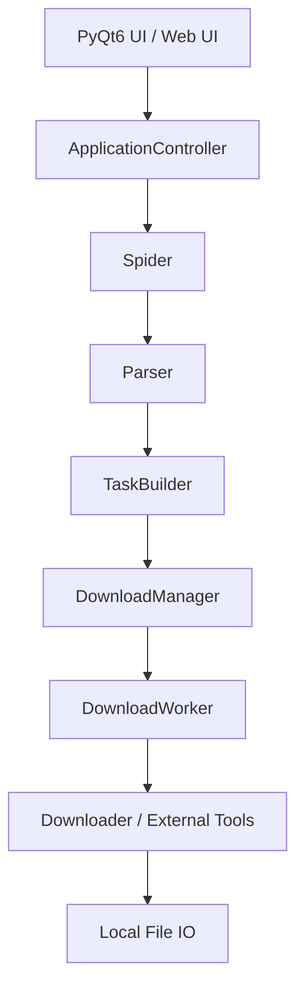

# 🚀 Universal Crawler Pro

中文 | [English](README_EN.md)

<p align="left">
  
  
  
  
  
  
  
  
</p>

**Universal Crawler Pro** 是一款专为 **Windows 桌面环境** 打造的多平台媒体采集与下载工具。项目基于 **Python + PyQt6 + Playwright + FastAPI** 构建，提供从 **站点访问与数据嗅探**、**资源解析与勾选**、**统一下载调度** 到 **本地资产管理与播放预览** 的完整桌面工作流，同时支持 **Web UI 远程操控**。

它不是一个套壳网页，也不是一堆零散脚本的堆叠，而是一个围绕 **可维护性、可扩展性、可调试性、可打包分发** 设计出来的桌面端采集工作站。

> 💡 **设计目标**
>
> 让普通用户不用接触复杂命令行，就能完成多平台媒体采集与下载；
> 也让开发者可以在一个结构清晰、职责明确、测试友好的代码库里持续迭代新平台、新下载策略和新 UI 能力。

---

<a id="toc"></a>
## 📑 目录导航

- [✨ 核心特性](#features)
- [🌐 支持平台与能力矩阵](#platforms)
- [🖥️ 双模式交互：桌面 GUI + Web UI](#dual-mode)
- [🎯 适合谁使用](#audience)
- [📦 安装与快速启动](#quickstart)
- [🐳 Docker / 容器化部署](#docker)
- [⚙️ 配置体系说明](#config)
- [🏗️ 核心架构与工程化设计](#architecture)
- [🛠️ 全链路日志与调试体系](#debugging)
- [🧪 测试与质量保证](#testing)
- [📚 文档与目录索引](#docs)
- [📦 打包与分发](#packaging)
- [👨‍💻 二次开发与贡献指南](#contributing)
- [⚠️ 边界、限制与免责声明](#disclaimer)

---

<a id="features"></a>
## ✨ 核心特性

### 🎨 1. 真正面向桌面的 GUI 体验

- **纯本地桌面程序**：默认面向 Windows 10 / 11，无需额外部署 Web 服务，也不用维护前后端分离栈。
- **PyQt6 原生交互**：主窗口、下载队列、日志面板、媒体预览、主题切换、全屏播放等体验完整。
- **下载后即管理**：支持本地媒体扫描、重命名、删除、图片预览与视频播放，不需要再切回文件夹手工整理。
- **对小白友好**：平台选择、参数输入、结果勾选、进度观察都在统一界面中完成。

### 🌐 2. Web UI 远程操控

- **浏览器即控制台**：内置 FastAPI + uvicorn 服务，启动 `CrawlerWebPortal.exe` 后自动打开浏览器，即可远程操控下载。
- **系统托盘驻留**：Web UI 模式下最小化到系统托盘，右键菜单可打开浏览器或退出，不会在后台无影无踪。
- **端口冲突检测**：默认端口被占用时自动弹窗提示，支持自定义端口。
- **脚本注入**：支持启动时注入自定义 Python 脚本，方便自动化批量任务。

### ⚡ 3. 统一下载引擎，不是平台脚本拼盘

- **统一队列调度**：所有任务统一进入 `DownloadManager`，由 `DownloadWorker` 管理生命周期、并发槽位与回调。
- **策略自动分发**：根据资源特征自动选择不同下载器与外部工具，包括普通 HTTP、分块下载、`ffmpeg`、`N_m3u8DL-RE` 等路径。
- **文件落盘更稳健**：自动推断扩展名、避免重名覆盖、按文件签名修正后缀，减少下载成功但打不开的尴尬。
- **适配多种资源形态**：支持普通视频、DASH 音视频分离、图集、实况图、m3u8/HLS 流媒体等多类资源。

### 🧩 4. 插件化架构，新增平台不需要硬改主界面

- **平台定义集中注册**：平台能力通过 `app/core/plugins/` 注入，而不是在控制器和 UI 到处写分支。
- **Spider 三段式设计**：每个平台都尽量拆成 `spider.py`、`parser.py`、`task_builder.py`，让流程控制、数据解析、任务装配职责清晰。
- **配置面板按插件生成**：平台专属参数可由 settings builder 统一构建与读取，降低新增平台 = 改一堆 UI 的成本。
- **便于二次开发**：开发者可以只聚焦一个平台目录完成接入，而不用把整个工程读成一团。

### 🔍 5. 工业化的调试与排障能力

- **Trace ID 全链路追踪**：同一任务从爬虫、解析、入队、下载到外部工具执行，都能用 `trace_id` 串起来。
- **自动错误摘要**：错误发生后自动生成 `latest_error_summary.md`，给出分级、结论和排查建议。
- **敏感信息自动脱敏**：日志会自动掩码 Cookie、Token、Authorization、代理认证等信息，方便分享日志又降低泄露风险。
- **UI 内建调试入口**：可直接打开最新日志、最新错误摘要，或复制当前任务的 `trace_id`。

### 🧪 6. 不只是能跑，还强调测试与工程质量

- **统一测试框架**：项目使用 `unittest`，本地与 GitHub Actions 保持一致。
- **覆盖真实高风险路径**：当前测试已覆盖模型、配置、控制器、下载器、解析器、日志脱敏、半集成链路等多个层面。
- **适合重构**：Spider 主流程、下载策略、配置迁移、文件落盘等区域都在逐步补齐保护网，降低后续演进成本。

---

<a id="platforms"></a>
## 🌐 支持平台与能力矩阵

系统采用模块化 Spider 架构，目前仓库已原生接入如下平台：

| 平台 | 状态 | 认证方式 | 支持输入 | 典型策略 |
| :-- | :--: | :-- | :-- | :-- |
| **抖音** |  稳定 | 扫码登录 / Cookie | 作品链接、主页、合集、搜索词、短链、`modal_id` | 内置参数生成与接口访问，支持无水印图集拆分、实况图、普通视频下载 |
| **Bilibili** |  稳定 | 扫码登录 / Cookie | BV、完整链接、空间链接、UID、搜索词 | 浏览器扫描 BV + API 拉详情 + DASH 音视频分离下载 + `ffmpeg` 合并 |
| **快手** |  测试 | 浏览器辅助登录 | 主页链接、快手号、搜索关键词 | Playwright 页面滚动 + 媒体请求捕获，根据资源自动切换 HTTP / HLS |
| **MissAV** |  稳定 | 无需站内登录 | 番号、演员、分类、列表、单体 URL | 双轮扫描 + 中文字幕/无码优先策略 + `playlist.m3u8` 嗅探 + `N_m3u8DL-RE` 下载 |

### 平台设计上的一个关键点

这套架构的价值，不只是支持的平台多，更重要的是：

- 每个平台都被收敛到统一的 `VideoItem` 任务模型里。
- 控制器与下载器面对的是统一任务，而不是一堆平台专属临时结构。
- 这意味着后续新增平台时，主要是在平台目录与插件层扩展，不需要把主程序重写一遍。

---

<a id="dual-mode"></a>
## 🖥️ 双模式交互：桌面 GUI + Web UI

项目提供两种交互模式，覆盖不同使用场景：

### 桌面 GUI 模式

```bash
python main.py
# 或
python -m entry.gui_entry
```

- `main.py` 是统一自适应入口，无参数时默认进入桌面 GUI。
- 也可以直接走 `entry.gui_entry` 薄入口。
- 完整的 PyQt6 桌面体验，适合日常本地使用。
- 支持主题切换、媒体预览、全屏播放等。

### Web UI 模式

```bash
python -m entry.web_entry --host 127.0.0.1 --port 8000
# 或
ucrawl-web --host 127.0.0.1 --port 8000
```

- Web 入口已从历史上的 `web_main.py` 收敛到 `entry.web_entry`。
- 启动后自动打开浏览器，通过 Web 界面操控下载。
- 系统托盘驻留，右键可打开浏览器或退出。
- RESTful API 完整暴露，方便二次集成。

### Web API 速览

| 端点 | 方法 | 说明 |
| :-- | :--: | :-- |
| `/api/platforms` | GET | 获取支持的平台列表 |
| `/api/config` | GET/PUT | 读取/更新配置 |
| `/api/crawl/start` | POST | 启动爬取任务 |
| `/api/crawl/stop` | POST | 停止当前爬取 |
| `/api/download/start` | POST | 开始下载选中项 |
| `/api/download/stop` | POST | 停止下载 |
| `/api/dir/list` | GET | 浏览目录内容 |
| `/api/dir/change` | POST | 切换保存目录 |
| `/api/dir/pick-native` | GET | 调用系统原生文件夹选择器 |

---

<a id="audience"></a>
## 🎯 适合谁使用

### 如果你是普通用户

你会更看重这些体验：

- 不想折腾命令行，只想打开程序就用。
- 希望多平台采集逻辑统一，不用每个平台都找一个独立脚本。
- 下载后能直接在程序里管理、预览和播放。
- 出问题时希望有明确日志和错误摘要，而不是只看到下载失败。
- 想用浏览器远程操控下载，不用一直盯着桌面窗口。

### 如果你是开发者

你会更在意这些工程点：

- 代码不是揉成一团，而是按 `controller / spider / parser / builder / downloader / service / ui` 分层。
- 新平台接入路径明确，插件注册清晰。
- 下载策略和外部工具封装是独立模块，便于替换和扩展。
- Web UI 提供 RESTful API，方便与其他系统集成。
- 测试和文档不是摆设，而是已经进入主线工作流。

---

<a id="quickstart"></a>
## 📦 安装与快速启动

### 1. 环境要求

- **操作系统**：Windows 10 / 11
- **Python**：3.10 及以上
- **浏览器内核**：Playwright Chromium
- **外部工具**：`ffmpeg.exe`、`N_m3u8DL-RE.exe`

### 2. 获取源码

```bash
git clone <你的仓库地址>
cd UniversalCrawlerPro
```

### 3. 安装依赖

```bash
pip install -e .
playwright install chromium
```

### 4. 放置核心外部工具

为了保证 B 站混流与 m3u8 下载等完整能力，请确保以下文件位于**项目根目录**，或者已经在系统环境中可被找到：

- `ffmpeg.exe`
- `N_m3u8DL-RE.exe`

推荐的根目录结构大致如下：

```text
UniversalCrawlerPro/
├── app/                    # 应用核心代码
│   ├── config/             # 配置管理
│   ├── controllers/        # 控制器层
│   ├── core/               # 核心引擎（下载器、插件、工具库）
│   ├── spiders/            # 各平台爬虫
│   ├── ui/                 # PyQt6 界面组件
│   └── web/                # Web UI（FastAPI 服务端 + 静态页面）
├── docs/                   # 项目文档
├── packaging/              # 打包脚本与配置
├── tests/                  # 测试用例
├── ffmpeg.exe              # 外部工具
├── N_m3u8DL-RE.exe         # 外部工具
├── main.py                 # 统一自适应入口（默认进入 GUI）
├── entry/                  # GUI / Web / CLI / Interactive / Test 薄入口
└── pyproject.toml          # 项目配置与依赖
```

### 5. 启动应用

**桌面 GUI 模式：**

```bash
python main.py
```

**Web UI 模式：**

```bash
python -m entry.web_entry --host 127.0.0.1 --port 8000
```

首次启动后，程序会自动完成必要的初始化，并准备默认运行环境。

### 6. 用户数据实际存放在哪里？

项目运行时的用户数据并不推荐直接散落在仓库里，程序会优先使用用户目录下的数据路径。对于 Windows 环境，通常位于：

```text
%LOCALAPPDATA%\UniversalCrawlerPro
```

这里会保存运行期配置、日志和部分用户态数据。这样做有几个好处：

- 仓库目录更干净。
- 打包后的便携版与源码运行态更容易共存。
- 升级程序时不容易把用户数据覆盖掉。

---

<a id="docker"></a>
## 🐳 Docker / 容器化部署

项目已经提供第一版容器化资产，但定位非常明确：

- **容器只支持 Web/API 形态**
- **默认入口是 `entry.web_entry --no-qt --no-browser`**
- **不覆盖桌面 GUI、托盘、Qt 交互**
- **`ffmpeg` 下载链可用，`N_m3u8DL-RE.exe` 的 Windows-only 路径不承诺**

### 快速开始

```bash
docker build -t ucrawl-web:latest .
docker compose up --build
```

如果你需要自定义主机端口或透传额外参数，先复制环境变量模板：

```bash
cp .env.docker.example .env
```

Windows PowerShell：

```powershell
Copy-Item .env.docker.example .env
```

Compose 默认会：

- 暴露 `8000` 端口
- 挂载 `./user_data -> /data/user_data`
- 挂载 `./downloads -> /data/downloads`
- 通过 `/api/ping` 做健康检查

如果容器需要启用依赖 Playwright 的平台抓取能力，可在构建时显式开启浏览器安装：

```bash
docker build --build-arg INSTALL_PLAYWRIGHT=1 -t ucrawl-web:playwright .
```

更完整的说明、限制和支持矩阵见：

- [容器化部署说明](docs/containerization.md)

---

<a id="config"></a>
## ⚙️ 配置体系说明

项目配置统一由 [`app/config/settings.py`](app/config/settings.py) 管理，具备以下特点：

- **默认值补齐**：即使配置缺字段，也能自动回填默认配置。
- **类型归一化**：字符串、布尔、数字等配置会做基础收敛，降低 UI 或手工编辑导致的异常。
- **坏配置保护**：损坏配置会自动备份并重置到可运行状态，避免整个程序起不来。
- **平台配置收口**：各平台参数尽量收口到各自配置分组，而不是散落在代码各处。

<details>
<summary><b>点击展开一个典型的 config.json 结构示例</b></summary>

```json
{
  "common": {
    "save_directory": "downloads",
    "last_source": "douyin",
    "theme": "dark"
  },
  "download": {
    "max_concurrent": 3,
    "local_scan_limit": 1000,
    "max_retries": 3,
    "chunk_size": 65536
  },
  "bilibili": {
    "api_workers": 8,
    "max_pages": 1
  },
  "missav": {
    "proxy_url": "http://127.0.0.1:7890",
    "priority": "中文字幕优先",
    "individual_only": false
  }
}
```
</details>

更多配置说明可查看：

- [配置文档](docs/config.md)
- [开发文档](docs/development.md)

---

<a id="architecture"></a>
## 🏗️ 核心架构与工程化设计

本项目的重点，从来不只是能抓到资源，而是让这件事能够**长期维护、持续扩展、方便排障、易于打包**。

### 核心数据流



### 关键分层说明

#### `app/controllers`

- 负责把 UI、爬虫、下载管理器、文件服务组装成完整应用。
- 统一接收信号回调，避免逻辑分散在各个窗口类里。
- 是用户动作和内部服务之间的总编排层。

#### `app/spiders`

每个平台尽量遵循统一三段式：

- `spider.py`：站点访问、登录、滚动、捕获、用户勾选、发射任务。
- `parser.py`：清洗 HTML / JSON / 标题 / URL / 指纹等原始数据。
- `task_builder.py`：把平台结果映射为统一下载任务元数据。

这套拆分的最大价值在于：**流程复杂的部分与纯逻辑部分可以分开测试与演进。**

#### `app/core/download_manager.py`

- 负责下载队列与并发槽位控制。
- 负责统一管理 Worker 生命周期。
- 支持排队取消、运行中停止、回调分发和任务完成收尾。

#### `app/core/downloaders`

封装了多种下载策略，根据资源类型自动选择最优路径：

| 下载器 | 用途 |
| :-- | :-- |
| `base.py` | 下载器基类与通用 HTTP 下载 |
| `chunked.py` | 大文件分块下载 |
| `bilibili.py` | B 站 DASH 音视频分离下载 |
| `douyin.py` | 抖音专属下载策略 |
| `kuaishou.py` | 快手专属下载策略 |
| `missav.py` | MissAV 专属下载策略 |
| `ffmpeg.py` | ffmpeg 命令构建与执行（混流、转码等） |
| `m3u8.py` | HLS/m3u8 流媒体下载（调用 N_m3u8DL-RE） |
| `external.py` | 外部工具统一调用封装 |

#### `app/core/plugins`

- 提供平台注册表。
- 将平台定义、配置面板和 spider 类暴露为统一能力。
- 新增平台时，不需要在控制器和 UI 里到处加 if-else。

#### `app/web`

- 基于 FastAPI + uvicorn 的 Web UI 服务。
- 提供完整的 RESTful API，覆盖爬取、下载、配置、目录管理等全部功能。
- 静态前端页面位于 `app/web/static/`。
- 支持脚本注入系统，可通过 `--script` 参数在启动时执行自定义 Python 脚本。

#### `app/core/lib/douyin`

抖音平台专属底层库，包含：

- `encrypt/`：请求参数加密
- `extract/`：数据提取
- `interface/`：API 接口封装
- `js/`：X-Bogus / A-Bogus 等 JS 签名
- `link/`：链接解析
- `tools/`：辅助工具

### 为什么这套架构值得一提？

因为很多能用的下载工具，随着平台增多会很快变成：

- 控制器越来越大
- 每个平台都直接操作 UI
- 下载逻辑和站点逻辑互相穿透
- 出问题时根本不知道该看哪里

而这个项目已经明显在规避这些问题：

- 平台接入路径清晰
- 下载调度独立
- UI 与业务解耦
- Web UI 与桌面 GUI 共享同一套核心引擎
- 测试与文档配套存在
- 打包逻辑单独收口到 `packaging/`

相关文档：

- [架构说明](docs/architecture.md)
- [内部接口说明](docs/api.md)

---

<a id="debugging"></a>
## 🛠️ 全链路日志与调试体系

桌面爬虫最怕两件事：**黑盒失败** 和 **问题无法复现**。

Universal Crawler Pro 在这方面做了比较完整的设计。

### 日志系统提供什么能力？

- **结构化记录**：模块、动作、状态码、上下文、详情、trace_id 都会被保留下来。
- **敏感信息脱敏**：Cookie、Token、Authorization、代理账号等信息会自动掩码。
- **错误摘要自动生成**：最近一次错误会生成 Markdown 摘要，适合直接给使用者看。
- **命令调用可回放**：`ffmpeg` 与 `N_m3u8DL-RE` 的关键参数会写入日志，便于诊断命令构造问题。

### 常用调试入口

- `latest_debug.log`
- `latest_error_summary.md`
- UI 顶部的最新日志 / 错误摘要 / 复制 Trace 入口

### 推荐排障顺序

1. 先打开错误摘要，确认问题落在哪个阶段。
2. 复制或记录对应 `trace_id`。
3. 在最新日志中全文搜索 `trace_id`。
4. 顺着 `Spider -> Controller -> DownloadManager -> Downloader -> External Tool` 链路逆向定位。

相关说明：

- [调试服务实现](app/services/debug_service.py)
- [底层日志器实现](app/debug_logger.py)
- [打包说明](packaging/README.md)

---

<a id="testing"></a>
## 🧪 测试与质量保证

项目当前以 `pytest` 作为统一运行入口，测试代码主体仍以 `unittest.TestCase` 风格编写，兼容历史资产与新回归用例。

### 当前测试重点覆盖

- 数据模型与工具函数
- 配置读写与损坏恢复
- 控制器编排与 UI 交互边界
- 下载器策略选择、外部工具命令构建、文件落盘纯逻辑
- 抖音 / B 站 / 快手 / MissAV 的关键解析与流程分支
- Spider -> Controller -> DownloadManager 等半集成链路
- 日志脱敏、错误摘要生成与调试服务行为

### 当前分支的测试信号

- 已覆盖 CLI / SDK / Web API / 打包配置 / 桌面 UI / 浏览器 E2E 等多个层面。
- 已接入自动分类测试套件，新增测试可按命名规则自动归类。
- GitHub Actions 已接入基础自动化检查。

### 本地执行命令

```bash
python -m compileall app tests main.py
python -m pytest tests
```

### 测试策略建议

- 对真实网站行为尽量做 mock，不把站点稳定性耦合进 CI。
- 对 Spider 主流程与下载器路径做半集成测试，对纯逻辑做单元测试。
- 高风险改动优先补测试，再改实现。

相关说明：

- [测试总览](tests/README.md)
- [测试策略文档](docs/testing.md)
- [CI 工作流](.github/workflows/python-tests.yml)

---

<a id="docs"></a>
## 📚 文档与目录索引

如果你希望快速理解项目，建议按下面顺序阅读：

### 先看总览

- [根 README](README.md)
- [架构文档](docs/architecture.md)
- [开发指南](docs/development.md)

### 再看关键专题

- [接口与关键对象](docs/api.md)
- [测试策略](docs/testing.md)
- [配置说明](docs/config.md)
- [打包与发布指南](docs/packaging.md)
- [容器化部署说明](docs/containerization.md)
- [打包脚本说明](packaging/README.md)
- [测试目录说明](tests/README.md)

### 关键目录 README

- [爬虫目录说明](app/spiders/README.md)
- [下载器目录说明](app/core/downloaders/README.md)
- [插件目录说明](app/core/plugins/README.md)
- [抖音底层库说明](app/core/lib/douyin/README.md)
- [测试目录说明](tests/README.md)

---

<a id="packaging"></a>
## 📦 打包与分发

这个项目并不只面向源码运行，也考虑了实际交付。

### 当前已具备的分发方式

| 产物 | 说明 | 入口脚本 |
| :-- | :-- | :-- |
| **便携版** | 解压即用，内含 Playwright Chromium | `packaging/build_portable.py` |
| **安装包** | Inno Setup 安装器，支持开始菜单与桌面快捷方式 | `packaging/build_installer.py` |
| **一键发布** | 依次构建便携版 + 安装包 | `packaging/build_release.py` |

### 便携版包含什么

- `UniversalCrawlerPro.exe` — 桌面 GUI 主程序
- `CrawlerWebPortal.exe` — Web UI 入口（系统托盘驻留）
- `_internal/` — 运行时依赖与资源
- `ffmpeg.exe` / `N_m3u8DL-RE.exe` — 外部下载工具
- `ms-playwright/` — 内置 Chromium 内核

### 安装包特性

- 安装到 `%LOCALAPPDATA%\Programs\UniversalCrawlerPro`
- 创建开始菜单快捷方式（Universal CrawlerPro / Crawler WebPortal）
- 可选创建桌面快捷方式
- 支持标准卸载流程

### 打包相关文件

- [`packaging/build_portable.py`](packaging/build_portable.py) — 便携版构建
- [`packaging/build_installer.py`](packaging/build_installer.py) — 安装包构建
- [`packaging/build_release.py`](packaging/build_release.py) — 一键发布
- [`packaging/portable.spec`](packaging/portable.spec) — PyInstaller 打包规格
- [`packaging/installer.iss`](packaging/installer.iss) — Inno Setup 安装脚本
- [`packaging/runtime_hook.py`](packaging/runtime_hook.py) — 运行时初始化钩子

### 打包前建议检查

- 是否已安装并验证 `playwright install chromium`
- `ffmpeg.exe` 是否可用
- `N_m3u8DL-RE.exe` 是否可用
- 是否已通过完整测试
- 是否确认不把用户态配置和 Cookie 打入产物

详细说明见：[打包与发布指南](docs/packaging.md) 与 [打包脚本说明](packaging/README.md)

---

<a id="contributing"></a>
## 👨‍💻 二次开发与贡献指南

如果你准备在这个项目上继续开发，新平台接入路径已经比较明确。

### 新平台接入的最短路径

1. 在 `app/spiders/<platform>/` 下实现：
   - `spider.py`
   - `parser.py`
   - `task_builder.py`
2. 在 `app/core/downloaders/` 中补充下载策略。
3. 在 `app/core/plugins/` 中注册平台定义和设置构建器。
4. 为关键逻辑补充测试。
5. 更新文档与目录 README。

### 推荐开发流程

```bash
# 编译检查
python -m compileall app tests main.py

# 运行测试
python -m pytest tests

# 桌面 GUI 模式启动
python main.py

# Web UI 模式启动
python -m entry.web_entry --host 127.0.0.1 --port 8000
```

### 一些对维护者很重要的约定

- 改 Spider 流程时，请同步评估测试是否需要补充。
- 改下载策略时，请同步检查外部工具命令构建与日志记录。
- 改目录职责或接入方式时，请同步更新文档。
- 不要把平台特例散写进控制器和 UI，优先沉到插件、parser、task_builder 或 downloader 层。

如果你觉得这个项目有价值，欢迎：

- 提交 Issue
- 提交 PR
- 补测试
- 补文档
- 改善打包与分发体验

---

<a id="disclaimer"></a>
## ⚠️ 边界、限制与免责声明

### 当前边界与限制

1. **运行环境偏向 Windows**：当前路径处理、外部工具封装、打包脚本都明显偏向 Windows 桌面环境。
2. **真实站点行为会变化**：目标平台的页面结构、接口策略、登录机制都可能变化，因此平台逻辑需要持续维护。
3. **TikTok 仅保留底层能力**：仓库中保留相关底层协议与接口能力，但 GUI 尚未完整接入。
4. **部分平台依赖登录态**：Cookie 失效或浏览器状态异常时，需要重新登录或重新持久化会话。

### 免责声明

> 本项目仅用于学习、研究与桌面端工程实践。
>
> 本项目版权归作者个人所有，仅授权个人学习、研究和非商业开发使用。未经作者书面许可，禁止将本项目或其衍生版本用于任何商业用途。
>
> 使用者应自行遵守相关法律法规、版权要求与目标平台服务条款。请勿将本工具用于商业侵权、批量搬运、隐私窃取或其他非法用途。
>
> 作者不对因使用本项目产生的任何直接或间接后果承担责任。

---

## ❤️ 最后

如果这个项目对你有帮助，欢迎给仓库点一个 **Star**。

对于普通用户，这会是一个更省心的多平台下载工作台。

对于开发者，这会是一份已经具备明显工程味道、值得继续打磨的桌面端采集框架。
