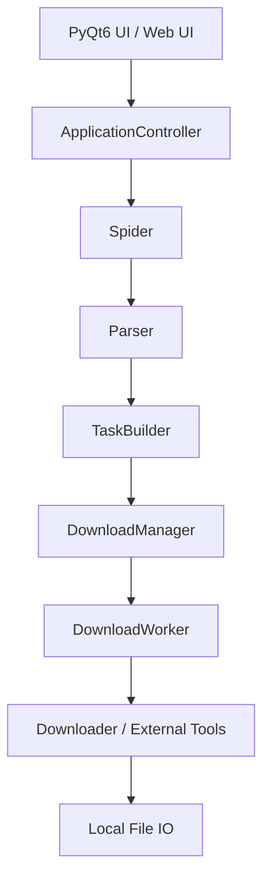

# Universal Crawler Pro

[中文](README.md) | English

<p align="left">
  
  
  
  
  
  
  
  
</p>

**Universal Crawler Pro** is a multi-platform media crawling and downloading tool built specifically for the **Windows desktop environment**. Based on **Python + PyQt6 + Playwright + FastAPI**, it provides a complete desktop workflow covering **site access and data sniffing**, **resource parsing and selection**, **unified download scheduling**, and **local asset management and preview**, while also supporting **remote control through Web UI**.

It is neither a thin shell around a webpage nor a pile of scattered scripts. It is a desktop-grade media crawling workstation designed around **maintainability, extensibility, debuggability, and distributable packaging**.

> 💡 **Design Goals**
>
> Let ordinary users complete multi-platform media crawling and downloading without touching complicated command lines;
> and let developers continue to evolve new platforms, new download strategies, and new UI capabilities in a codebase that is structurally clear, responsibility-driven, and test-friendly.

---

<a id="toc"></a>
## 📑 Table Of Contents

- [✨ Core Features](#features)
- [🌐 Supported Platforms And Capability Matrix](#platforms)
- [🖥️ Dual Interaction Modes: Desktop GUI + Web UI](#dual-mode)
- [🎯 Who Is This For](#audience)
- [📦 Installation And Quick Start](#quickstart)
- [🐳 Docker / Container Deployment](#docker)
- [⚙️ Configuration System](#config)
- [🏗️ Core Architecture And Engineering Design](#architecture)
- [🛠️ End-To-End Logging And Debugging](#debugging)
- [🧪 Testing And Quality Assurance](#testing)
- [📚 Documentation And Directory Index](#docs)
- [📦 Packaging And Distribution](#packaging)
- [👨‍💻 Secondary Development And Contribution Guide](#contributing)
- [⚠️ Boundaries, Limitations, And Disclaimer](#disclaimer)

---

<a id="features"></a>
## ✨ Core Features

### 🎨 1. A Real Desktop-First GUI Experience

- **Pure local desktop application**: primarily targets Windows 10 / 11, with no need to deploy an extra web service or maintain a front-end/back-end split stack.
- **Native PyQt6 interaction**: main window, download queue, log panel, media preview, theme switching, fullscreen playback, and other interactions are fully supported.
- **Manage after download**: supports local media scanning, renaming, deletion, image preview, and video playback directly inside the application, without switching back to file explorer.
- **Friendly for non-technical users**: platform selection, parameter input, result picking, and progress observation all happen in a unified interface.

### 🌐 2. Web UI Remote Control

- **Browser as control console**: ships with a built-in FastAPI + uvicorn service. After starting `CrawlerWebPortal.exe`, the browser opens automatically and can remotely control crawling and downloading.
- **System tray residency**: in Web UI mode the app can minimize to the system tray, and the right-click menu can reopen the browser or exit cleanly.
- **Port conflict detection**: when the default port is occupied, the application prompts the user and supports choosing a custom port.
- **Script injection**: supports injecting custom Python scripts at startup for automation and batch operations.

### ⚡ 3. A Unified Download Engine, Not A Pile Of Platform Scripts

- **Unified queue scheduling**: all tasks enter `DownloadManager`, and `DownloadWorker` manages lifecycle, concurrency slots, and callbacks.
- **Automatic strategy routing**: chooses different downloaders and external tools based on resource characteristics, including normal HTTP, chunked downloading, `ffmpeg`, `N_m3u8DL-RE`, and more.
- **More robust file persistence**: automatically infers extensions, avoids collisions, and corrects suffixes by file signature, reducing the case where downloads succeed but files cannot be opened.
- **Supports multiple media shapes**: ordinary videos, DASH separated audio/video, image galleries, live photos, and m3u8/HLS streaming resources.

### 🧩 4. Plugin-Oriented Architecture, So New Platforms Do Not Require Hard-Coded UI Changes

- **Centralized platform registration**: platform capabilities are injected through `app/core/plugins/` instead of being scattered across controllers and UI branches.
- **Three-part Spider design**: each platform is split as much as possible into `spider.py`, `parser.py`, and `task_builder.py`, keeping flow control, data parsing, and task assembly clear and isolated.
- **Configuration panels generated from plugins**: platform-specific parameters can be built and read through settings builders, reducing the cost of “new platform = change lots of UI code”.
- **Better for secondary development**: developers can focus on a single platform directory instead of having to understand the whole repository as one large bundle.

### 🔍 5. Industrialized Debugging And Troubleshooting

- **Trace ID through the whole chain**: the same task can be tracked from spider, parsing, enqueueing, downloading, to external tool execution using `trace_id`.
- **Automatic error summary**: when an error occurs, `latest_error_summary.md` is generated automatically with severity, conclusion, and troubleshooting suggestions.
- **Automatic desensitization of sensitive information**: logs mask cookies, tokens, authorization headers, proxy credentials, and similar secrets, making logs safer to share.
- **Built-in UI debug entry points**: directly open the latest log, the latest error summary, or copy the current task's `trace_id`.

### 🧪 6. Not Just Runnable, But Also Focused On Testing And Engineering Quality

- **Unified testing framework**: the project uses `unittest`, aligned with local execution and GitHub Actions.
- **Covers real high-risk paths**: current tests already cover models, configuration, controllers, downloaders, parsers, log desensitization, and semi-integrated flows.
- **Friendly for refactoring**: the spider main flow, download strategies, configuration migration, and file persistence areas are gradually being protected by tests, lowering the risk of future evolution.

---

<a id="platforms"></a>
## 🌐 Supported Platforms And Capability Matrix

The system uses a modular Spider architecture. The repository currently includes native support for the following platforms:

| Platform | Status | Auth Method | Supported Inputs | Typical Strategy |
| :-- | :--: | :-- | :-- | :-- |
| **Douyin** | Stable | QR login / Cookie | post links, homepage, collections, search keywords, short links, `modal_id` | built-in parameter generation and API access, supports watermark-free galleries, live photos, and normal video downloads |
| **Bilibili** | Stable | QR login / Cookie | BV, full links, space links, UID, search terms | browser BV scanning + detail APIs + DASH separated audio/video download + `ffmpeg` merge |
| **Kuaishou** | Testing | browser-assisted login | homepage links, Kuaishou IDs, search keywords | Playwright page scrolling + media request capture, automatically switching between HTTP / HLS |
| **MissAV** | Stable | no site login required | video code, actress, category, list, single URL | dual-pass scanning + subtitle / uncensored priority strategy + `playlist.m3u8` sniffing + `N_m3u8DL-RE` download |

### A Key Architectural Value Here

The value of this architecture is not only that it supports many platforms, but more importantly:

- Every platform is normalized into the unified `VideoItem` task model.
- Controllers and downloaders work against unified tasks instead of platform-specific temporary structures.
- This means future platform additions are mainly extensions inside platform directories and the plugin layer, rather than rewriting the whole application.

---

<a id="dual-mode"></a>
## 🖥️ Dual Interaction Modes: Desktop GUI + Web UI

The project offers two interaction modes to cover different usage scenarios:

### Desktop GUI Mode

```bash
python main.py
# or
python -m entry.gui_entry
```

- `main.py` is the unified adaptive entry point and defaults to desktop GUI when launched without arguments.
- You can also directly use the thin entry `entry.gui_entry`.
- Provides the full PyQt6 desktop experience for daily local usage.
- Supports theme switching, media preview, fullscreen playback, and more.

### Web UI Mode

```bash
python -m entry.web_entry --host 127.0.0.1 --port 8000
# or
ucrawl-web --host 127.0.0.1 --port 8000
```

- The Web entry has been consolidated from the historical `web_main.py` into `entry.web_entry`.
- After startup the browser opens automatically, and the Web interface can control downloads.
- Supports system tray residency, allowing reopen or exit from the tray menu.
- Exposes a complete RESTful API for secondary integration.

### Web API Snapshot

| Endpoint | Method | Description |
| :-- | :--: | :-- |
| `/api/platforms` | GET | get the supported platform list |
| `/api/config` | GET/PUT | read or update configuration |
| `/api/crawl/start` | POST | start a crawling task |
| `/api/crawl/stop` | POST | stop the current crawl |
| `/api/download/start` | POST | start downloading selected items |
| `/api/download/stop` | POST | stop downloading |
| `/api/dir/list` | GET | browse directory contents |
| `/api/dir/change` | POST | change the save directory |
| `/api/dir/pick-native` | GET | invoke the native system folder picker |

---

<a id="audience"></a>
## 🎯 Who Is This For

### If You Are A Regular User

You will probably care more about these experiences:

- You do not want to deal with command lines and just want to open the app and use it.
- You want unified multi-platform crawling logic instead of hunting for a separate script for every platform.
- You want to manage, preview, and play downloaded media directly inside the application.
- When something goes wrong, you want clear logs and error summaries instead of just “download failed”.
- You want to remotely control downloading from a browser rather than keeping the desktop window open all the time.

### If You Are A Developer

You will probably care more about these engineering points:

- The codebase is not mixed into one giant blob, but layered by `controller / spider / parser / builder / downloader / service / ui`.
- The platform integration path is clear and plugin registration is explicit.
- Download strategy and external tool integration are isolated modules, making replacement and extension easier.
- The Web UI exposes RESTful APIs that can integrate with other systems.
- Tests and documentation are not decorative assets, but part of the main workflow.

---

<a id="quickstart"></a>
## 📦 Installation And Quick Start

### 1. Environment Requirements

- **Operating System**: Windows 10 / 11
- **Python**: 3.10 or above
- **Browser Runtime**: Playwright Chromium
- **External Tools**: `ffmpeg.exe`, `N_m3u8DL-RE.exe`

### 2. Get The Source Code

```bash
git clone <your-repository-url>
cd UniversalCrawlerPro
```

### 3. Install Dependencies

```bash
pip install -e .
playwright install chromium
```

### 4. Place Core External Tools

To guarantee full capabilities such as Bilibili stream merging and m3u8 downloading, ensure the following files are located in the **project root directory**, or are already available through the system environment:

- `ffmpeg.exe`
- `N_m3u8DL-RE.exe`

The recommended root directory structure looks like this:

```text
UniversalCrawlerPro/
├── app/                    # application core code
│   ├── config/             # configuration management
│   ├── controllers/        # controller layer
│   ├── core/               # core engine (downloaders, plugins, utility libraries)
│   ├── spiders/            # platform spiders
│   ├── ui/                 # PyQt6 UI components
│   └── web/                # Web UI (FastAPI server + static pages)
├── docs/                   # project documentation
├── packaging/              # packaging scripts and configuration
├── tests/                  # test cases
├── ffmpeg.exe              # external tool
├── N_m3u8DL-RE.exe         # external tool
├── main.py                 # unified adaptive entry (defaults to GUI)
├── entry/                  # thin entries for GUI / Web / CLI / Interactive / Test
└── pyproject.toml          # project configuration and dependencies
```

### 5. Start The Application

**Desktop GUI Mode:**

```bash
python main.py
```

**Web UI Mode:**

```bash
python -m entry.web_entry --host 127.0.0.1 --port 8000
```

On the first launch, the application will complete the necessary initialization and prepare the default runtime environment.

### 6. Where Is User Data Actually Stored

User runtime data is not recommended to be scattered directly in the repository. The program will prefer a user-data path under the user directory. On Windows this is usually:

```text
%LOCALAPPDATA%\UniversalCrawlerPro
```

This directory stores runtime configuration, logs, and part of the user-state data. It helps because:

- the repository stays cleaner;
- packaged portable builds and source-based runtime can coexist more easily;
- upgrades are less likely to overwrite user data.

---

<a id="docker"></a>
## 🐳 Docker / Container Deployment

The project already includes a first version of container assets, but the scope is very explicit:

- **Containers only support the Web/API form**
- **The default entry is `entry.web_entry --no-qt --no-browser`**
- **Desktop GUI, tray, and Qt interaction are intentionally excluded**
- **The `ffmpeg` download chain is available, while the Windows-only `N_m3u8DL-RE.exe` path is not guaranteed**

### Quick Start

```bash
docker build -t ucrawl-web:latest .
docker compose up --build
```

If you need to customize the host port or pass extra runtime arguments, first copy the environment template:

```bash
cp .env.docker.example .env
```

Windows PowerShell:

```powershell
Copy-Item .env.docker.example .env
```

By default, Compose will:

- expose port `8000`
- mount `./user_data -> /data/user_data`
- mount `./downloads -> /data/downloads`
- use `/api/ping` as health check

If the container needs Playwright-dependent crawling capabilities, explicitly enable browser installation during build:

```bash
docker build --build-arg INSTALL_PLAYWRIGHT=1 -t ucrawl-web:playwright .
```

For the full explanation, constraints, and support matrix, see:

- [Containerization Guide](docs/containerization.md)

---

<a id="config"></a>
## ⚙️ Configuration System

Project configuration is centrally managed by [`app/config/settings.py`](app/config/settings.py) and provides the following characteristics:

- **Default completion**: even if configuration fields are missing, defaults can be filled back automatically.
- **Type normalization**: strings, booleans, numbers, and other values are normalized to reduce issues caused by UI input or manual edits.
- **Broken config protection**: corrupted configuration is automatically backed up and reset to a runnable state instead of preventing the entire application from starting.
- **Platform configuration consolidation**: platform parameters are grouped into their respective configuration sections instead of being scattered across the codebase.

<details>
<summary><b>Click to expand a typical config.json example</b></summary>

```json
{
  "common": {
    "save_directory": "downloads",
    "last_source": "douyin",
    "theme": "dark"
  },
  "download": {
    "max_concurrent": 3,
    "local_scan_limit": 1000,
    "max_retries": 3,
    "chunk_size": 65536
  },
  "bilibili": {
    "api_workers": 8,
    "max_pages": 1
  },
  "missav": {
    "proxy_url": "http://127.0.0.1:7890",
    "priority": "Prefer Chinese subtitles",
    "individual_only": false
  }
}
```
</details>

For more details:

- [Configuration Guide](docs/config.md)
- [Development Guide](docs/development.md)

---

<a id="architecture"></a>
## 🏗️ Core Architecture And Engineering Design

The point of this project has never been just “grab the resource somehow”, but making that capability **maintainable in the long run, continuously extensible, easy to debug, and easy to package**.

### Core Data Flow



### Key Layer Breakdown

#### `app/controllers`

- Assembles UI, spiders, download manager, and file services into the complete application.
- Receives signals and callbacks in a unified place, instead of scattering logic across window classes.
- Acts as the main orchestration layer between user actions and internal services.

#### `app/spiders`

Each platform tries to follow the same three-part pattern:

- `spider.py`: site access, login, scrolling, capture, user selection, and task emission.
- `parser.py`: cleans raw HTML / JSON / titles / URLs / fingerprints and related raw data.
- `task_builder.py`: maps platform results into unified download task metadata.

The biggest benefit of this split is that **flow-heavy parts and pure logic parts can evolve and be tested separately**.

#### `app/core/download_manager.py`

- Controls the download queue and concurrency slots.
- Manages worker lifecycle in a unified way.
- Supports queued cancellation, stopping running tasks, callback dispatching, and completion cleanup.

#### `app/core/downloaders`

Encapsulates multiple download strategies and automatically selects the optimal path according to resource type:

| Downloader | Purpose |
| :-- | :-- |
| `base.py` | downloader base class and generic HTTP download |
| `chunked.py` | chunked large-file download |
| `bilibili.py` | Bilibili DASH separated audio/video download |
| `douyin.py` | Douyin-specific download strategy |
| `kuaishou.py` | Kuaishou-specific download strategy |
| `missav.py` | MissAV-specific download strategy |
| `ffmpeg.py` | `ffmpeg` command construction and execution, including muxing and transcoding |
| `m3u8.py` | HLS / m3u8 streaming download via `N_m3u8DL-RE` |
| `external.py` | unified wrapper for external tool invocation |

#### `app/core/plugins`

- Provides the platform registry.
- Exposes platform definitions, configuration panels, and spider classes as unified capabilities.
- Allows adding new platforms without scattering `if-else` logic across controller and UI layers.

#### `app/web`

- Provides the Web UI service based on FastAPI + uvicorn.
- Exposes a full RESTful API covering crawling, downloading, configuration, and directory management.
- Static front-end assets are located in `app/web/static/`.
- Supports a script injection system, and custom Python scripts can be executed at startup through `--script`.

#### `app/core/lib/douyin`

This is the Douyin-specific low-level library, including:

- `encrypt/`: request parameter encryption
- `extract/`: data extraction
- `interface/`: API wrappers
- `js/`: signatures such as X-Bogus / A-Bogus
- `link/`: link parsing
- `tools/`: helper utilities

### Why Is This Architecture Worth Calling Out

Because many “usable” download tools eventually become this as platforms grow:

- larger and larger controllers
- every platform directly manipulating the UI
- download logic and site logic penetrating each other
- no one knows where to look when something breaks

This project is already clearly trying to avoid those traps:

- the platform integration path is explicit
- download scheduling is independent
- UI and business logic are decoupled
- Web UI and desktop GUI share the same core engine
- tests and documentation actually exist together with the code
- packaging logic is isolated under `packaging/`

Related documents:

- [Architecture Overview](docs/architecture.md)
- [Internal API Notes](docs/api.md)

---

<a id="debugging"></a>
## 🛠️ End-To-End Logging And Debugging

Desktop crawlers are most afraid of two things: **black-box failures** and **bugs that cannot be reproduced**.

Universal Crawler Pro has a relatively complete design around both.

### What Does The Logging System Provide

- **Structured records**: module, action, status code, context, detail, and `trace_id` are all preserved.
- **Sensitive data masking**: cookies, tokens, authorization headers, proxy accounts, and similar data are automatically masked.
- **Automatic error summary generation**: the latest error is summarized into a Markdown file suitable for direct consumption.
- **Command replayability**: key parameters for `ffmpeg` and `N_m3u8DL-RE` are written into logs for easier diagnosis of command construction problems.

### Common Debug Entry Points

- `latest_debug.log`
- `latest_error_summary.md`
- latest log / error summary / copy trace entries in the UI top bar

### Recommended Troubleshooting Order

1. Open the latest error summary first to confirm which phase failed.
2. Copy or record the corresponding `trace_id`.
3. Search for that `trace_id` in the latest log.
4. Trace backward along `Spider -> Controller -> DownloadManager -> Downloader -> External Tool`.

Related references:

- [Debug service implementation](app/services/debug_service.py)
- [Low-level logger implementation](app/debug_logger.py)
- [Packaging notes](packaging/README.md)

---

<a id="testing"></a>
## 🧪 Testing And Quality Assurance

The project currently uses `pytest` as the unified execution entry, while the test code body still largely follows the historical `unittest.TestCase` style for compatibility with existing assets and new regression cases.

### Current Testing Focus

- data models and utility functions
- configuration reading/writing and corruption recovery
- controller orchestration and UI interaction boundaries
- downloader strategy selection, external command construction, and pure file persistence logic
- key parsing and flow branches for Douyin / Bilibili / Kuaishou / MissAV
- semi-integrated chains such as Spider -> Controller -> DownloadManager
- log desensitization, error summary generation, and debug service behavior

### Current Test Signal In This Branch

- already covers CLI / SDK / Web API / packaging configuration / desktop UI / browser E2E and more
- automatic test-suite classification has been integrated, and new tests can be categorized through naming rules
- GitHub Actions already includes baseline automation checks

### Local Execution Commands

```bash
python -m compileall app tests main.py
python -m pytest tests
```

### Testing Strategy Suggestions

- Mock real site behavior as much as possible instead of coupling CI stability to external websites.
- Use semi-integration tests for Spider main flows and downloader paths, and unit tests for pure logic.
- For high-risk changes, add tests first and then change implementation.

Related references:

- [Testing Overview](tests/README.md)
- [Testing Strategy](docs/testing.md)
- [CI Workflow](.github/workflows/python-tests.yml)

---

<a id="docs"></a>
## 📚 Documentation And Directory Index

If you want to understand the project quickly, the following reading order is recommended:

### Start With The Overview

- [Root README](README.md)
- [Architecture Document](docs/architecture.md)
- [Development Guide](docs/development.md)

### Then Read Key Topics

- [Interfaces And Key Objects](docs/api.md)
- [Testing Strategy](docs/testing.md)
- [Configuration Guide](docs/config.md)
- [Packaging And Release Guide](docs/packaging.md)
- [Containerization Guide](docs/containerization.md)
- [Packaging Script Notes](packaging/README.md)
- [Tests Directory Notes](tests/README.md)

### Key Directory READMEs

- [Spider Directory Notes](app/spiders/README.md)
- [Downloader Directory Notes](app/core/downloaders/README.md)
- [Plugin Directory Notes](app/core/plugins/README.md)
- [Douyin Low-Level Library Notes](app/core/lib/douyin/README.md)
- [Tests Directory Notes](tests/README.md)

---

<a id="packaging"></a>
## 📦 Packaging And Distribution

This project is not only meant for source execution; practical delivery and distribution are also considered.

### Current Distribution Methods

| Artifact | Description | Entry Script |
| :-- | :-- | :-- |
| **Portable Build** | unzip and run, includes Playwright Chromium | `packaging/build_portable.py` |
| **Installer Build** | Inno Setup installer, supports Start Menu and desktop shortcuts | `packaging/build_installer.py` |
| **One-Click Release** | builds portable package and installer sequentially | `packaging/build_release.py` |

### What Is Included In The Portable Build

- `UniversalCrawlerPro.exe` — desktop GUI main program
- `CrawlerWebPortal.exe` — Web UI entry with tray residency
- `_internal/` — runtime dependencies and resources
- `ffmpeg.exe` / `N_m3u8DL-RE.exe` — external download tools
- `ms-playwright/` — embedded Chromium runtime

### Installer Features

- installs into `%LOCALAPPDATA%\Programs\UniversalCrawlerPro`
- creates Start Menu shortcuts for Universal CrawlerPro / Crawler WebPortal
- optionally creates desktop shortcuts
- supports a standard uninstall flow

### Packaging-Related Files

- [`packaging/build_portable.py`](packaging/build_portable.py) — portable build
- [`packaging/build_installer.py`](packaging/build_installer.py) — installer build
- [`packaging/build_release.py`](packaging/build_release.py) — one-click release
- [`packaging/portable.spec`](packaging/portable.spec) — PyInstaller spec
- [`packaging/installer.iss`](packaging/installer.iss) — Inno Setup installer script
- [`packaging/runtime_hook.py`](packaging/runtime_hook.py) — runtime initialization hook

### Suggested Checks Before Packaging

- whether `playwright install chromium` has been installed and verified
- whether `ffmpeg.exe` is available
- whether `N_m3u8DL-RE.exe` is available
- whether the full test suite has passed
- whether user configuration and cookies are confirmed not to be bundled into outputs

For details, see the [Packaging And Release Guide](docs/packaging.md) and [Packaging Script Notes](packaging/README.md).

---

<a id="contributing"></a>
## 👨‍💻 Secondary Development And Contribution Guide

If you plan to continue developing on top of this project, the integration path for new platforms is already fairly clear.

### Shortest Path For Adding A New Platform

1. Implement the following under `app/spiders/<platform>/`:
   - `spider.py`
   - `parser.py`
   - `task_builder.py`
2. Add or adjust download strategy support under `app/core/downloaders/`.
3. Register the platform definition and settings builder in `app/core/plugins/`.
4. Add tests for key logic.
5. Update related documentation and directory READMEs.

### Recommended Development Workflow

```bash
# compile check
python -m compileall app tests main.py

# run tests
python -m pytest tests

# start desktop GUI mode
python main.py

# start Web UI mode
python -m entry.web_entry --host 127.0.0.1 --port 8000
```

### A Few Important Agreements For Maintainers

- When changing Spider flows, evaluate whether tests need to be expanded.
- When changing download strategies, also review external command construction and logging.
- When changing directory responsibilities or access paths, update documentation at the same time.
- Do not scatter platform-specific exceptions directly into the controller and UI; prefer sinking them into the plugin, parser, task builder, or downloader layers.

If you find value in this project, contributions are welcome through:

- Issues
- PRs
- more tests
- more documentation
- improvements to packaging and distribution experience

---

<a id="disclaimer"></a>
## ⚠️ Boundaries, Limitations, And Disclaimer

### Current Boundaries And Limitations

1. **The runtime environment is strongly Windows-oriented**: current path handling, external tool wrappers, and packaging scripts clearly target the Windows desktop environment.
2. **Real site behavior can change**: target platforms may change page structure, APIs, and login mechanisms, so platform logic needs continuous maintenance.
3. **TikTok currently keeps only the low-level capability layer**: related low-level protocols and interfaces remain in the repository, but the GUI has not yet been fully integrated.
4. **Some platforms depend on login state**: when cookies expire or browser state becomes invalid, login may need to be refreshed or the session persisted again.

### Disclaimer

> This project is intended only for learning, research, and desktop engineering practice.
>
> The copyright of this project belongs to the individual author. It is licensed only for personal learning, research, and non-commercial development. Without written permission from the author, commercial use of this project or any derivative version is prohibited.
>
> Users are responsible for complying with applicable laws, copyright requirements, and the terms of service of target platforms. Do not use this tool for commercial infringement, large-scale content re-uploading, privacy theft, or any other illegal purpose.
>
> The author is not responsible for any direct or indirect consequences arising from the use of this project.

---

## ❤️ Final Note

If this project helps you, a **Star** on the repository is always appreciated.

For regular users, this can become a more worry-free multi-platform downloading workstation.

For developers, this is already a desktop-oriented crawling framework with clear engineering direction and good potential for further polishing.
