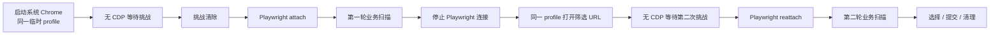

# MissAV Cloudflare 挑战会话工程约束

> 本文描述当前生产实现的长期契约。历史排查过程和失败实验见
> [MissAV Cloudflare 挑战拒绝活动 CDP 会话复盘](../postmortems/missav-cloudflare-active-cdp-browser-rejection.md)。

更新日期：2026-07-18

## 结论

MissAV 可视化爬取采用“系统浏览器独立过挑战，挑战后再由 Playwright 接管”的会话模型。

核心不变量：

```text
挑战加载和判定期间：没有活动 CDP 客户端
业务扫描期间：Playwright 通过 CDP 接管同一系统浏览器
下一次可能触发挑战的导航前：先断开 CDP，再复用同一 profile 打开 URL
```

这不是通用的“反检测技巧”，而是当前 MissAV 双轮扫描的兼容性边界。不得复制到其他
平台，除非该平台已经完成独立实验、安全评审和真实回归。

## 模块职责

| 模块 | 职责 | 不负责 |
| --- | --- | --- |
| `app/spiders/missav/challenge_session.py` | 启动系统浏览器、管理临时 profile、元数据等待、挑战后 attach、最终清理 | 页面扫描、DOM 解析、任务构建 |
| `ExternalChromeChallengeSession` | 原生浏览器进程和 profile 的唯一所有者 | 长期持有 Playwright 对象 |
| `BrowserTarget` | 表达 `/json/list` 中匹配的页面目标 | 连接 WebSocket |
| `BrowserAttachment` | 返回挑战后获得的 browser/context/page | 决定进程生命周期 |
| `_ChallengeBrowserRuntime` | 保存当前接管阶段的 Playwright 和页面句柄 | 拥有外部 Chrome 进程 |
| `MissAVSpider` | 编排两轮扫描、接管/断开、取消、日志和选择 | 复制系统浏览器启动与目标匹配逻辑 |

## 状态机契约



顺序约束：

- `start -> wait -> attach`
- `disconnect -> open_url -> wait -> attach`
- `disconnect -> session.close`

禁止：

- `start -> attach -> wait`
- `open_url -> disconnect`
- `browser.close -> open_url`
- `new profile -> second URL`

## 系统浏览器启动

`ExternalChromeChallengeSession` 按稳定版 Chrome、Edge 的顺序定位系统浏览器，并使用：

- 随机 loopback 调试端口。
- `--remote-debugging-address=127.0.0.1`。
- 独立临时 `user-data-dir`。
- 固定 `Default` profile。
- 与任务一致的代理参数。
- `--no-first-run` 和 `--no-default-browser-check`。

不得添加会修改浏览器公开指纹的参数、扩展或脚本。尤其不得在 MissAV challenge path
重新加入全局 stealth，或给 context 设置与实际内核不一致的 UA。

系统浏览器不是“用户日常 Chrome”。不得复用默认用户目录，也不得读取用户已有登录态、
扩展或浏览历史。

## 无 CDP 等待

挑战等待只能访问：

```text
http://127.0.0.1:<debug-port>/json/list
```

允许读取：

- target type。
- target ID。
- URL。
- title。

不允许：

- 使用 `webSocketDebuggerUrl`。
- 调用 `connect_over_cdp()`。
- 执行 CDP command。
- 用 Playwright 读取 DOM。
- 注入 JavaScript。
- 自动点击挑战。
- 自动刷新页面。

目标匹配必须同时比较：

- 规范化 hostname。
- 去除尾斜杠后的 path。
- 目标查询参数是否为候选 URL 查询参数的子集。

存在多个匹配 target 时优先选择查询参数完全一致的页面，避免 attach 到上一轮标签页。

## 挑战状态

`wait_for_ready_page()` 把空标题和已知挑战标题视为未就绪。只有目标标签页存在且标题离开
挑战标记后，才允许进入 attach。

等待必须同时处理：

- 用户停止任务。
- 任务 interrupt。
- 总超时。
- 系统浏览器异常退出。
- 调试接口暂时未启动或返回无效 JSON。

本地调试接口短暂不可用属于可重试状态；浏览器进程已经退出属于立即失败状态。等待循环
必须使用受控轮询间隔，不能无间隔占满 CPU。

## Attach 与 Detach

### Attach

挑战清除后：

1. 启动新的 Playwright 实例。
2. `connect_over_cdp(session.cdp_endpoint)`。
3. 遍历已有 contexts/pages。
4. 精确选择目标 URL 对应标签页。
5. 将 browser/context/page 绑定到 runtime。

attach 失败时必须停止刚创建的 Playwright 实例，不能留下半绑定状态。

### Detach

detach 的目标是关闭“控制连接”，不是关闭“被控制的浏览器”：

- 清空 runtime 中的 browser/context/page/playwright。
- 从项目浏览器追踪器中移除当前 CDP browser。
- 停止 Playwright 实例。
- 保留 `ExternalChromeChallengeSession`、Chrome 进程和 profile。

不得在 detach 中调用 `browser.close()`。外部 Chrome 的唯一终止入口是
`ExternalChromeChallengeSession.close()`。

## 双轮扫描

第一轮扫描结束后：

1. 用 parser 基于当前业务 URL 构造中文字幕筛选 URL。
2. 去掉分页参数，避免第二轮从错误页码开始。
3. 保证筛选 URL 只是在已经验证的 MissAV 业务 URL 上修改查询参数，不得替换 hostname。
4. 调用 `_navigate_external_challenge()`。
5. 重新取得 runtime 中的 browser/context/page。
6. 执行中文字幕扫描。

禁止沿用 detach 前保存的 page 局部变量。重新 attach 后，旧 page 句柄已经失效，必须从
runtime 重新读取。如果筛选 URL 的来源或构造方式未来不再是受信同源改写，必须在
`open_url()` 前重新执行 `_require_missav_page_url()`。

## 资源所有权与清理

### 正常结束

```text
stop Playwright connection
  -> terminate external Chrome process tree
  -> cleanup temporary profile
```

### 取消、超时和异常

所有出口都必须进入同一个释放函数。不得在业务分支中零散地：

- 只关 page。
- 只关 browser。
- 只 stop Playwright。
- 忘记清理 profile。
- 杀死用户其他 Chrome 进程。

Windows 使用会话启动进程的 PID 终止其进程树；不得按进程名全局 `taskkill chrome.exe`。

## 直接 Playwright fallback

仅在以下情况使用原来的直接 Playwright 路径：

- 配置要求无头运行。
- 系统没有可用的稳定版 Chrome/Edge。

fallback 必须：

- 保留浏览器原生 UA。
- 不注入全局 stealth。
- 正确识别 pending、unsupported 和 clear。
- 在失败时给出明确日志并停止，不能无限重试。

Cloudflare 官方不支持 Playwright 等自动化框架和无头浏览器通过挑战，因此 fallback
只能保证程序有明确退路，不承诺能完成 MissAV 挑战。可见模式下应优先使用外部系统
浏览器会话。

## 挑战检测契约

Cloudflare unsupported 的判定必须包含两类证据：

```text
Cloudflare 证据：
  pending marker / "cloudflare" / "ray id"

不支持证据：
  "浏览器不支持" / "browser not supported" /
  "unsupported browser" / "update your browser"
```

只有两类证据同时存在才判定 `unsupported`。单独出现播放器兼容性警告时不能中断扫描。

## 公网安全约束

该实现是 [Playwright 公网守卫](playwright-public-network-guard.md) 的受限例外：

- 外部 Chrome 在 attach 前已经创建页面，无法依赖 context 路由先于页面存在。
- 因此只允许项目验证过的 `missav.ai` URL。
- 用户输入或重定向得到的入口必须执行 `_require_missav_page_url()`；项目构造的筛选
  URL 必须保持同源且只修改受控查询参数。
- 禁止从页面文本、弹窗或重定向中取得任意外域 URL 后交给 `open_url()`。
- 调试服务必须只监听 loopback。
- 读取 `/json/list` 时必须绕过系统 HTTP 代理。
- profile 必须临时、隔离、可清理。

如果未来需要允许 MissAV 以外的 hostname，必须先解决 attach 前页面的传输层边界，不能
只扩大 `PAGE_HOSTS`。

## 日志要求

生产日志至少能还原以下阶段：

- 使用代理或直连。
- 构造与修正后的入口 URL。
- 启动外部系统浏览器。
- 检测到挑战。
- 挑战通过或等待超时。
- 接管的系统浏览器版本。
- 第一轮扫描开始/结束。
- 第二轮筛选 URL。
- detach、第二次挑战、reattach。
- 第二轮扫描开始/结束。
- 候选数、分组结果和选择结果。
- 用户取消、异常或正常清理。

日志不得输出 Cookie、完整认证头、调试 WebSocket URL 或 profile 中的敏感内容。

## 自动化测试契约

最低单元测试：

- 系统浏览器启动参数不注入伪造 UA/stealth。
- 初始和第二 URL 使用相同 profile。
- challenge wait 不调用 Playwright attach。
- 等待可取消、可超时、能识别进程退出。
- URL target 匹配优先选择精确查询参数。
- attach 返回正确 page。
- 第二次导航顺序固定为 `disconnect -> open -> ready -> attach`。
- detach 不关闭系统 Chrome。
- 最终 close 清理进程树和临时 profile。
- 普通播放器“不支持”文本不会误判。
- Cloudflare pending/unsupported/clear 三态正确。

测试入口：

- `tests/unit/app/spiders/missav/test_challenge_session.py`
- `tests/unit/app/spiders/missav/test_challenge_browser.py`

## 真实回归契约

涉及以下任一改动时必须执行真实可见浏览器回归：

- Chrome 启动参数。
- profile 生命周期。
- CDP attach/detach。
- challenge title 判定。
- 第二轮 URL 构造或导航。
- Playwright 追踪器与清理逻辑。

回归步骤：

1. 使用会触发双轮扫描的输入，例如 `CAWD-377`。
2. 开启可见浏览器。
3. 确认初始 URL 能通过挑战。
4. 确认第一轮扫描完成。
5. 确认跳转中文字幕 URL 前已 detach。
6. 若出现第二次挑战，确认它显示正常验证而不是“浏览器不支持”。
7. 确认第二次挑战通过后重新 attach。
8. 确认第二轮扫描完成并到达资源选择。
9. 取消选择，确认没有误提交下载。
10. 确认任务结束后浏览器进程和临时 profile 被回收。

只验证“窗口弹出来”或“初始页能打开”不算通过。

## CR 检查清单

- [ ] 挑战加载时是否保证没有活动 CDP 客户端？
- [ ] 第二次导航是否先 detach，再打开 URL？
- [ ] 两次导航是否复用同一个 Chrome 进程和 profile？
- [ ] detach 是否避免调用 `browser.close()`？
- [ ] runtime 是否在 reattach 后重新读取 page/context/browser？
- [ ] URL 是否仍限制为经过验证的 MissAV 公网地址？
- [ ] 调试端口是否仍只绑定 loopback？
- [ ] `/json/list` 是否仍绕过系统代理？
- [ ] 是否避免重新引入 UA、Canvas、WebGL 等伪装？
- [ ] challenge wait 是否可取消、可超时且不无限刷新？
- [ ] unsupported 判定是否要求 Cloudflare 证据？
- [ ] 单元测试与第二 URL 真实回归是否都已完成？

## 相关资料

- [事故复盘：MissAV Cloudflare 挑战拒绝活动 CDP 会话](../postmortems/missav-cloudflare-active-cdp-browser-rejection.md)
- [公网网络边界工程约束](playwright-public-network-guard.md)
- [MissAV / surrit HLS 403 复盘](../postmortems/missav-surrit-hls-403-local-proxy.md)
- [Cloudflare Supported browsers](https://developers.cloudflare.com/cloudflare-challenges/reference/supported-browsers/)
- [Cloudflare How Challenges work](https://developers.cloudflare.com/cloudflare-challenges/concepts/how-challenges-work/)
