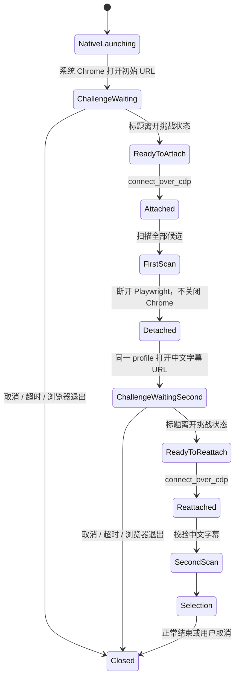

# MissAV Cloudflare 挑战拒绝活动 CDP 会话复盘

- 状态：已修复
- 复盘日期：2026-07-18
- 影响范围：MissAV 可视化爬取、双轮列表扫描、中文字幕筛选跳转

## 摘要

MissAV 的初始搜索页能够正常打开，但第一轮扫描结束后跳转到中文字幕筛选 URL 时，
Cloudflare 会间歇性返回“浏览器不支持”。更新浏览器、切换 Chrome/Edge、调整 UA、
移除通用 stealth、修改 `navigator.webdriver`、改用点击或脚本跳转，都不能稳定解决。

最终实验确认，本项目中决定性条件不是“有没有远程调试端口”，而是：

> Cloudflare 挑战加载和判定期间，浏览器是否存在活动的 Playwright/CDP 控制连接。

稳定方案是让系统 Chrome/Edge 使用同一个临时用户目录独立完成挑战；等待期间不建立
CDP WebSocket，只读取本机 `/json/list` 元数据判断标题和 URL。挑战清除后才连接
Playwright。进入第二轮中文字幕 URL 前再次断开 Playwright，复用同一浏览器进程和
用户目录打开新页，通过挑战后再接管。

该结论来自本项目在 2026-07-18 的对照实验，不应扩展解释为 Cloudflare 的内部实现。
Cloudflare 官方只公开说明：Playwright 等自动化框架、开发者工具、设备模拟和深度修改
浏览器环境都可能导致挑战失败或不受支持。

## 用户可见现象

稳定复现链路是：

1. 输入 `CAWD-377`。
2. 打开 `https://missav.ai/cn/search/CAWD-377`，初始页面通常正常。
3. 第一轮扫描结束，构造中文字幕筛选 URL：
   `https://missav.ai/cn/search/CAWD-377?filters=chinese-subtitle`。
4. 第二次导航触发 Cloudflare。
5. 页面不显示可完成人工验证的正常五秒盾，而是直接显示：
   “正在进行安全验证 / 浏览器不支持”。
6. 日志记录 `MISSAV_CLOUDFLARE_CH...`，随后扫描终止。

挑战并非每次都触发，因此单次成功不能作为修复证据。回归必须覆盖初始 URL 和第二个
筛选 URL，并重复执行或使用能稳定触发第二次挑战的输入。

## 影响

- MissAV 普通页面偶尔仍可扫描，导致问题容易被误判为已经修好。
- 中文字幕筛选是双轮扫描的关键步骤；第二次导航失败会让中文标签校验中断。
- 把“浏览器不支持”简单归因于浏览器版本，会诱导用户反复更新浏览器，却无法解决。
- 失败发生在真实 Chrome 窗口中，表面上看不像自动化环境问题，排查成本较高。

## 官方约束与项目实验要分开理解

Cloudflare 官方资料提供了排查边界：

- 稳定版 Chrome、Edge 等受支持，过旧、预发布、深度修改的浏览器环境支持受限。
- Playwright、Selenium、Puppeteer 等自动化框架可能被挑战识别并阻止。
- 修改 UA、Canvas、WebGL 等浏览器表面的扩展或工具可能干扰挑战。
- 一次挑战的请求与求解需要保持网络和会话一致，切换 IP 可能形成挑战循环。

参考：

- [Supported browsers](https://developers.cloudflare.com/cloudflare-challenges/reference/supported-browsers/)
- [How Challenges work](https://developers.cloudflare.com/cloudflare-challenges/concepts/how-challenges-work/)
- [Clearance](https://developers.cloudflare.com/cloudflare-challenges/concepts/clearance/)

这些资料说明“自动化环境可能失败”，但没有说明 MissAV 当前规则具体检查哪个信号。
“活动 CDP 连接是本项目关键触发条件”是对照实验结论，不是对 Cloudflare 私有规则的
逆向声明。

## 排查过程

### 第一阶段：先排除浏览器版本和明显伪装冲突

最初怀疑随包 Chromium 版本过旧，随后依次尝试：

- 系统稳定版 Chrome。
- 系统稳定版 Edge。
- Playwright 随包 Chromium。
- 原生 UA，不覆盖 `user_agent`。
- 不注入项目通用 `stealth.js`。
- 保留或移除 `--disable-blink-features=AutomationControlled`。
- `navigator.webdriver` 为 `true` 或 `false` 的不同环境。
- 原始 context、最小 context、项目本地化 context。

结果：这些改动可以减少互相矛盾的指纹，但都不能稳定消除第二次导航的“不支持”页。
因此“只换浏览器通道”与“只修 UA”不是完整答案。

### 第二阶段：排除导航方式和请求上下文

针对第二个筛选 URL，比较了：

- `page.goto()`。
- `window.location.assign()`。
- Playwright 真实点击页面链接。
- 有 Referer 与无 Referer。
- 复用页面与新建标签页。
- 代理访问与直连。

结果：挑战是否拒绝与导航 API 没有稳定相关性。把 `goto` 换成点击只改变了表面动作，
没有改变浏览器仍被 Playwright/CDP 控制这一事实。

### 第三阶段：分离浏览器进程与自动化客户端

进一步把系统 Chrome 作为独立进程启动：

- Chrome 使用临时 `user-data-dir`。
- 远程调试只绑定 `127.0.0.1`。
- 初始 URL 和筛选 URL 复用同一浏览器资料。

当 Playwright 仍在挑战期间通过 CDP 连接时，问题依旧存在。由此排除“只要是独立
Chrome 进程就能解决”的假设。

最后移除挑战期间的活动 CDP 客户端：

1. 独立启动系统 Chrome。
2. 不调用 `connect_over_cdp()`。
3. 仅通过本机 HTTP 元数据接口 `/json/list` 读取目标标题和 URL。
4. 标题离开挑战状态后，再建立 Playwright/CDP 连接。
5. 第二次导航前断开连接，在同一资料目录中打开筛选 URL。
6. 再次等待挑战清除，然后重新接管。

该组合稳定通过初始挑战和第二次筛选挑战，是实验矩阵中唯一解决实际问题的方案。

## 实验矩阵

| 方案 | 挑战期间存在活动 CDP | 结果 | 结论 |
| --- | --- | --- | --- |
| Playwright `page.goto()` | 是 | 仍可能“不支持” | 导航 API 不是根因 |
| `window.location.assign()` | 是 | 仍可能“不支持” | 页面脚本跳转无效 |
| Playwright 真实点击 | 是 | 仍可能“不支持” | 模拟用户动作无效 |
| 系统 Chrome / Edge 通道 | 是 | 仍可能“不支持” | 浏览器版本不是充分条件 |
| 随包 Chromium | 是 | 仍可能“不支持” | 换内核不能解决 |
| 原生 UA、无 stealth | 是 | 仍可能“不支持” | 指纹一致性必要但不充分 |
| `webdriver` true / false | 是 | 结果无决定性差异 | 单个表面属性不是根因 |
| 代理 / 直连 | 是 | 都能复现 | 不是单纯代理 IP 问题 |
| 独立系统 Chrome + Playwright 接管 | 是 | 仍可能“不支持” | 独立进程不是充分条件 |
| 独立系统 Chrome + 仅轮询 `/json/list` | 否 | 挑战可正常清除 | 不建立活动控制连接是关键 |
| 挑战清除后再 `connect_over_cdp()` | 清除后才连接 | 业务扫描正常 | 接管时机比接管方式更重要 |

## 根因

### 真实根因

旧实现让 Playwright 在以下整个阶段持续控制浏览器：

```text
初始导航
  -> 第一轮扫描
  -> 构造中文字幕 URL
  -> 第二次导航
  -> Cloudflare 挑战加载与判定
```

第二次导航触发挑战时，CDP 控制连接仍然活跃。对当前 MissAV/Cloudflare 组合而言，
这会使挑战判定当前浏览器环境不受支持。系统 Chrome 的版本、UA 和可见窗口都正常，
但“真实浏览器外观”不能消除活动自动化控制通道。

### 为什么初始页经常正常，第二次导航才失败

这不是两个 URL 使用了不同浏览器。更可能的运行事实是：

- Cloudflare 不会在每个请求都发出相同挑战。
- 初始搜索 URL 可能直接放行或只执行轻量检测。
- 筛选参数、访问节奏或前序行为可能使第二次请求进入更严格的挑战路径。
- 第二次挑战发生时，Playwright 已经完成第一轮扫描并保持活动控制连接。

因此“初始页能打开”只能证明浏览器可访问站点，不能证明后续挑战会接受该会话。

## 失败修法及其教训

### 只更新浏览器

系统稳定版浏览器是必要基线，但不是充分条件。错误信息中的“更新浏览器”是通用提示，
不能直接当作根因。

### 继续堆 stealth

通用 stealth 会修改 UA、Canvas、WebGL、语言或其他 Web API。Cloudflare 官方明确指出，
这些修改可能干扰挑战。更多伪装并不等于更接近真实浏览器，互相矛盾的特征反而扩大
检测面。

本项目 MissAV 挑战路径不得注入全局 `stealth.js`，也不得轮换与实际内核不一致的 UA。

### 只修改 `navigator.webdriver`

单个属性只是众多信号之一。实验中无论其值如何，只要挑战期间仍有活动 CDP 连接，
都不能稳定解决。

### 把 `goto` 换成点击

挑战看到的是完整浏览器环境和请求链路，不只是一条导航 API。Playwright 点击仍然发生
在活动自动化会话中。

### 不断刷新或重试挑战页

挑战是一次需要完成的正式状态转换。盲目刷新会重置或扰乱验证过程，增加挑战循环和
限流风险。等待逻辑必须观察可验证状态，并允许用户取消，不能用无限 reload 掩盖失败。

### 只启动独立 Chrome，但保持 CDP 连接

这是最接近正确答案、也最容易误判的方案。进程独立不代表挑战环境独立；只要
Playwright/CDP 仍连接着，决定性条件没有改变。

### 为每次导航新建资料目录

这样会丢失 Cookie、站点存储和已完成挑战的会话连续性。初始 URL 与筛选 URL 必须复用
同一个临时 profile；只断开控制连接，不重建浏览器身份。

## 最终方案

### 状态机



### 挑战等待阶段

`ExternalChromeChallengeSession.wait_for_ready_page()` 只做以下事情：

- 请求 `http://127.0.0.1:<port>/json/list`。
- 从 page target 中匹配目标 hostname、path 和查询参数。
- 根据标题识别“请稍候”“安全验证”“浏览器不支持”等挑战状态。
- 检查任务取消、超时和浏览器进程退出。

它不得：

- 连接 target 的 `webSocketDebuggerUrl`。
- 调用 Playwright。
- 注入脚本。
- 读取页面 DOM。
- 自动点击挑战控件。
- 刷新挑战页。

### 挑战清除后的接管

只有标题恢复为业务页面后，`attach()` 才：

1. 启动 `sync_playwright()`。
2. 调用 `connect_over_cdp()`。
3. 在现有 context/page 中按目标 URL 查找正确标签页。
4. 把 browser/context/page 绑定到 `_ChallengeBrowserRuntime`。

### 第二次导航

`_navigate_external_challenge()` 的顺序是不可交换的：

```text
disconnect Playwright/CDP
  -> same Chrome + same profile 打开筛选 URL
  -> metadata-only challenge wait
  -> attach Playwright/CDP
  -> second scan
```

任何“先打开 URL，再断开”的改动都会重新暴露挑战加载期间的活动控制连接。

## 资源所有权

| 资源 | 所有者 | 释放规则 |
| --- | --- | --- |
| 系统 Chrome/Edge 进程树 | `ExternalChromeChallengeSession` | 仅由 `close()` 终止 |
| 临时浏览器 profile | `ExternalChromeChallengeSession` | 进程结束后清理 |
| loopback 调试端口 | `ExternalChromeChallengeSession` | 随进程和会话结束失效 |
| Playwright 实例 | `_ChallengeBrowserRuntime` 的当前接管阶段 | 每次 detach 时停止 |
| CDP browser/context/page 句柄 | 当前接管阶段 | detach 时清空，不负责终止系统 Chrome |

对 `connect_over_cdp()` 返回的 browser 调用 `browser.close()` 可能关闭被接管浏览器，
破坏 profile 连续性。第二次挑战前必须停止 Playwright 连接并清空追踪句柄，而不是关闭
系统浏览器。最终退出时才由外部会话终止其启动的进程树。

## URL、身份和网络一致性

挑战前后必须保持：

- 同一个系统浏览器进程。
- 同一个临时用户目录。
- 同一个浏览器 profile。
- 同一个代理设置和出口网络。
- 浏览器原生 UA、Client Hints、platform 与原生 Web API。
- 同一组站点 Cookie 和存储。

不得在挑战中途：

- 从代理切到直连或反向切换。
- 把 Cookie 复制到另一个新 context 继续验证。
- 用 requests/curl 获取挑战，再让浏览器求解。
- 替换 UA、Client Hints、platform、语言、时区、屏幕/视口或 Canvas/WebGL 行为。

## 安全边界与残余风险

该路径为了让挑战在无活动 CDP 客户端的环境中运行，不能在页面创建前安装项目标准的
Playwright `BrowserContext` 公网守卫。它是一个有意收窄的例外，必须满足：

- 只接受 `_require_missav_page_url()` 验证过的 `missav.ai` 公网 URL。
- 初始 URL 和项目构造的筛选 URL 都要单独验证，不能把任意页面链接交给外部浏览器。
- 调试服务只绑定 `127.0.0.1`，不得绑定局域网或公网地址。
- `/json/list` 必须使用禁用系统代理的本地 opener，避免 loopback 请求被代理转发。
- 必须使用临时 profile，不能复用用户日常 Chrome 资料。
- profile 和浏览器进程必须在取消、异常与正常结束时统一回收。

远程调试端口本身没有认证，因此同一台机器上的其他进程理论上可能访问。当前通过随机
loopback 端口、短生命周期和独立 profile 降低风险，但这不是跨进程隔离。后续若扩大
该机制的使用范围，必须重新做威胁建模，不能把它泛化为任意站点浏览器服务。

与 [公网网络边界工程约束](../engineering/playwright-public-network-guard.md) 的关系：
普通 Playwright 路径继续使用共享公网守卫；只有这个需要“挑战时无 CDP 客户端”的
外部浏览器路径按上述更窄的 URL 白名单运行。

## 挑战状态误判

业务视频播放器也可能出现“browser not supported”文本。如果只在整页文本中搜索这一
短语，会把普通播放器兼容性提示误判为 Cloudflare 拒绝。

当前判定要求同时存在挑战证据：

- 挑战等待标记；或
- `Cloudflare`；或
- `Ray ID`。

只有“挑战证据 + unsupported 标记”才返回 `unsupported`。普通播放器警告保持
`clear`，避免错误中止已经通过挑战的业务页面。

## 回归结果

### 单元测试

挑战会话和浏览器编排测试覆盖：

- 启动参数保留系统浏览器原生指纹。
- 第二个 URL 复用同一 profile。
- 等待阶段只轮询元数据，不提前 attach。
- 任务取消能中断等待。
- attach 精确选择带筛选参数的目标标签页。
- 第二次导航严格按 `disconnect -> open -> ready -> attach` 执行。
- detach 不关闭系统 Chrome。
- 普通播放器“不支持”文本不会误判为 Cloudflare。

执行结果：

```text
挑战专项：15 passed
MissAV 单元组：44 passed, 155 deselected
Ruff：通过
py_compile：通过
git diff --check：通过
```

### 真实浏览器回归

辅助链路回归：

- 初始页约 29 个网格链接。
- 中文字幕筛选页约 25 个网格链接。
- `browser_unsupported = false`。
- 接管后的 `navigator.webdriver = false`。

完整 `MissAVSpider.run()` 回归使用用户配置、可见浏览器、Clash `7890`、最多 20 项、
扫描 1 页，并在资源选择阶段立即取消：

1. 初始目标进入 `?filters=individual`。
2. 检测并通过第一次挑战。
3. 接管系统 Chrome `150.0.7871.125`。
4. 第一轮扫描完成。
5. 断开 Playwright，进入 `?filters=individual%2Cchinese-subtitle`。
6. 检测并通过第二次挑战。
7. 重新接管同一 Chrome。
8. 第二轮扫描完成。
9. 2 个候选归并为 1 个最终结果。
10. 正常到达资源选择，用户取消，没有提交下载。

真实回归覆盖了原始故障点，不能被“只打开初始页”的烟雾测试替代。

## 后续守则

1. 挑战页加载时不得存在活动 Playwright/CDP 客户端。
2. 第二次可能触发挑战的导航必须先 detach，再打开 URL。
3. 初始页和筛选页必须复用同一个浏览器进程与 profile。
4. challenge wait 只允许轮询本机目标元数据，不允许读取 DOM 或执行脚本。
5. 不得重新引入全局 stealth、轮换 UA 或固定伪造指纹。
6. 不得用无限刷新、短周期重试或自动点击挑战控件掩盖失败。
7. fallback 直连 Playwright 只用于无系统浏览器或无头模式；它不承诺能通过 Cloudflare。
8. 挑战检测必须同时验证 Cloudflare 证据，不能按通用“不支持”短语误杀业务页。
9. 任何浏览器生命周期改动都要同时测试进程、profile、Playwright 和 CDP 句柄所有权。
10. 真实回归必须覆盖第二个筛选 URL，并记录是否真的进入第二轮扫描。

## 相关文档

- [MissAV Cloudflare 挑战会话工程约束](../engineering/missav-cloudflare-challenge-session.md)
- [MissAV / surrit HLS 403 与本地代理下载复盘](missav-surrit-hls-403-local-proxy.md)
- [公网网络边界工程约束](../engineering/playwright-public-network-guard.md)
- [测试体系](../guides/testing.md)

Cloudflare 挑战问题与 surrit HLS 403 是两个独立故障域：

- 本文解决入口页面挑战、浏览器环境和自动化接管时机。
- HLS 403 复盘解决媒体直链、TLS/HTTP 指纹、本地代理和下载器协作。

不能因为二者都发生在 MissAV 就复用同一个“补请求头”或“换浏览器”结论。
