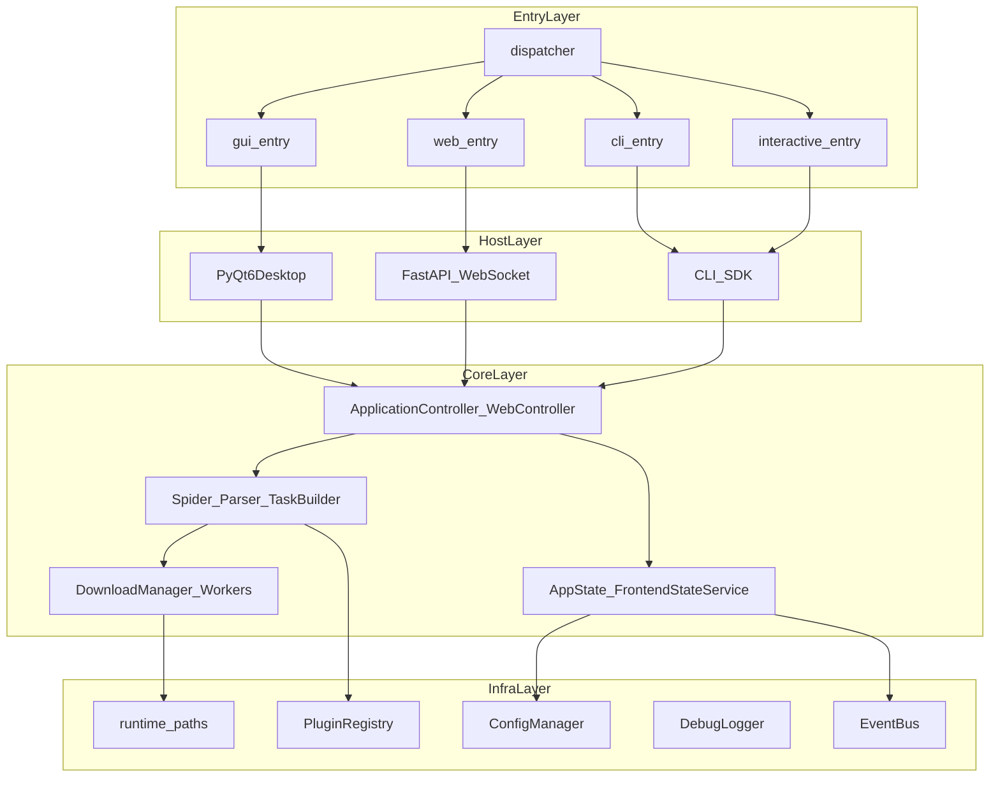
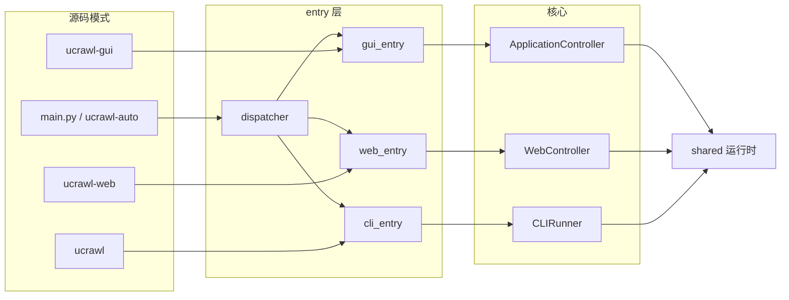
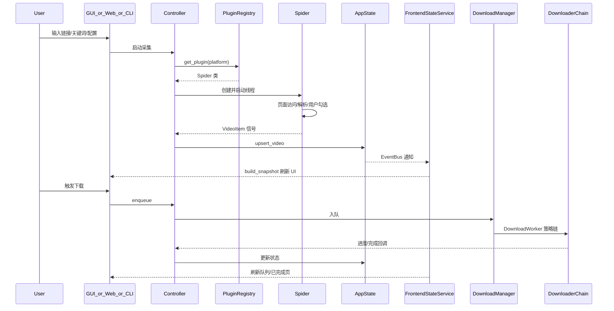

# Universal Crawler Pro — 架构审查

> 本文档对项目当前架构做**全景审查**：描述分层结构、多入口模型、核心数据流、交付形态与演进状态。  
> 开发向的分层说明见 [../guides/architecture.md](../guides/architecture.md)；图示索引见 [../../mermaid/README.md](../../mermaid/README.md)。

**审查日期**：2026-06-22  
**包名 / 版本**：`ucrawl` 1.0.0（[pyproject.toml](../../pyproject.toml)）

---

## 目录

1. [项目定位与技术栈](#1-项目定位与技术栈)
2. [总体架构鸟瞰](#2-总体架构鸟瞰)
3. [仓库目录与职责矩阵](#3-仓库目录与职责矩阵)
4. [多入口架构](#4-多入口架构)
5. [核心业务数据流](#5-核心业务数据流)
6. [关键设计模式与职责边界](#6-关键设计模式与职责边界)
7. [配置与运行时路径](#7-配置与运行时路径)
8. [交付与工程化架构](#8-交付与工程化架构)
9. [架构优势](#9-架构优势)
10. [已知演进点与风险](#10-已知演进点与风险)
11. [相关文档索引](#11-相关文档索引)

---

## 1. 项目定位与技术栈

### 1.1 产品定位

**Universal Crawler Pro** 是一款面向 **Windows 桌面环境** 的多平台媒体采集与下载工作站。它不是简单的脚本集合或套壳网页，而是围绕以下目标设计的完整应用：

- **可维护性**：平台逻辑与 UI、下载调度分层隔离
- **可扩展性**：插件化平台接入，Spider 三段式拆分
- **可调试性**：Trace ID 全链路、错误摘要、日志脱敏
- **可打包分发**：PyInstaller 便携版 + Inno Setup 安装包

同时提供 **Web UI**（FastAPI + 浏览器）远程操控，以及 **CLI / SDK** 供自动化与二次开发。

### 1.2 技术栈

| 层次 | 技术 |
|------|------|
| 语言 | Python ≥ 3.10 |
| 桌面 UI | PyQt6 |
| 浏览器自动化 | Playwright (Chromium) |
| Web 服务 | FastAPI + uvicorn + WebSocket |
| 外部工具 | ffmpeg、ffprobe、N_m3u8DL-RE、yt-dlp |
| Windows 打包 | PyInstaller + Inno Setup 6 |
| 容器化 | Docker（Web-only） |
| 测试 | unittest 风格 + pytest 执行器 + 分类注册表 |

### 1.3 已接入平台

通过 [app/core/plugins/definitions.py](../../app/core/plugins/definitions.py) 注册，各平台在 [app/spiders/](../../app/spiders/) 下独立实现：

| 平台 | 插件类 | Spider 目录 |
|------|--------|-------------|
| 抖音 | `DouyinPlugin` | `app/spiders/douyin/` |
| 哔哩哔哩 | `BilibiliPlugin` | `app/spiders/bilibili/` |
| 快手 | `KuaishouPlugin` | `app/spiders/kuaishou/` |
| MissAV | `MissAVPlugin` | `app/spiders/missav/` |
| 小红书 | `XiaohongshuPlugin` | `app/spiders/xiaohongshu/` |

每个平台尽量遵循 **spider.py / parser.py / task_builder.py** 三段式，将流程控制、数据解析、任务装配分离。

---

## 2. 总体架构鸟瞰

项目采用 **薄入口 → 宿主适配 → 共享编排 → 基础设施** 四层结构：



**核心原则**：

- `entry/` 只做路由与参数透传，不写业务逻辑
- `app/controllers/` 是桌面与 Web 的编排中枢
- `shared/` 承载跨宿主共享的爬虫会话、下载生命周期、CLI 运行时
- UI（PyQt6 / 静态 Web）不直接访问 Spider 或 Downloader，统一消费 `FrontendStateService` 快照

---

## 3. 仓库目录与职责矩阵

```
UniversalCrawlerProplus/
├── main.py                 # 开发态统一入口 → entry.run()
├── entry/                  # 薄入口层（dispatcher + 各 mode 适配器）
├── shared/                 # 跨 GUI/Web/CLI 共享运行时
├── app/                    # 应用核心
│   ├── controllers/        # 业务编排（Mixin 组合）
│   ├── spiders/            # 平台采集（五套三段式实现）
│   ├── core/               # 下载引擎、插件 SPI、事件总线
│   ├── services/           # 领域服务、前端状态、调试
│   ├── web/                # FastAPI + WebSocket + 静态前端
│   ├── ui/                 # PyQt6 桌面界面
│   ├── models/             # VideoItem、DownloadContext
│   ├── config/             # config.json 管理
│   ├── utils/              # 路径、文件名、Qt 辅助
│   └── exceptions/         # 分层异常类型
├── cli/                    # CLI 命令实现 + SDK 门面
├── ucrawl/                 # 向后兼容 re-export 层（→ cli）
├── packaging/              # Windows 打包发布
├── tests/                  # ~92 个测试文件 + 分类注册表
├── docs/                   # 专题文档
├── mermaid/                # 架构图示（10 个主题）
├── Dockerfile              # Web-only 容器
└── pyproject.toml          # 包元数据 + 7 个 console/gui scripts
```

### 各顶层包职责

| 路径 | 职责 |
|------|------|
| [main.py](../../main.py) | 开发态统一入口，插入 `sys.path` 后调用 `entry.run()` |
| [entry/](../../entry/) | 模式调度（dispatcher）与各宿主薄适配器 |
| [shared/](../../shared/) | `ControllerSessionMixin`、`SpiderSession`、`CLIRunner`、选择策略、命令运行时 |
| [app/controllers/](../../app/controllers/) | `ApplicationController`（8 个 Mixin 组合）、`WebController`、事件桥接 |
| [app/spiders/](../../app/spiders/) | 各平台 spider / parser / task_builder |
| [app/core/](../../app/core/) | `DownloadManager`、下载器策略链、插件注册表、`EventBus` |
| [app/services/](../../app/services/) | `AppState`、`FrontendStateService`、文件服务、调试、元数据探测 |
| [app/web/](../../app/web/) | FastAPI 路由、WebSocket 传输、会话运行时、`static/` 前端 |
| [app/ui/](../../app/ui/) | `MainWindow`、7 个功能页、组件、主题、对话框 |
| [app/models/](../../app/models/) | `VideoItem`（采集实体）、`DownloadContext`（下载元数据） |
| [app/config/](../../app/config/) | `ConfigManager` + 各平台 dataclass 配置段 |
| [cli/](../../cli/) + [ucrawl/](../../ucrawl/) | argparse 子命令、`UcrawlSDK`、选择策略、AI Skill 文档 |
| [packaging/](../../packaging/) | PyInstaller spec、Inno Setup、运行时 hook |
| [tests/](../../tests/) | 分类测试注册表、GUI/TUI/CLI 启动器、契约测试 |
| [docs/](../README.md) + [mermaid/](../../mermaid/) | 开发、测试、打包、API 等专题文档与图示 |

---

## 4. 多入口架构

### 4.1 安装脚本（pyproject.toml）

| 命令 | 类型 | 入口 | 用途 |
|------|------|------|------|
| `ucrawl` | console | `entry.cli_entry:main` | 单次 CLI 执行 |
| `ucrawl-i` | console | `entry.interactive_entry:main` | 交互式引导 |
| `ucrawl-web` | console | `entry.web_entry:main` | Web UI + 可选 Qt 托盘 |
| `ucrawl-auto` | console | `entry.dispatcher:run` | 自适应模式调度 |
| `ucrawl-test` | console | `entry.test_entry:main` | 测试套件启动器 |
| `ucrawl-gui` | gui-script | `entry.gui_entry:main` | 桌面 GUI（Windows 无黑窗） |
| `ucrawl-test-gui` | gui-script | `entry.test_entry:main` | 测试启动器 GUI 版 |

SDK 无独立 console script，通过 `from ucrawl import UcrawlSDK` 编程调用。

### 4.2 调度器行为（entry/dispatcher.py）

支持五种 `Mode`：`gui` / `web` / `cli` / `interactive` / `test`。

**优先级**：

1. `--mode` / `-m` 或环境变量 `UCRAWL_MODE`
2. 剥离调度器参数后，按 argv 特征启发式检测
3. 无参数时弹出 TUI 菜单（或 Qt 回退对话框）

**启发式规则摘要**：

| 特征 | 路由目标 |
|------|----------|
| `--port`、`--host`、`--script` 等 | Web |
| `--save-dir`、`--no-download`、`--pretty` | Interactive |
| `search` / `scan` / `download` / 平台别名 | CLI |
| TTY + PyQt6 可用 | GUI（默认） |
| 其它 | CLI |

### 4.3 各模式调用链



### 4.4 冻结分发与源码模式的分叉

Windows 打包产物（[packaging/portable.spec](../../packaging/portable.spec)）**不走 dispatcher**，而是双 EXE 直启：

| EXE | 入口 | AppUserModelID |
|-----|------|----------------|
| `UniversalCrawlerPro.exe` | `entry.gui_entry.main()` | `ucrawl.universalcrawlerpro.main` |
| `CrawlerWebPortal.exe` | `entry.web_entry.main()` | `ucrawl.universalcrawlerpro.web` |

CLI / 交互式 / 自适应调度仅适用于源码环境或 pip 安装后的 console scripts。`BUILD_INFO.txt` 与 [../guides/packaging.md](../guides/packaging.md) 已按此模型描述。

---

## 5. 核心业务数据流

### 5.1 端到端流程



### 5.2 分步说明

1. **用户输入** — 在 GUI 主窗口、Web 浏览器或 CLI 参数中提供平台、链接、Cookie 等配置。
2. **平台解析** — 控制器通过 `PluginRegistry` 查找对应 `Spider` 类，由 `SpiderSession`（[shared/spider_session_runtime.py](../../shared/spider_session_runtime.py)）管理生命周期。
3. **采集线程** — `BaseSpider` 在后台 daemon 线程运行 Playwright / HTTP 逻辑；通过 `CallbackSignal` 发射 `VideoItem`。
4. **跨线程桥接** — 桌面端经 `DomainEventBridge`（Qt `QueuedConnection`）回到 UI 线程；Web 端经 `WebSocketBridge` 推到浏览器会话。
5. **状态写入** — `AppState` 作为前端状态 SSOT，经 `EventBus` 发布变更；`FrontendEventAggregator` 做优先级节流。
6. **快照构建** — `FrontendStateService` 生成七页统一快照（队列 / 正在下载 / 已完成 / 失败 / 日志 / 配置 / 工具箱），GUI 与 Web 消费同一结构。
7. **下载调度** — `DownloadManager` 管理并发槽位与 `DownloadWorker` 线程；策略链依次尝试 M3U8 → 分块 → FFmpeg → HTTP。
8. **落盘与后处理** — 扩展名推断、签名修正、重名处理；`MediaLibraryService` 扫描本地库；`MediaMetadataService` 通过 `ffprobe` 探测时长/分辨率。

### 5.3 下载策略链

[app/core/downloaders/strategy.py](../../app/core/downloaders/strategy.py) 实现责任链模式，根据 `DownloadContext` 自动选择：

| 顺序 | 策略 | 典型场景 |
|------|------|----------|
| 1 | M3U8 / HLS | m3u8 流媒体（N_m3u8DL-RE / yt-dlp） |
| 2 | Chunked | 大文件分块 HTTP |
| 3 | FFmpeg | DASH 混流、转码 |
| 4 | HTTP 回退 | 普通直链下载 |

平台专属下载器（`bilibili.py`、`douyin.py` 等）在链外或链内按 `explicit_strategy` 分流。

---

## 6. 关键设计模式与职责边界

### 6.1 ApplicationController — Mixin 组合

[app/controllers/application_controller.py](../../app/controllers/application_controller.py) 通过 8 个 Mixin 拆分职责，避免单文件膨胀：

| Mixin | 职责 |
|-------|------|
| `ControllerHostMixin` | 宿主抽象访问 |
| `CrawlControllerMixin` | 爬虫启停、信号绑定 |
| `DownloadControllerMixin` | 入队、回调、停止 |
| `DebugControllerMixin` | 调试产物操作 |
| `ApplicationLifecycleMixin` | 启动/关闭生命周期 |
| `MediaHostControllerMixin` | 播放/预览协调 |
| `ControllerSessionMixin`（shared） | 下载会话、视频状态 |
| `MediaLibraryMixin` | 本地媒体扫描管理 |

`DesktopHostAdapter` 将 `MainWindow` 副作用隔离为宿主适配器。

### 6.2 插件 SPI

[app/core/plugins/](../../app/core/plugins/) 提供：

- `BasePlugin` 基类与自动发现（`discovery.py`）
- `definitions.py` 内置五平台定义
- `settings_builders.py` 生成各平台配置 UI
- `registry.py` 线程安全注册表

新增平台路径：实现 Plugin + Spider 三段式 + 下载器，无需修改主界面硬编码分支。

### 6.3 前端快照契约

[app/services/frontend_state_service.py](../../app/services/frontend_state_service.py) 明确定义七页 `PAGE_DEFINITIONS`，是 GUI 与 Web 的**传输无关**状态适配层。UI 组件与 `app/web/static/app.js` 均应通过快照 API 渲染，而非直接读 Spider 内部状态。

### 6.4 shared/ 跨宿主层

[shared/](../../shared/) 当前包含 13 个模块，核心职责：

| 模块 | 用途 |
|:----:|:----:|
| `controller_session.py` | 控制器下载/视频状态 Mixin |
| `spider_session_runtime.py` | Spider 创建、绑定、启停 |
| `cli_runner_runtime.py` | 无窗口 CLI 编排 |
| `sdk_runtime.py` | `UcrawlSDK` 编程接口 |
| `selection_runtime.py` | 选择策略协议与工厂 |
| `*_command_runtime.py` | search/download/interactive 命令共享逻辑 |
| `runtime_options.py` | 运行时配置合成 |
| `runtime_adapters.py` | Web 等宿主调用的薄门面 |

### 6.5 线程与信号边界

| 组件 | 线程模型 | 回到主线程方式 |
|:----:|:--------:|:--------------:|
| `BaseSpider` | daemon 后台线程 | `CallbackSignal` → `DomainEventBridge`（GUI） |
| `DownloadWorker` | 工作线程池 | 回调 → 控制器 → `EventBus` |
| WebSocket 推送 | asyncio 事件循环 | `WebSocketBridge` 异步 emit |
| CLI | 同步主线程 | 直接调用，无 Qt 依赖 |

### 6.6 测试职责边界（与 ../guides/architecture.md 一致）

| 层 | 推荐测试方式 |
|:--:|:------------:|
| `parser` / `task_builder` | 纯单元测试 |
| `ApplicationController` | 半集成，mock UI 与下载器 |
| `DownloadWorker` | 路径、扩展名、签名逻辑单元测试 |
| `Spider` 主流程 | mock Playwright page，验证分支与信号 |
| 多入口契约 | CLI / SDK / REST API 输出结构一致性 |

---

## 7. 配置与运行时路径

### 7.1 配置体系

[app/config/settings.py](../../app/config/settings.py) 使用 dataclass 分段聚合为 `AppSettings`，由 `ConfigManager` 线程安全读写 `config.json`：

- 支持类型强制、范围校验、损坏备份恢复
- 平台默认值与 GUI 设置面板通过 `settings_builders.py` 对齐
- 全局单例 `cfg` 供各层访问

### 7.2 路径解析（runtime_paths.py）

[app/utils/runtime_paths.py](../../app/utils/runtime_paths.py) 是开发态 / 打包态 / 容器态的**唯一口径**：

| 场景 | 用户数据 | 下载目录 | 工具搜索 |
|:----:|:--------:|:--------:|:--------:|
| 源码开发 | `<project>/user_data/` | `~/Downloads/UniversalCrawlerPro` 或 env | 项目根目录 |
| 冻结 EXE | `%LOCALAPPDATA%/UniversalCrawlerPro` | 同上 | EXE 同级 + `_MEIPASS` |
| Docker | `UCRAWL_USER_DATA_ROOT` | `UCRAWL_DOWNLOAD_ROOT` | `UCRAWL_TOOL_ROOT`（默认 `/app/tools`） |

环境变量覆盖：`UCRAWL_USER_DATA_ROOT`、`UCRAWL_DOWNLOAD_ROOT`、`UCRAWL_TOOL_ROOT`。

### 7.3 外部工具

通过 `resolve_tool_file()` 按序搜索：env 工具根 → `install_root()` → `resource_root()`。

| 工具 | 用途 | 打包随带 |
|:----:|:----:|:--------:|
| `ffmpeg.exe` | 混流、转码 | 是 |
| `ffprobe.exe` | 媒体元数据探测 | 是 |
| `N_m3u8DL-RE.exe` | HLS 下载 | 是 |
| Playwright Chromium | 浏览器自动化 | 是（`ms-playwright/`） |
| yt-dlp | Python 包依赖 | 随 PyInstaller 打包 |

用户态文件（`config.json`、`*_auth.json`）**禁止**打入发布包。

---

## 8. 交付与工程化架构

### 8.1 Windows 打包

```
pyproject.toml (version)
    → packaging/project_meta.py
    → build_portable.py (PyInstaller)
    → dist/UniversalCrawlerPro/
    → build_installer.py (Inno Setup)
    → dist/installer/UniversalCrawlerPro_Setup_<version>.exe
```

- 元数据、AppUserModelID、版本注入均有脚本自动化
- `packaging/runtime_hook.py` 修正冻结运行时（Playwright 路径、stdout、任务栏 ID）
- `tests/test_packaging.py` 提供静态契约验证（不实际跑 PyInstaller）

### 8.2 容器化（Web-only）

- [Dockerfile](../../Dockerfile) + [docker-compose.yml](../../docker-compose.yml)
- 使用 [requirements-web.txt](../../requirements-web.txt)（无 PyQt6）
- 入口：`python -m entry.web_entry`，健康检查 `GET /api/ping`
- 卷映射：`user_data`、`downloads`、`tools`

### 8.3 CI（GitHub Actions）

| Workflow | 触发 | 内容 |
|----------|------|------|
| `python-tests.yml` | push/PR | Ubuntu + Python 3.13，`compileall` + `unittest discover` |
| `docker-build.yml` | Docker 相关路径 | `docker compose config` + `docker build` |

当前 CI **未**运行分类测试启动器、pytest、lint 或 Windows 构建。

### 8.4 测试基础设施

[tests/test_registry.py](../../tests/test_registry.py) 维护 11 个内置分类：

| ID | 说明 | 优先级 |
|----|------|--------|
| `all` | 全量 | 0 |
| `cli_sdk` | CLI / SDK / Runner | 10 |
| `web_api` | FastAPI / WebSocket / 契约 | 20 |
| `app_flows` | 端到端 / 入口调度 | 30 |
| `desktop_ui` | Qt 主窗口 / 对话框 | 40 |
| `browser_e2e` | Playwright 浏览器回归 | 50 |
| `pipeline` | stdin/stdout JSON 管道 | 60 |
| `packaging` | spec / hook / 发布完整性 | 70 |
| `core_services` | 下载器 / 服务 / Mixin | 80 |
| `suite_infra` | 测试套件自身 | 90 |
| `misc` | 未归类新测试 | 999 |

运行栈：`entry/test_entry.py` → `tests/test_launcher.py`（GUI/TUI/CLI）→ `tests/test_runner.py`（pytest 封装）→ 注册表解析文件列表。

约 **92** 个 `test_*.py` 文件，测试主体为 `unittest.TestCase` 风格，由 pytest 统一执行。

### 8.5 调试体系

- [app/debug_logger.py](../../app/debug_logger.py)：结构化日志、Trace ID、敏感信息脱敏
- [app/services/debug_service.py](../../app/services/debug_service.py)：错误摘要 Markdown、日志路径
- UI 内置：最新日志、错误摘要、复制 Trace 入口
- 事故复盘：[docs/postmortems/](../postmortems/)

---

## 9. 架构优势

审查结论：该项目在「个人 / 小团队桌面 Python 应用」范畴内，架构成熟度处于**中上水平**。

1. **分层清晰** — entry / shared / app / cli 边界明确，平台接入有文档化最小路径（[docs/guides/development.md](../guides/development.md)）。
2. **多入口统一核心** — GUI、Web、CLI、SDK 共享 `DownloadManager`、插件注册表与前端快照契约，避免多套业务逻辑分叉。
3. **可测试性有意识设计** — Spider 三段式、策略链、契约测试、打包静态验证，形成多层保护网。
4. **可观测性完整** — Trace ID、错误摘要、日志脱敏，适合生产排障与日志分享。
5. **交付链路闭环** — 便携版 + 安装包 + Docker Web + 文档联动矩阵，版本从 `pyproject.toml` 单源同步。
6. **插件化扩展** — 新平台不必修改 `ApplicationController` 主流程，符合开闭原则。

---

## 10. 已知演进点与风险

### 10.1 代码收敛进行中

| 现象 | 说明 |
|------|------|
| `shared/controller_session` vs `app/controllers/session_mixin` | Web 侧仍使用 app 副本，桌面已迁 shared |
| `cli/runner.py` vs `shared/cli_runner_runtime.py` | 双 `CLIRunner` 并存，SDK 需感知实际激活版本 |
| `app/web/server.py` 直接引 `cli.runner` | `shared/runtime_adapters.run_cli_search` 尚未全面替换 |

**影响**：功能正常，但重构时需注意导入路径与行为一致性。

### 10.2 工程化漂移

| 现象 | 说明 |
|------|------|
| CI 用 `unittest discover` | 本地推荐 `pytest` + 分类启动器，覆盖范围不一致 |
| CI 仅 Ubuntu | GUI / PyQt6 / Windows 打包无自动化验证 |
| 无 lint / typecheck 门禁 | `requirements-dev.txt` 列出 ruff/mypy 但未接入 CI |
| Python 版本分散 | pyproject ≥3.10，Docker 3.12，CI 3.13 |

### 10.3 平台与交付边界

- **主战场 Windows**：无 Linux/macOS 原生安装包；Docker 仅覆盖 Web。
- **真实站点依赖 Playwright**：测试以 mock 为主，站点变更需人工回归。
- **高风险区域**（[../guides/architecture.md](../guides/architecture.md)）：浏览器事件监听、扩展名修正、多阶段用户选择、登录降级路径。

### 10.4 建议关注顺序（供维护者参考）

1. 完成 `shared/` 与 Web session 的收敛，消除双份 Mixin
2. 对齐 CI 与本地测试入口（pytest + 轻量分类子集）
3. 接入 ruff 作为低成本静态门禁
4. 关键平台 Spider 流程保持半集成测试覆盖

---

## 11. 相关文档索引

### 架构与开发

| 文档 | 内容 |
|------|------|
| [../guides/architecture.md](../guides/architecture.md) | 分层职责、数据流、测试边界 |
| [docs/guides/development.md](../guides/development.md) | 新代码放置、平台接入最小路径 |
| [docs/guides/api.md](../guides/api.md) | 内部接口说明 |
| [../guides/config.md](../guides/config.md) | config.json 字段参考 |

### 测试与质量

| 文档 | 内容 |
|------|------|
| [../guides/testing.md](../guides/testing.md) | 测试策略、注册表、启动器 |
| [tests/README.md](../../tests/README.md) | 测试目录说明 |
| [tests/NAMING.md](../../tests/NAMING.md) | 测试文件命名与自动分类规则 |

### 交付与运维

| 文档 | 内容 |
|------|------|
| [../guides/packaging.md](../guides/packaging.md) | 发布流程、验收清单 |
| [packaging/README.md](../../packaging/README.md) | 打包目录职责 |
| [docs/guides/containerization.md](../guides/containerization.md) | Docker 部署 |
| [docs/guides/windows-file-association.md](../guides/windows-file-association.md) | 文件关联 |

### CLI / SDK

| 文档 | 内容 |
|------|------|
| [docs/cli/cli-guide.md](../cli/cli-guide.md) | 命令行指南 |
| [docs/cli/python-sdk-guide.md](../cli/python-sdk-guide.md) | SDK 编程接口 |
| [docs/cli/rest-api-reference.md](../cli/rest-api-reference.md) | REST API 参考 |
| [docs/SKILL_GUIDE.md](../guides/ai-skill-guide.md) | AI Skill 集成 |

### 图示（Mermaid）

| 文件 | 主题 |
|------|------|
| [mermaid/01-system-overview.md](../../mermaid/01-system-overview.md) | 系统总览 |
| [mermaid/02-entrypoints-and-hosts.md](../../mermaid/02-entrypoints-and-hosts.md) | 多入口与宿主 |
| [mermaid/03-controller-and-events.md](../../mermaid/03-controller-and-events.md) | 控制器与事件 |
| [mermaid/04-plugin-and-spider-pipeline.md](../../mermaid/04-plugin-and-spider-pipeline.md) | 插件与爬虫管线 |
| [mermaid/05-download-pipeline.md](../../mermaid/05-download-pipeline.md) | 下载管线 |
| [mermaid/06-web-runtime.md](../../mermaid/06-web-runtime.md) | Web 运行时 |
| [mermaid/07-cli-sdk-runtime.md](../../mermaid/07-cli-sdk-runtime.md) | CLI/SDK 运行时 |
| [mermaid/08-data-models-and-context.md](../../mermaid/08-data-models-and-context.md) | 数据模型 |
| [mermaid/09-testing-and-quality.md](../../mermaid/09-testing-and-quality.md) | 测试体系 |
| [mermaid/10-packaging-and-delivery.md](../../mermaid/10-packaging-and-delivery.md) | 打包与交付 |

---

*本文档随仓库架构演进更新；结构调整时请同步修订本节与 [../guides/architecture.md](../guides/architecture.md)。*

