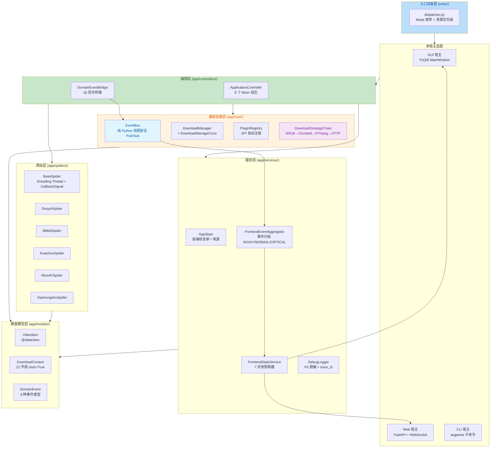
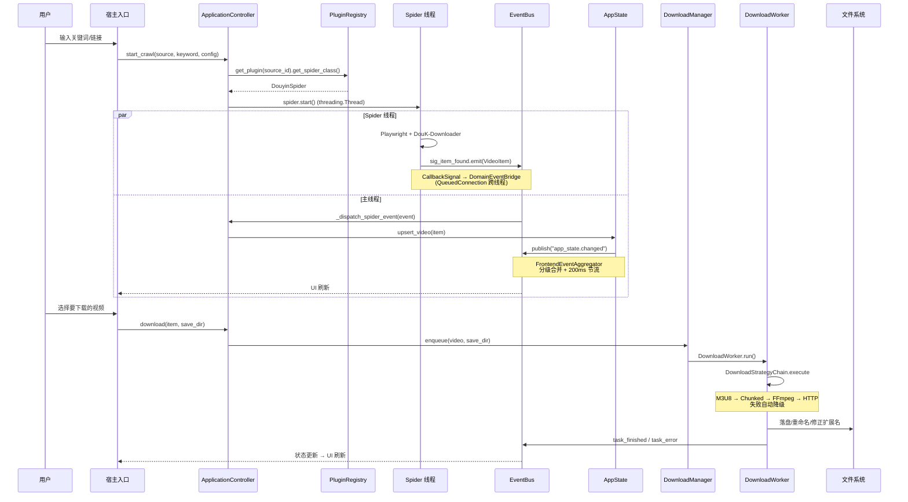
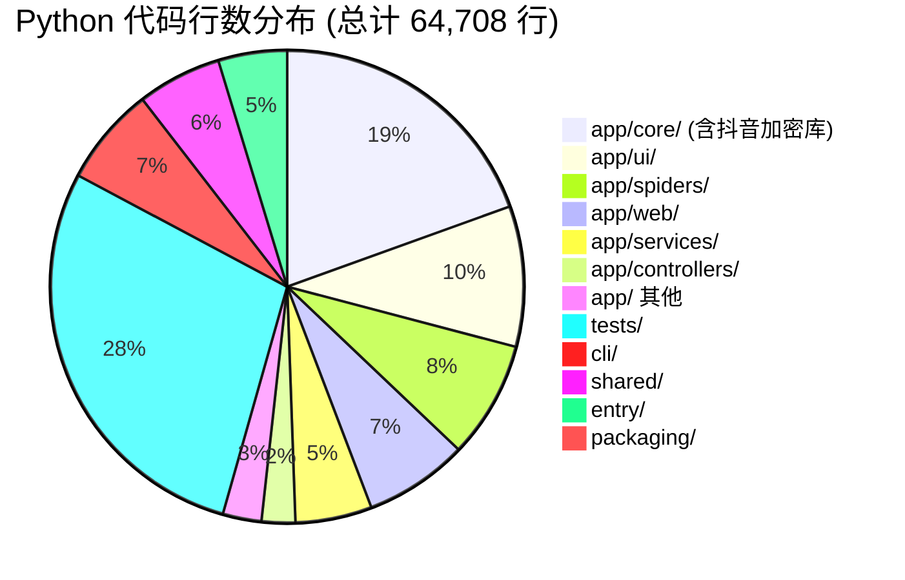

# 01 系统总览

## 项目全景（基于实际代码分析）

```mermaid
flowchart TB
    subgraph Entry["入口派发层 (entry/)"]
        Dispatcher["dispatcher.py<br/>Mode 枚举 + 多源优先级"]
    end

    subgraph Hosts["多宿主适配"]
        GUI["GUI 宿主<br/>PyQt6 MainWindow"]
        WEB["Web 宿主<br/>FastAPI + WebSocket"]
        CLI["CLI 宿主<br/>argparse 子命令"]
    end

    subgraph Controller["编排层 (app/controllers/)"]
        AppCtrl["ApplicationController<br/>8 个 Mixin 组合"]
        EventBridge["DomainEventBridge<br/>Qt 信号桥接"]
    end

    subgraph Core["基础设施层 (app/core/)"]
        EventBus["EventBus<br/>纯 Python 线程安全 Pub/Sub"]
        DLMgr["DownloadManager<br/>+ DownloadManagerCore"]
        PluginReg["PluginRegistry<br/>SPI 自动注册"]
        Strategy["DownloadStrategyChain<br/>M3U8→Chunked→FFmpeg→HTTP"]
    end

    subgraph Spiders["爬虫层 (app/spiders/)"]
        BaseSpider["BaseSpider<br/>threading.Thread + CallbackSignal"]
        Douyin["DouyinSpider"]
        Bilibili["BilibiliSpider"]
        Kuaishou["KuaishouSpider"]
        MissAV["MissAVSpider"]
        XHS["XiaohongshuSpider"]
    end

    subgraph Services["服务层 (app/services/)"]
        AppState["AppState<br/>前端状态单一来源"]
        FrontendSvc["FrontendStateService<br/>7 页快照构建"]
        Aggregator["FrontendEventAggregator<br/>事件分级 NOISY/NORMAL/CRITICAL"]
        DebugLogger["DebugLogger<br/>PII 脱敏 + trace_id"]
    end

    subgraph Models["数据模型层 (app/models/)"]
        VideoItem["VideoItem<br/>@dataclass"]
        DlContext["DownloadContext<br/>22 字段 slots=True"]
        DomainEvent["DomainEvent<br/>8 种事件类型"]
    end

    Entry --> Hosts
    Hosts --> Controller
    Controller --> Core
    Controller --> Spiders
    Controller --> Services
    Core --> Models
    Spiders --> Models
    Services --> Models
    EventBridge --> EventBus
    EventBus --> Aggregator
    Aggregator --> FrontendSvc
    FrontendSvc --> GUI
    FrontendSvc --> WEB

    style Entry fill:#bbdefb,color:#0d47a1
    style Controller fill:#c8e6c9,color:#1a5e20
    style Core fill:#fff3e0,color:#e65100
    style Strategy fill:#f3e5f5,color:#7b1fa2
    style EventBus fill:#e1f5fe,color:#01579b
```

## 核心数据流（用户搜索到下载完成）

```mermaid
sequenceDiagram
    participant U as 用户
    participant H as 宿主入口
    participant C as ApplicationController
    participant P as PluginRegistry
    participant S as Spider 线程
    participant EB as EventBus
    participant AS as AppState
    participant DM as DownloadManager
    participant DW as DownloadWorker
    participant F as 文件系统

    U->>H: 输入关键词/链接
    H->>C: start_crawl(source, keyword, config)
    C->>P: get_plugin(source_id).get_spider_class()
    P-->>C: DouyinSpider
    C->>S: spider.start() (threading.Thread)
    
    par Spider 线程
        S->>S: Playwright + DouK-Downloader
        S->>EB: sig_item_found.emit(VideoItem)
        Note over S,EB: CallbackSignal → DomainEventBridge<br/>(QueuedConnection 跨线程)
    and 主线程
        EB->>C: _dispatch_spider_event(event)
        C->>AS: upsert_video(item)
        AS->>EB: publish("app_state.changed")
        Note over AS,EB: FrontendEventAggregator<br/>分级合并 + 200ms 节流
        EB-->>H: UI 刷新
    end

    U->>H: 选择要下载的视频
    H->>C: download(item, save_dir)
    C->>DM: enqueue(video, save_dir)
    DM->>DW: DownloadWorker.run()
    DW->>DW: DownloadStrategyChain.execute
    Note over DW: M3U8 → Chunked → FFmpeg → HTTP<br/>失败自动降级
    DW->>F: 落盘/重命名/修正扩展名
    DW->>EB: task_finished / task_error
    EB-->>H: 状态更新 → UI 刷新
```

## 代码量分布（实际统计）

```mermaid
pie title Python 代码行数分布 (总计 64,708 行)
    "app/core/ (含抖音加密库)" : 12508
    "app/ui/" : 6173
    "app/spiders/" : 5137
    "app/web/" : 4559
    "app/services/" : 3358
    "app/controllers/" : 1475
    "app/ 其他" : 1697
    "tests/" : 18235
    "cli/" : 4331
    "shared/" : 3697
    "entry/" : 3015
    "packaging/" : 454
```
