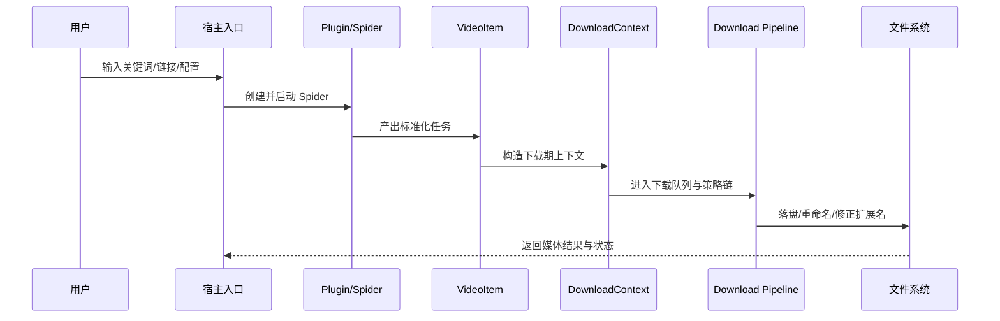

# 01 系统总览

## 项目全景

```mermaid
flowchart LR
    User[用户] --> Entry[entry/* 多入口]
    Entry --> Host[GUI / Web / CLI / SDK]
    Host --> Controller[ApplicationController / WebController / CLIRunner]
    Controller --> Plugin[PluginRegistry]
    Plugin --> Spider[Spider / Parser / TaskBuilder]
    Spider --> Video[VideoItem]
    Video --> Context[DownloadContext]
    Context --> DCore[DownloadManagerCore]
    DCore --> DMgr[DownloadManager]
    DMgr --> Worker[DownloadWorker]
    Worker --> Strategy[DownloadStrategyChain]
    Strategy --> Downloader[Platform Downloader]
    Strategy --> Tool[ffmpeg / N_m3u8DL-RE]
    Downloader --> FileIO[FileOpPolicy / Local File IO]
    FileIO --> Library[MediaLibraryService]
    Controller --> Events[Domain Events / Event Bridge]
    Events --> UI[GUI / WebSocket / CLI 输出]

    style Entry fill:#bbdefb,color:#0d47a1
    style Controller fill:#c8e6c9,color:#1a5e20
    style Context fill:#fff3e0,color:#e65100
    style Strategy fill:#f3e5f5,color:#7b1fa2
    style Events fill:#e1f5fe,color:#01579b
```

## 核心数据流

```mermaid
sequenceDiagram
    participant U as 用户
    participant H as 宿主入口
    participant P as Plugin/Spider
    participant V as VideoItem
    participant C as DownloadContext
    participant D as Download Pipeline
    participant F as 文件系统

    U->>H: 输入关键词/链接/配置
    H->>P: 创建并启动 Spider
    P->>V: 产出标准化任务
    V->>C: 构造下载期上下文
    C->>D: 进入下载队列与策略链
    D->>F: 落盘/重命名/修正扩展名
    F-->>H: 返回媒体结果与状态
```
