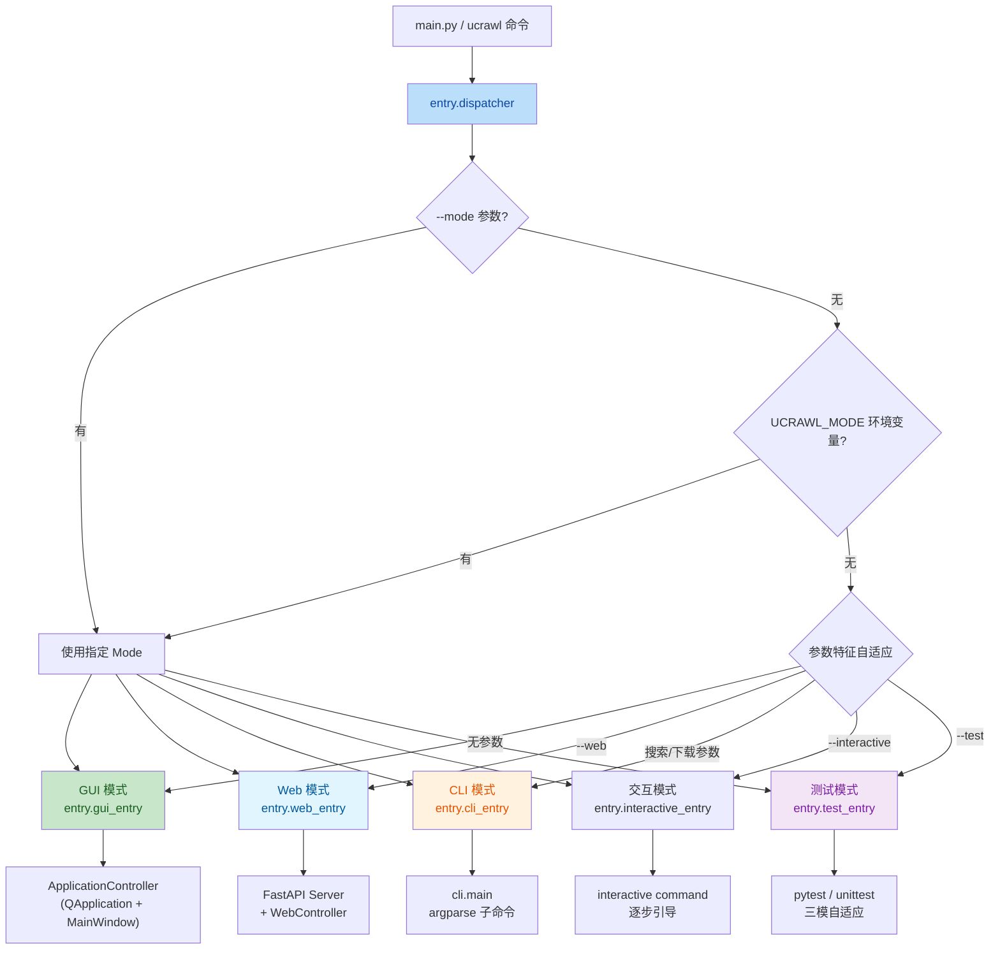
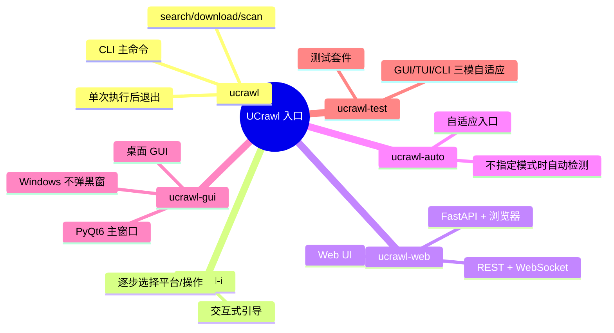
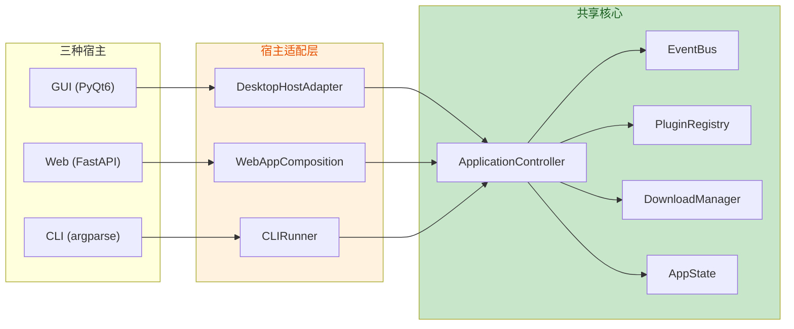
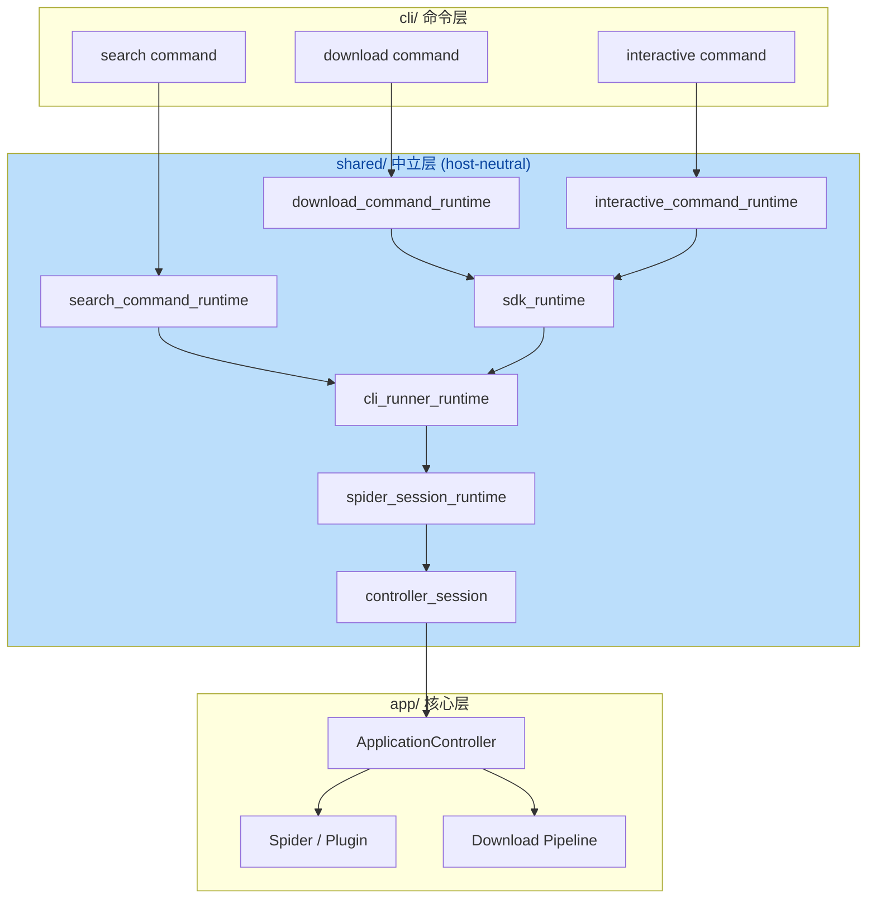

# 02 多入口与宿主模式

## 入口路由（dispatcher 多源优先级）

```mermaid
flowchart TB
    Main["main.py / ucrawl 命令"] --> Disp["entry.dispatcher"]
    
    Disp --> P1{"--mode 参数?"}
    P1 -->|有| Use["使用指定 Mode"]
    P1 -->|无| P2{"UCRAWL_MODE 环境变量?"}
    P2 -->|有| Use
    P2 -->|无| P3{"参数特征自适应"}
    P3 -->|无参数| GUI["GUI 模式<br/>entry.gui_entry"]
    P3 -->|--web| WEB["Web 模式<br/>entry.web_entry"]
    P3 -->|搜索/下载参数| CLI["CLI 模式<br/>entry.cli_entry"]
    P3 -->|--interactive| ICLI["交互模式<br/>entry.interactive_entry"]
    P3 -->|--test| TEST["测试模式<br/>entry.test_entry"]

    Use --> GUI
    Use --> WEB
    Use --> CLI
    Use --> ICLI
    Use --> TEST

    GUI --> AppCtrl["ApplicationController<br/>(QApplication + MainWindow)"]
    WEB --> FastAPI["FastAPI Server<br/>+ WebController"]
    CLI --> CLIMain["cli.main<br/>argparse 子命令"]
    ICLI --> Interactive["interactive command<br/>逐步引导"]
    TEST --> Pytest["pytest / unittest<br/>三模自适应"]

    style Disp fill:#bbdefb,color:#0d47a1
    style GUI fill:#c8e6c9,color:#1a5e20
    style WEB fill:#e1f5fe,color:#01579b
    style CLI fill:#fff3e0,color:#e65100
    style TEST fill:#f3e5f5,color:#7b1fa2
```

## 六种入口模式（pyproject.scripts）

```mermaid
mindmap
  root((UCrawl 入口))
    ucrawl
      CLI 主命令
      单次执行后退出
      search/download/scan
    ucrawl-i
      交互式引导
      逐步选择平台/操作
    ucrawl-web
      Web UI
      FastAPI + 浏览器
      REST + WebSocket
    ucrawl-auto
      自适应入口
      不指定模式时自动检测
    ucrawl-gui
      桌面 GUI
      PyQt6 主窗口
      Windows 不弹黑窗
    ucrawl-test
      测试套件
      GUI/TUI/CLI 三模自适应
```

## 宿主共享核心逻辑

```mermaid
flowchart LR
    subgraph Hosts["三种宿主"]
        GUI["GUI (PyQt6)"]
        WEB["Web (FastAPI)"]
        CLI["CLI (argparse)"]
    end

    subgraph Shared["共享核心"]
        AppCtrl["ApplicationController"]
        EventBus["EventBus"]
        PluginReg["PluginRegistry"]
        DLMgr["DownloadManager"]
        AppState["AppState"]
    end

    subgraph Adapters["宿主适配层"]
        Desktop["DesktopHostAdapter"]
        WebComp["WebAppComposition"]
        CLIRunner["CLIRunner"]
    end

    GUI --> Desktop --> AppCtrl
    WEB --> WebComp --> AppCtrl
    CLI --> CLIRunner --> AppCtrl

    AppCtrl --> EventBus
    AppCtrl --> PluginReg
    AppCtrl --> DLMgr
    AppCtrl --> AppState

    style Shared fill:#c8e6c9,color:#1a5e20
    style Adapters fill:#fff3e0,color:#e65100
```

## shared/ 中立桥接层

```mermaid
flowchart TB
    subgraph CLI["cli/ 命令层"]
        CmdSearch["search command"]
        CmdDownload["download command"]
        CmdInteractive["interactive command"]
    end

    subgraph Shared["shared/ 中立层 (host-neutral)"]
        SearchRt["search_command_runtime"]
        DownloadRt["download_command_runtime"]
        InteractiveRt["interactive_command_runtime"]
        SDKRt["sdk_runtime"]
        CLIRunnerRt["cli_runner_runtime"]
        SpiderSession["spider_session_runtime"]
        ControllerSession["controller_session"]
    end

    subgraph App["app/ 核心层"]
        AppCtrl["ApplicationController"]
        Spider["Spider / Plugin"]
        Download["Download Pipeline"]
    end

    CmdSearch --> SearchRt
    CmdDownload --> DownloadRt
    CmdInteractive --> InteractiveRt

    SearchRt --> CLIRunnerRt
    DownloadRt --> SDKRt
    InteractiveRt --> SDKRt
    SDKRt --> CLIRunnerRt
    CLIRunnerRt --> SpiderSession
    SpiderSession --> ControllerSession
    ControllerSession --> AppCtrl

    AppCtrl --> Spider
    AppCtrl --> Download

    style Shared fill:#bbdefb,color:#0d47a1
```
