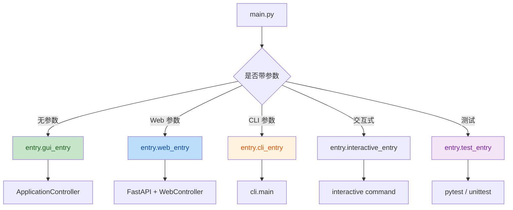
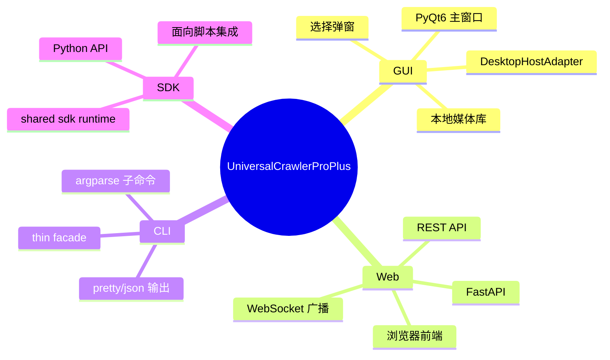

# 02 多入口与宿主模式

## 入口路由

```mermaid
flowchart TB
    Main[main.py] --> Decide{是否带参数}
    Decide -->|无参数| GUI[entry.gui_entry]
    Decide -->|Web 参数| WEB[entry.web_entry]
    Decide -->|CLI 参数| CLI[entry.cli_entry]
    Decide -->|交互式| ICLI[entry.interactive_entry]
    Decide -->|测试| TEST[entry.test_entry]

    GUI --> AppCtrl[ApplicationController]
    WEB --> FastAPI[FastAPI + WebController]
    CLI --> CLIMain[cli.main]
    ICLI --> CmdInteractive[interactive command]
    TEST --> Pytest[pytest / unittest]

    style GUI fill:#c8e6c9,color:#1a5e20
    style WEB fill:#bbdefb,color:#0d47a1
    style CLI fill:#fff3e0,color:#e65100
    style TEST fill:#f3e5f5,color:#7b1fa2
```

## 宿主运行模式

```mermaid
mindmap
  root((UniversalCrawlerProPlus))
    GUI
      PyQt6 主窗口
      DesktopHostAdapter
      本地媒体库
      选择弹窗
    Web
      FastAPI
      REST API
      WebSocket 广播
      浏览器前端
    CLI
      argparse 子命令
      pretty/json 输出
      thin facade
    SDK
      Python API
      shared sdk runtime
      面向脚本集成
```
