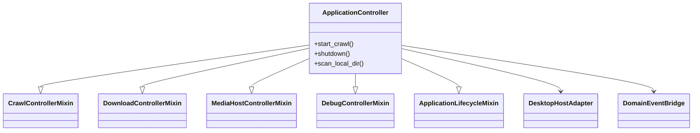
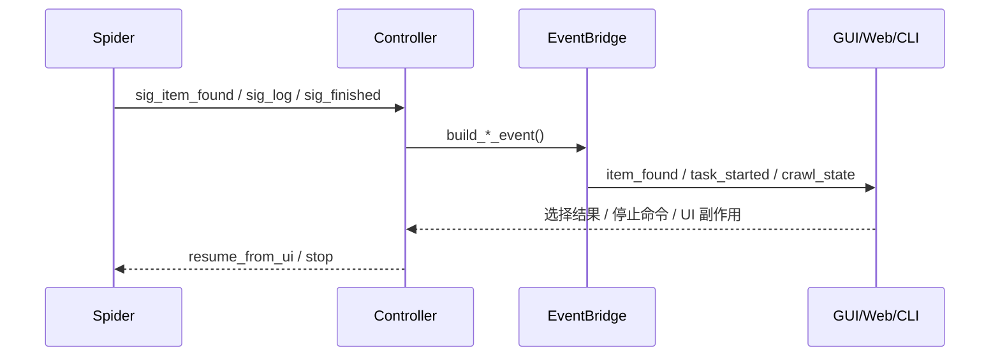

# 03 控制器与事件桥

## 控制器组合根

```mermaid
classDiagram
    class ApplicationController {
      +start_crawl()
      +shutdown()
      +scan_local_dir()
    }
    class CrawlControllerMixin
    class DownloadControllerMixin
    class MediaHostControllerMixin
    class DebugControllerMixin
    class ApplicationLifecycleMixin
    class DesktopHostAdapter
    class DomainEventBridge

    ApplicationController --|> CrawlControllerMixin
    ApplicationController --|> DownloadControllerMixin
    ApplicationController --|> MediaHostControllerMixin
    ApplicationController --|> DebugControllerMixin
    ApplicationController --|> ApplicationLifecycleMixin
    ApplicationController --> DesktopHostAdapter
    ApplicationController --> DomainEventBridge
```

## 事件桥接流程

```mermaid
sequenceDiagram
    participant Spider
    participant Ctrl as Controller
    participant Bridge as EventBridge
    participant Host as GUI/Web/CLI

    Spider->>Ctrl: sig_item_found / sig_log / sig_finished
    Ctrl->>Bridge: build_*_event()
    Bridge->>Host: item_found / task_started / crawl_state
    Host-->>Ctrl: 选择结果 / 停止命令 / UI 副作用
    Ctrl-->>Spider: resume_from_ui / stop
```
