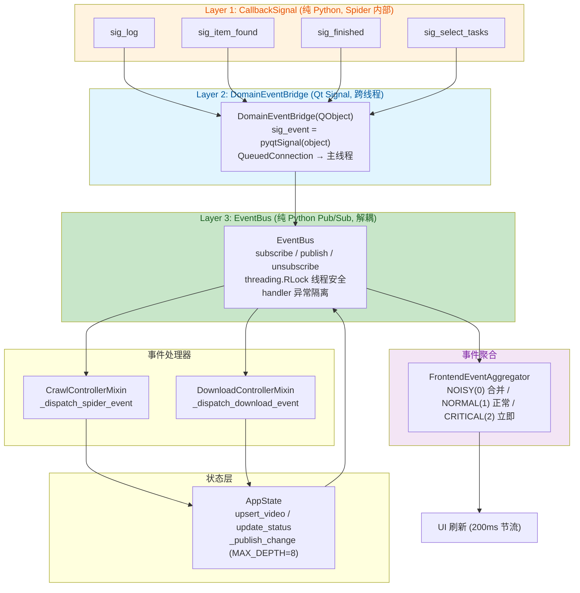
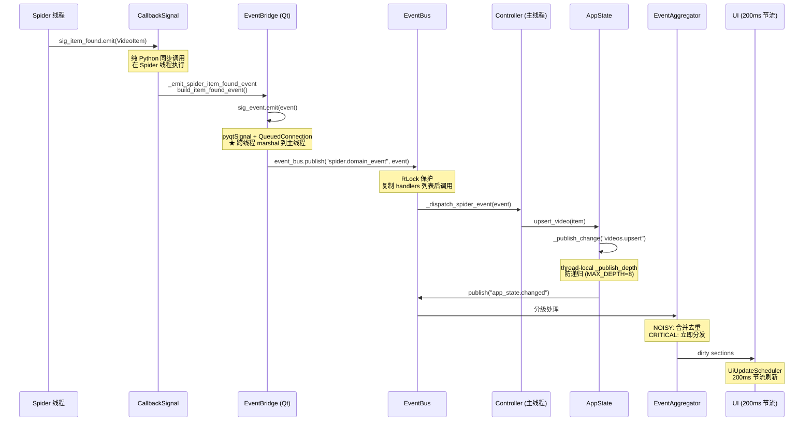
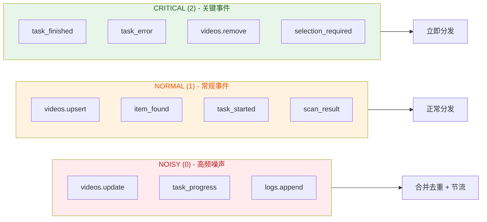
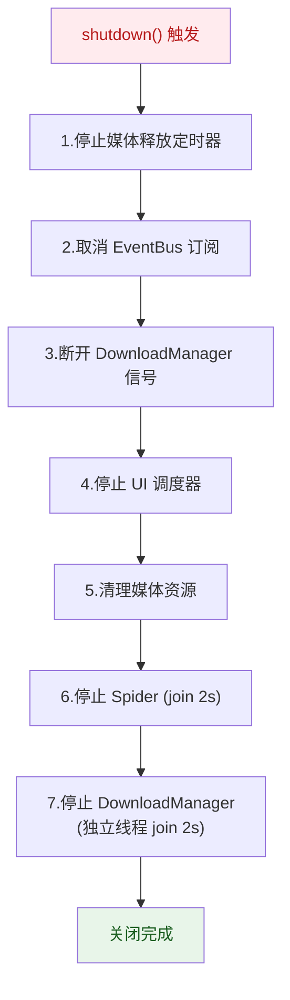

# 03 控制器组合根与事件桥接

## ApplicationController Mixin 组合（8 个 Mixin）

```mermaid
classDiagram
    class ApplicationController {
        +__init__(config)
        +start_crawl(source, keyword, config)
        +shutdown()
        +scan_local_dir(directory)
        -_initialize_event_bridges()
        -_connect_window_signals()
        -_video_lookup(video_id) VideoItem
        -_store_video_item(item)
    }

    class ControllerHostMixin {
        +_host() DesktopHostAdapter
        +_item_details(item) dict
        +_run_debug_action(action)
    }

    class CrawlControllerMixin {
        -_spider_event_handlers() dict
        -_dispatch_spider_event(event)
        -_create_spider(source_id, keyword, config)
        -_bind_spider_signals(spider)
        -_emit_spider_log_event(msg)
        -_emit_spider_item_found_event(item)
        -_emit_spider_finished_event()
    }

    class DownloadControllerMixin {
        -_connect_download_signals(manager)
        -_emit_task_started_event(item)
        -_emit_task_progress_event(item, pct)
        -_emit_task_finished_event(item)
        -_emit_task_error_event(item, error)
        -_last_progress_by_video: dict
    }

    class ApplicationLifecycleMixin {
        +shutdown()
        -_stop_media_release_timer()
        -_unsubscribe_event_bus()
        -_disconnect_download_signals()
        -_stop_spider(join_timeout=2s)
        -_stop_download_manager()
    }

    class DebugControllerMixin {
        +run_debug_action(action, payload)
        -_collect_debug_artifacts()
    }

    class MediaHostControllerMixin {
        -_on_media_scan_completed()
        -_refresh_media_library()
    }

    class ControllerSessionMixin {
        +create_session(config) SpiderSession
        +bind_session(spider, bindings)
        +destroy_session(session_id)
    }

    class MediaLibraryMixin {
        +scan_local_media(directory)
        +get_media_items() list
        +cleanup_orphaned_files()
    }

    ApplicationController --|> ControllerHostMixin
    ApplicationController --|> CrawlControllerMixin
    ApplicationController --|> DownloadControllerMixin
    ApplicationController --|> ApplicationLifecycleMixin
    ApplicationController --|> DebugControllerMixin
    ApplicationController --|> MediaHostControllerMixin
    ApplicationController --|> ControllerSessionMixin
    ApplicationController --|> MediaLibraryMixin

    ApplicationController --> DomainEventBridge
    ApplicationController --> EventBus
    ApplicationController --> AppState
    ApplicationController --> DownloadManager
```

## 三层事件体系

```mermaid
flowchart TB
    subgraph Layer1["Layer 1: CallbackSignal (纯 Python, Spider 内部)"]
        SigLog["sig_log"]
        SigItem["sig_item_found"]
        SigFinished["sig_finished"]
        SigSelect["sig_select_tasks"]
    end

    subgraph Layer2["Layer 2: DomainEventBridge (Qt Signal, 跨线程)"]
        Bridge["DomainEventBridge(QObject)<br/>sig_event = pyqtSignal(object)<br/>QueuedConnection → 主线程"]
    end

    subgraph Layer3["Layer 3: EventBus (纯 Python Pub/Sub, 解耦)"]
        Bus["EventBus<br/>subscribe / publish / unsubscribe<br/>threading.RLock 线程安全<br/>handler 异常隔离"]
    end

    subgraph Handlers["事件处理器"]
        CrawlHandler["CrawlControllerMixin<br/>_dispatch_spider_event"]
        DlHandler["DownloadControllerMixin<br/>_dispatch_download_event"]
    end

    subgraph State["状态层"]
        AppState["AppState<br/>upsert_video / update_status<br/>_publish_change (MAX_DEPTH=8)"]
    end

    subgraph Aggregator["事件聚合"]
        FrontendAgg["FrontendEventAggregator<br/>NOISY(0) 合并 / NORMAL(1) 正常 / CRITICAL(2) 立即"]
    end

    SigLog --> Bridge
    SigItem --> Bridge
    SigFinished --> Bridge
    SigSelect --> Bridge

    Bridge --> Bus
    Bus --> CrawlHandler
    Bus --> DlHandler
    CrawlHandler --> AppState
    DlHandler --> AppState
    AppState --> Bus
    Bus --> FrontendAgg
    FrontendAgg --> UI["UI 刷新 (200ms 节流)"]

    style Layer1 fill:#fff3e0,color:#e65100
    style Layer2 fill:#e1f5fe,color:#01579b
    style Layer3 fill:#c8e6c9,color:#1a5e20
    style Aggregator fill:#f3e5f5,color:#7b1fa2
```

## 事件传播时序（Spider 线程 → 主线程）

```mermaid
sequenceDiagram
    participant S as Spider 线程
    participant CS as CallbackSignal
    participant EB as EventBridge (Qt)
    participant Bus as EventBus
    participant Ctrl as Controller (主线程)
    participant AS as AppState
    participant Agg as EventAggregator
    participant UI as UI (200ms 节流)

    S->>CS: sig_item_found.emit(VideoItem)
    Note over CS: 纯 Python 同步调用<br/>在 Spider 线程执行
    CS->>EB: _emit_spider_item_found_event<br/>build_item_found_event()
    EB->>EB: sig_event.emit(event)
    Note over EB: pyqtSignal + QueuedConnection<br/>★ 跨线程 marshal 到主线程
    EB->>Bus: event_bus.publish("spider.domain_event", event)
    Note over Bus: RLock 保护<br/>复制 handlers 列表后调用
    Bus->>Ctrl: _dispatch_spider_event(event)
    Ctrl->>AS: upsert_video(item)
    AS->>AS: _publish_change("videos.upsert")
    Note over AS: thread-local _publish_depth<br/>防递归 (MAX_DEPTH=8)
    AS->>Bus: publish("app_state.changed")
    Bus->>Agg: 分级处理
    Note over Agg: NOISY: 合并去重<br/>CRITICAL: 立即分发
    Agg->>UI: dirty sections
    Note over UI: UiUpdateScheduler<br/>200ms 节流刷新
```

## 事件分级与命名规范

```mermaid
flowchart LR
    subgraph Noisy["NOISY (0) - 高频噪声"]
        N1["videos.update"]
        N2["task_progress"]
        N3["logs.append"]
    end

    subgraph Normal["NORMAL (1) - 常规事件"]
        NM1["videos.upsert"]
        NM2["item_found"]
        NM3["task_started"]
        NM4["scan_result"]
    end

    subgraph Critical["CRITICAL (2) - 关键事件"]
        C1["task_finished"]
        C2["task_error"]
        C3["videos.remove"]
        C4["selection_required"]
    end

    Noisy --> Merge["合并去重 + 节流"]
    Normal --> Direct["正常分发"]
    Critical --> Immediate["立即分发"]

    style Noisy fill:#ffebee,color:#b71c1c
    style Normal fill:#fff3e0,color:#e65100
    style Critical fill:#e8f5e9,color:#1b5e20
```

## 生命周期关闭顺序

```mermaid
flowchart TB
    Start["shutdown() 触发"] --> S1["1.停止媒体释放定时器"]
    S1 --> S2["2.取消 EventBus 订阅"]
    S2 --> S3["3.断开 DownloadManager 信号"]
    S3 --> S4["4.停止 UI 调度器"]
    S4 --> S5["5.清理媒体资源"]
    S5 --> S6["6.停止 Spider (join 2s)"]
    S6 --> S7["7.停止 DownloadManager<br>(独立线程 join 2s)"]
    S7 --> Done["关闭完成"]

    style Start fill:#ffebee,color:#b71c1c
    style Done fill:#e8f5e9,color:#1b5e20
```
