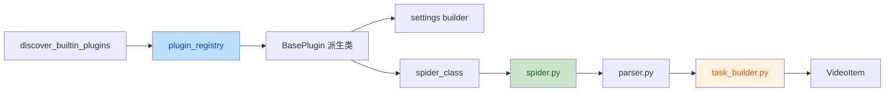
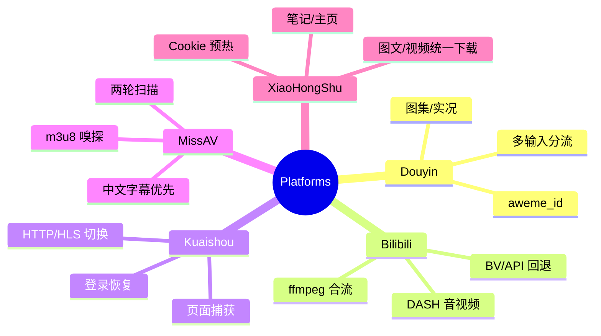
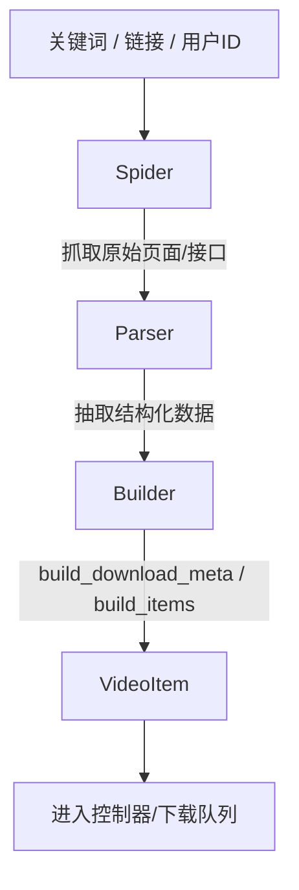

# 04 插件系统与 Spider 三段式

## 插件发现与注册

```mermaid
flowchart LR
    Discover[discover_builtin_plugins] --> Registry[plugin_registry]
    Registry --> PluginDef[BasePlugin 派生类]
    PluginDef --> Settings[settings builder]
    PluginDef --> SpiderCls[spider_class]
    SpiderCls --> Spider[spider.py]
    Spider --> Parser[parser.py]
    Parser --> Builder[task_builder.py]
    Builder --> Item[VideoItem]

    style Registry fill:#bbdefb,color:#0d47a1
    style Spider fill:#c8e6c9,color:#1a5e20
    style Builder fill:#fff3e0,color:#e65100
```

## 平台能力地图

```mermaid
mindmap
  root((Platforms))
    Douyin
      多输入分流
      图集/实况
      aweme_id
    Bilibili
      BV/API 回退
      DASH 音视频
      ffmpeg 合流
    Kuaishou
      页面捕获
      HTTP/HLS 切换
      登录恢复
    MissAV
      两轮扫描
      中文字幕优先
      m3u8 嗅探
    XiaoHongShu
      笔记/主页
      Cookie 预热
      图文/视频统一下载
```

## Spider 三段式流水线

```mermaid
flowchart TB
    Input[关键词 / 链接 / 用户ID] --> Spider
    Spider -->|抓取原始页面/接口| Parser
    Parser -->|抽取结构化数据| Builder
    Builder -->|build_download_meta / build_items| VideoItem
    VideoItem --> Queue[进入控制器/下载队列]
```
