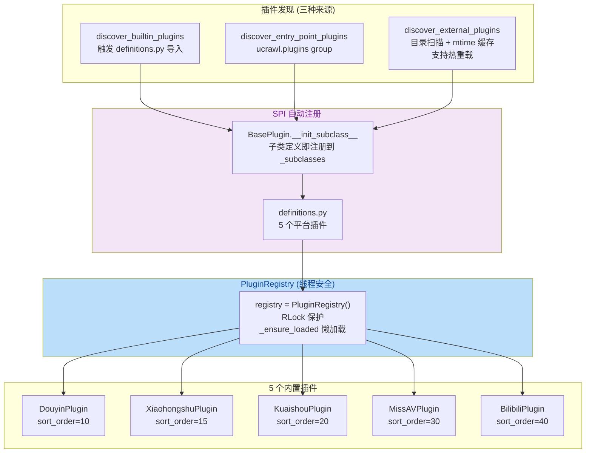
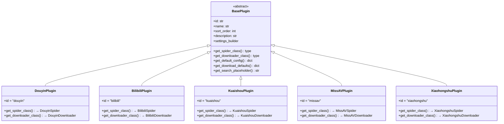
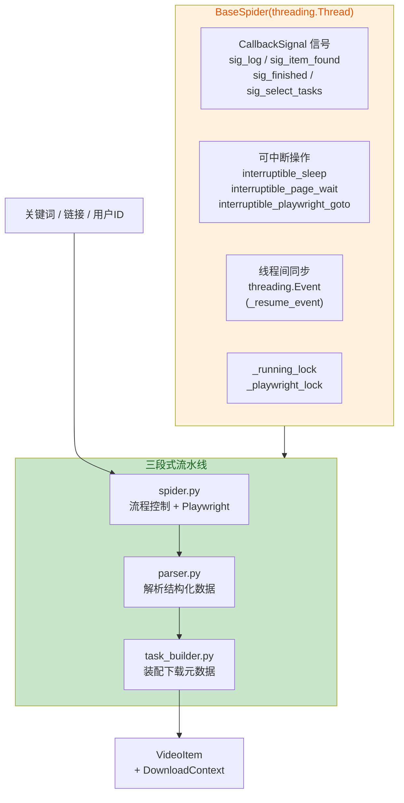
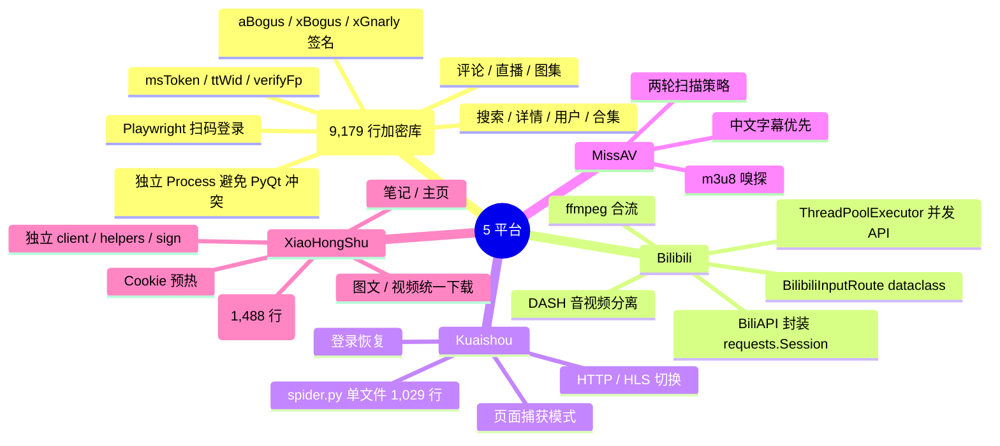
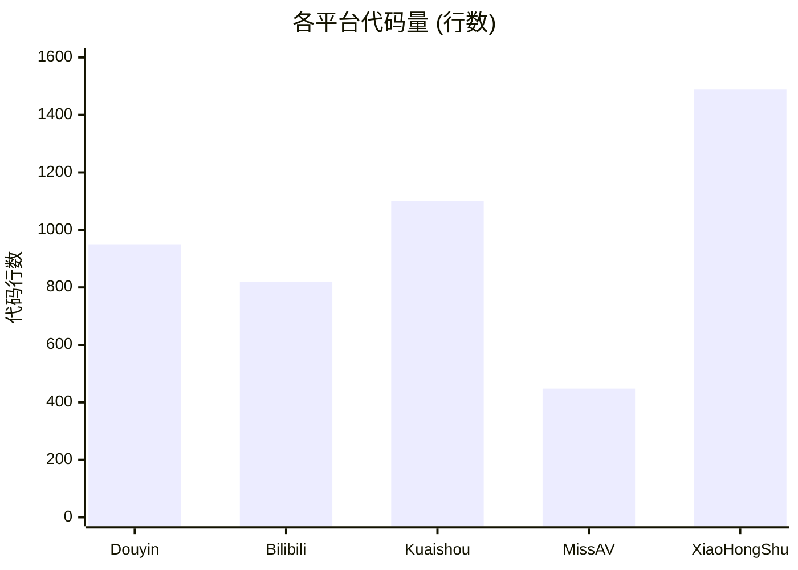

# 04 插件系统与 Spider 三段式

## SPI 自动注册机制

```mermaid
flowchart TB
    subgraph Discovery["插件发现 (三种来源)"]
        Builtin["discover_builtin_plugins<br/>触发 definitions.py 导入"]
        EntryPoint["discover_entry_point_plugins<br/>ucrawl.plugins group"]
        External["discover_external_plugins<br/>目录扫描 + mtime 缓存<br/>支持热重载"]
    end

    subgraph SPI["SPI 自动注册"]
        Base["BasePlugin.__init_subclass__<br/>子类定义即注册到 _subclasses"]
        Defs["definitions.py<br/>5 个平台插件"]
    end

    subgraph Registry["PluginRegistry (线程安全)"]
        Reg["registry = PluginRegistry()<br/>RLock 保护<br/>_ensure_loaded 懒加载"]
    end

    Builtin --> Base
    EntryPoint --> Base
    External --> Base
    Base --> Defs
    Defs --> Reg

    subgraph Plugins["5 个内置插件"]
        P1["DouyinPlugin<br/>sort_order=10"]
        P2["XiaohongshuPlugin<br/>sort_order=15"]
        P3["KuaishouPlugin<br/>sort_order=20"]
        P4["MissAVPlugin<br/>sort_order=30"]
        P5["BilibiliPlugin<br/>sort_order=40"]
    end

    Reg --> P1
    Reg --> P2
    Reg --> P3
    Reg --> P4
    Reg --> P5

    style SPI fill:#f3e5f5,color:#7b1fa2
    style Registry fill:#bbdefb,color:#0d47a1
```

## 插件提供能力

```mermaid
classDiagram
    class BasePlugin {
        <<abstract>>
        +id: str
        +name: str
        +sort_order: int
        +description: str
        +settings_builder
        +get_spider_class() type
        +get_downloader_class() type
        +get_default_config() dict
        +get_download_defaults() dict
        +get_search_placeholder() str
    }

    class DouyinPlugin {
        +id = "douyin"
        +get_spider_class() → DouyinSpider
        +get_downloader_class() → DouyinDownloader
    }

    class BilibiliPlugin {
        +id = "bilibili"
        +get_spider_class() → BilibiliSpider
        +get_downloader_class() → BilibiliDownloader
    }

    class KuaishouPlugin {
        +id = "kuaishou"
        +get_spider_class() → KuaishouSpider
        +get_downloader_class() → KuaishouDownloader
    }

    class MissAVPlugin {
        +id = "missav"
        +get_spider_class() → MissAVSpider
        +get_downloader_class() → MissAVDownloader
    }

    class XiaohongshuPlugin {
        +id = "xiaohongshu"
        +get_spider_class() → XiaohongshuSpider
        +get_downloader_class() → XiaohongshuDownloader
    }

    BasePlugin <|-- DouyinPlugin
    BasePlugin <|-- BilibiliPlugin
    BasePlugin <|-- KuaishouPlugin
    BasePlugin <|-- MissAVPlugin
    BasePlugin <|-- XiaohongshuPlugin
```

## Spider 三段式架构

```mermaid
flowchart TB
    Input["关键词 / 链接 / 用户ID"] --> Spider["spider.py<br/>流程控制 + Playwright"]

    subgraph ThreeStage["三段式流水线"]
        Spider --> Parser["parser.py<br/>解析结构化数据"]
        Parser --> Builder["task_builder.py<br/>装配下载元数据"]
    end

    Builder --> Item["VideoItem<br/>+ DownloadContext"]

    subgraph BaseSpider["BaseSpider(threading.Thread)"]
        Signals["CallbackSignal 信号<br/>sig_log / sig_item_found<br/>sig_finished / sig_select_tasks"]
        Interrupt["可中断操作<br/>interruptible_sleep<br/>interruptible_page_wait<br/>interruptible_playwright_goto"]
        Sync["线程间同步<br/>threading.Event<br/>(_resume_event)"]
        Lock["_running_lock<br/>_playwright_lock"]
    end

    BaseSpider --> ThreeStage

    style ThreeStage fill:#c8e6c9,color:#1a5e20
    style BaseSpider fill:#fff3e0,color:#e65100
```

## 平台能力地图

```mermaid
mindmap
  root((5 平台))
    Douyin (9,179 行加密库)
      Playwright 扫码登录
      独立 Process 避免 PyQt 冲突
      aBogus / xBogus / xGnarly 签名
      msToken / ttWid / verifyFp
      搜索 / 详情 / 用户 / 合集
      评论 / 直播 / 图集
    Bilibili
      BiliAPI 封装 requests.Session
      BilibiliInputRoute dataclass
      ThreadPoolExecutor 并发 API
      DASH 音视频分离
      ffmpeg 合流
    Kuaishou
      页面捕获模式
      HTTP / HLS 切换
      登录恢复
      spider.py 单文件 1,029 行
    MissAV
      两轮扫描策略
      中文字幕优先
      m3u8 嗅探
    XiaoHongShu
      独立 client / helpers / sign
      笔记 / 主页
      Cookie 预热
      图文 / 视频统一下载
      代码量最大 (1,488 行)
```

## 各平台代码量

```mermaid
xychart-beta
    title "各平台代码量 (行数)"
    x-axis ["Douyin", "Bilibili", "Kuaishou", "MissAV", "XiaoHongShu"]
    y-axis "代码行数" 0 --> 1600
    bar [950, 819, 1100, 448, 1488]
```
