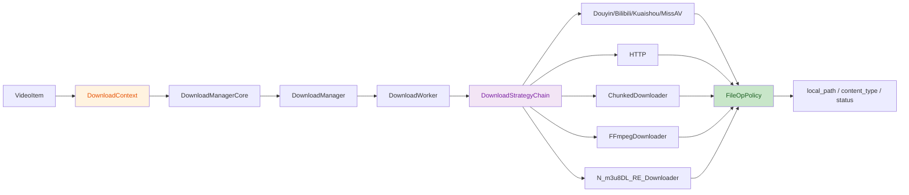
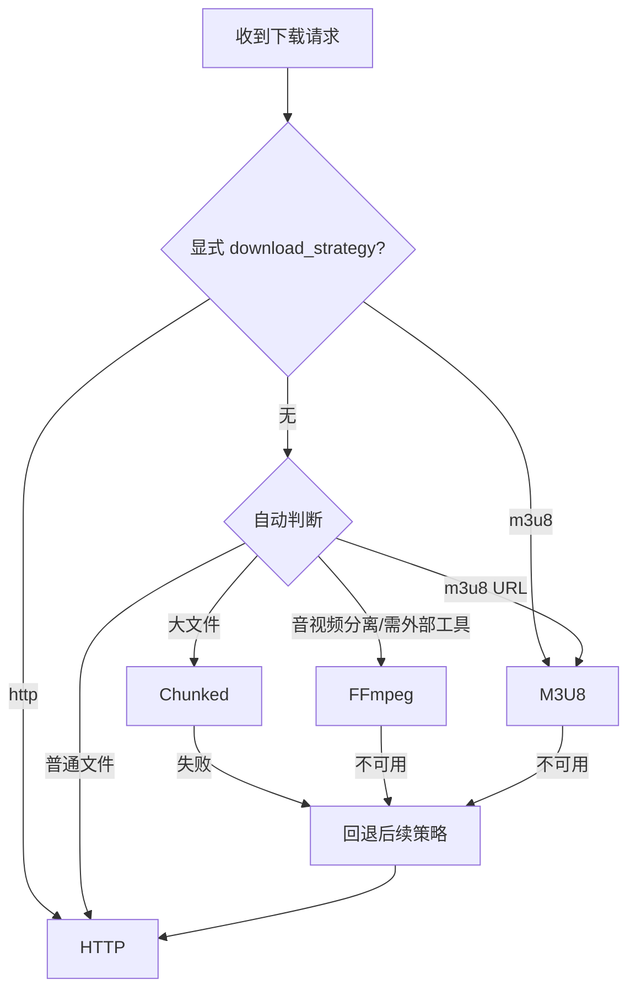
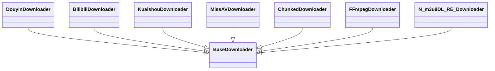

# 05 下载链全景

## 下载主链

```mermaid
flowchart LR
    Item[VideoItem] --> Context[DownloadContext]
    Context --> Core[DownloadManagerCore]
    Core --> Manager[DownloadManager]
    Manager --> Worker[DownloadWorker]
    Worker --> Strat[DownloadStrategyChain]
    Strat --> Http[HTTP]
    Strat --> Chunked[ChunkedDownloader]
    Strat --> FF[FFmpegDownloader]
    Strat --> M3U8[N_m3u8DL_RE_Downloader]
    Strat --> Platform[Douyin/Bilibili/Kuaishou/MissAV]
    Platform --> FileOps[FileOpPolicy]
    Http --> FileOps
    Chunked --> FileOps
    FF --> FileOps
    M3U8 --> FileOps
    FileOps --> Result[local_path / content_type / status]

    style Context fill:#fff3e0,color:#e65100
    style Strat fill:#f3e5f5,color:#7b1fa2
    style FileOps fill:#c8e6c9,color:#1a5e20
```

## 策略链决策树

```mermaid
flowchart TB
    Start[收到下载请求] --> Explicit{显式 download_strategy?}
    Explicit -->|m3u8| M3U8
    Explicit -->|http| HTTP
    Explicit -->|无| Auto{自动判断}
    Auto -->|m3u8 URL| M3U8
    Auto -->|大文件| Chunked
    Auto -->|音视频分离/需外部工具| FFmpeg
    Auto -->|普通文件| HTTP
    Chunked -->|失败| Fallback[回退后续策略]
    FFmpeg -->|不可用| Fallback
    M3U8 -->|不可用| Fallback
    Fallback --> HTTP
```

## 平台下载器矩阵

```mermaid
classDiagram
    class BaseDownloader
    class DouyinDownloader
    class BilibiliDownloader
    class KuaishouDownloader
    class MissAVDownloader
    class ChunkedDownloader
    class FFmpegDownloader
    class N_m3u8DL_RE_Downloader

    DouyinDownloader --|> BaseDownloader
    BilibiliDownloader --|> BaseDownloader
    KuaishouDownloader --|> BaseDownloader
    MissAVDownloader --|> BaseDownloader
    ChunkedDownloader --|> BaseDownloader
    FFmpegDownloader --|> BaseDownloader
    N_m3u8DL_RE_Downloader --|> BaseDownloader
```
