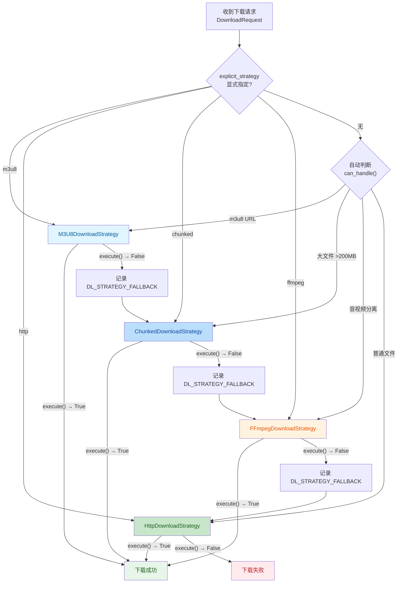
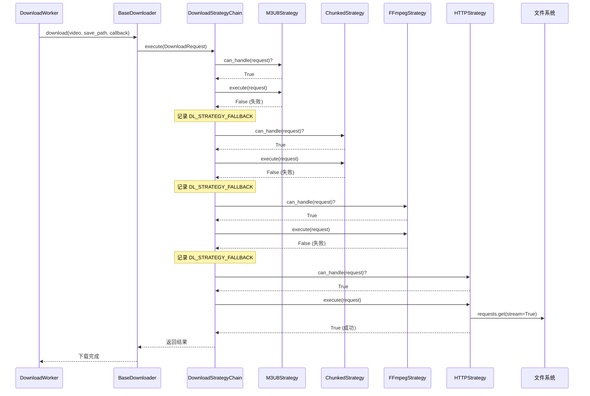
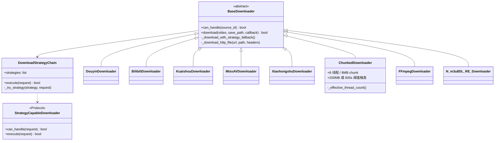
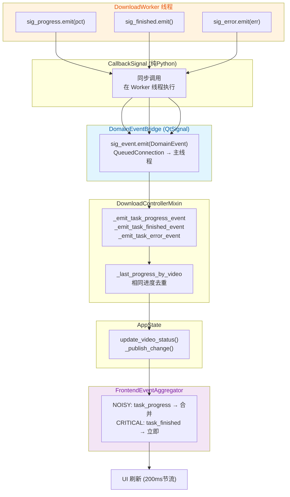

# 05 下载链全景

## 下载主链（从 VideoItem 到文件落盘）

```mermaid
flowchart LR
    Item["VideoItem"] --> Context["DownloadContext<br/>22 字段 slots=True"]
    Context --> Core["DownloadManagerCore<br/>PendingDownloadQueue<br/>(Condition + deque)"]
    Core --> Manager["DownloadManager<br/>DownloadWorker 线程池"]
    Manager --> Worker["DownloadWorker<br/>(threading.Thread, daemon)"]
    Worker --> Resolve["DownloaderRegistry.resolve(item)"]
    Resolve --> Plugin["plugin.get_downloader_class()"]
    Plugin --> Downloader["平台下载器"]
    Downloader --> Chain["DownloadStrategyChain"]
    Chain --> FileOps["MediaLibraryService<br/>统一文件变更重试入口"]
    FileOps --> Result["local_path / content_type / status"]

    style Context fill:#fff3e0,color:#e65100
    style Chain fill:#f3e5f5,color:#7b1fa2
    style FileOps fill:#c8e6c9,color:#1a5e20
```

## 策略链决策树（核心亮点）

```mermaid
flowchart TB
    Start["收到下载请求<br/>DownloadRequest"] --> Explicit{"explicit_strategy<br/>显式指定?"}

    Explicit -->|m3u8| TryM3U8["M3U8DownloadStrategy"]
    Explicit -->|http| TryHTTP["HttpDownloadStrategy"]
    Explicit -->|chunked| TryChunked["ChunkedDownloadStrategy"]
    Explicit -->|ffmpeg| TryFF["FFmpegDownloadStrategy"]
    Explicit -->|无| Auto{"自动判断<br/>can_handle()"}

    Auto -->|m3u8 URL| TryM3U8
    Auto -->|大文件 >200MB| TryChunked
    Auto -->|音视频分离| TryFF
    Auto -->|普通文件| TryHTTP

    TryM3U8 -->|"execute() → True"| Done["下载成功"]
    TryM3U8 -->|"execute() → False"| Fallback1["记录 DL_STRATEGY_FALLBACK"]
    TryChunked -->|"execute() → True"| Done
    TryChunked -->|"execute() → False"| Fallback2["记录 DL_STRATEGY_FALLBACK"]
    TryFF -->|"execute() → True"| Done
    TryFF -->|"execute() → False"| Fallback3["记录 DL_STRATEGY_FALLBACK"]
    TryHTTP -->|"execute() → True"| Done
    TryHTTP -->|"execute() → False"| Fail["下载失败"]

    Fallback1 --> TryChunked
    Fallback2 --> TryFF
    Fallback3 --> TryHTTP

    style TryM3U8 fill:#e1f5fe,color:#01579b
    style TryChunked fill:#bbdefb,color:#0d47a1
    style TryFF fill:#fff3e0,color:#e65100
    style TryHTTP fill:#c8e6c9,color:#1a5e20
    style Done fill:#e8f5e9,color:#1b5e20
    style Fail fill:#ffebee,color:#b71c1c
```

## 策略链有序执行

```mermaid
sequenceDiagram
    participant W as DownloadWorker
    participant D as BaseDownloader
    participant C as DownloadStrategyChain
    participant S1 as M3U8Strategy
    participant S2 as ChunkedStrategy
    participant S3 as FFmpegStrategy
    participant S4 as HTTPStrategy
    participant F as 文件系统

    W->>D: download(video, save_path, callback)
    D->>C: execute(DownloadRequest)
    
    C->>S1: can_handle(request)?
    S1-->>C: True
    C->>S1: execute(request)
    S1-->>C: False (失败)
    Note over C: 记录 DL_STRATEGY_FALLBACK
    
    C->>S2: can_handle(request)?
    S2-->>C: True
    C->>S2: execute(request)
    S2-->>C: False (失败)
    Note over C: 记录 DL_STRATEGY_FALLBACK
    
    C->>S3: can_handle(request)?
    S3-->>C: True
    C->>S3: execute(request)
    S3-->>C: False (失败)
    Note over C: 记录 DL_STRATEGY_FALLBACK
    
    C->>S4: can_handle(request)?
    S4-->>C: True
    C->>S4: execute(request)
    S4->>F: requests.get(stream=True)
    S4-->>C: True (成功)
    C-->>D: 返回结果
    D-->>W: 下载完成
```

## 下载器类层次

```mermaid
classDiagram
    class BaseDownloader {
        <<abstract>>
        +can_handle(source_id) bool
        +download(video, save_path, callback) bool
        -_download_with_strategy_fallback()
        -_download_http_file(url, path, headers)
    }

    class StrategyCapableDownloader {
        <<Protocol>>
        +can_handle(request) bool
        +execute(request) bool
    }

    class DownloadStrategyChain {
        +strategies: list
        +execute(request) bool
        -_try_strategy(strategy, request)
    }

    class DouyinDownloader
    class BilibiliDownloader
    class KuaishouDownloader
    class MissAVDownloader
    class XiaohongshuDownloader
    class ChunkedDownloader {
        +8 线程 / 8MB chunk
        +200MB 或 600s 阈值触发
        -_effective_thread_count()
    }
    class FFmpegDownloader
    class N_m3u8DL_RE_Downloader

    BaseDownloader <|-- DouyinDownloader
    BaseDownloader <|-- BilibiliDownloader
    BaseDownloader <|-- KuaishouDownloader
    BaseDownloader <|-- MissAVDownloader
    BaseDownloader <|-- XiaohongshuDownloader
    BaseDownloader <|-- ChunkedDownloader
    BaseDownloader <|-- FFmpegDownloader
    BaseDownloader <|-- N_m3u8DL_RE_Downloader

    BaseDownloader --> DownloadStrategyChain
    DownloadStrategyChain ..> StrategyCapableDownloader
```

## 下载进度回传机制

```mermaid
flowchart TB
    subgraph Worker["DownloadWorker 线程"]
        Progress["sig_progress.emit(pct)"]
        Finished["sig_finished.emit()"]
        Error["sig_error.emit(err)"]
    end

    subgraph Callback["CallbackSignal (纯Python)"]
        CS["同步调用<br/>在 Worker 线程执行"]
    end

    subgraph Bridge["DomainEventBridge (QtSignal)"]
        EB["sig_event.emit(DomainEvent)<br/>QueuedConnection → 主线程"]
    end

    subgraph Controller["DownloadControllerMixin"]
        Emit["_emit_task_progress_event<br/>_emit_task_finished_event<br/>_emit_task_error_event"]
        Dedup["_last_progress_by_video<br/>相同进度去重"]
    end

    subgraph State["AppState"]
        Update["update_video_status()<br/>_publish_change()"]
    end

    subgraph Agg["FrontendEventAggregator"]
        Level["NOISY: task_progress → 合并<br/>CRITICAL: task_finished → 立即"]
    end

    Progress --> CS --> EB
    Finished --> CS --> EB
    Error --> CS --> EB
    EB --> Emit
    Emit --> Dedup
    Dedup --> Update
    Update --> Level
    Level --> UI["UI 刷新 (200ms节流)"]

    style Worker fill:#fff3e0,color:#e65100
    style Bridge fill:#e1f5fe,color:#01579b
    style Agg fill:#f3e5f5,color:#7b1fa2
```
