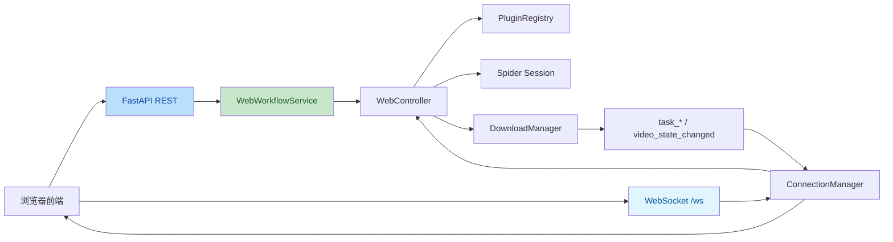
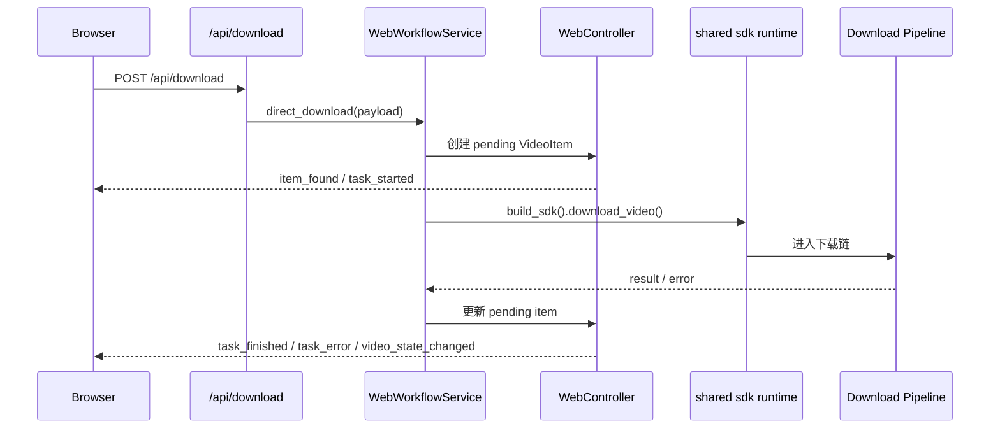

# 06 Web 运行时

## REST / WebSocket 双通道

```mermaid
flowchart LR
    Browser[浏览器前端] --> REST[FastAPI REST]
    Browser --> WS[WebSocket /ws]
    REST --> Workflow[WebWorkflowService]
    WS --> Manager[ConnectionManager]
    Workflow --> WebCtrl[WebController]
    Manager --> WebCtrl
    WebCtrl --> Plugin[PluginRegistry]
    WebCtrl --> Spider[Spider Session]
    WebCtrl --> Download[DownloadManager]
    Download --> Events[task_* / video_state_changed]
    Events --> Manager
    Manager --> Browser

    style REST fill:#bbdefb,color:#0d47a1
    style WS fill:#e1f5fe,color:#01579b
    style Workflow fill:#c8e6c9,color:#1a5e20
```

## 直接下载请求生命周期

```mermaid
sequenceDiagram
    participant UI as Browser
    participant API as /api/download
    participant WF as WebWorkflowService
    participant C as WebController
    participant SDK as shared sdk runtime
    participant DL as Download Pipeline

    UI->>API: POST /api/download
    API->>WF: direct_download(payload)
    WF->>C: 创建 pending VideoItem
    C-->>UI: item_found / task_started
    WF->>SDK: build_sdk().download_video()
    SDK->>DL: 进入下载链
    DL-->>WF: result / error
    WF->>C: 更新 pending item
    C-->>UI: task_finished / task_error / video_state_changed
```
