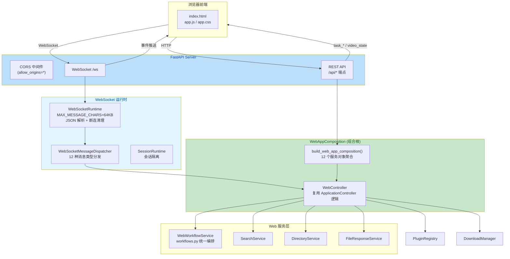
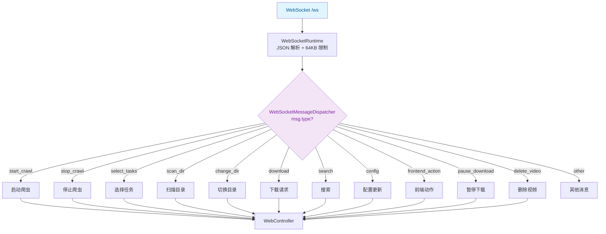
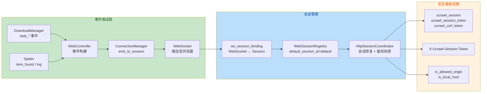
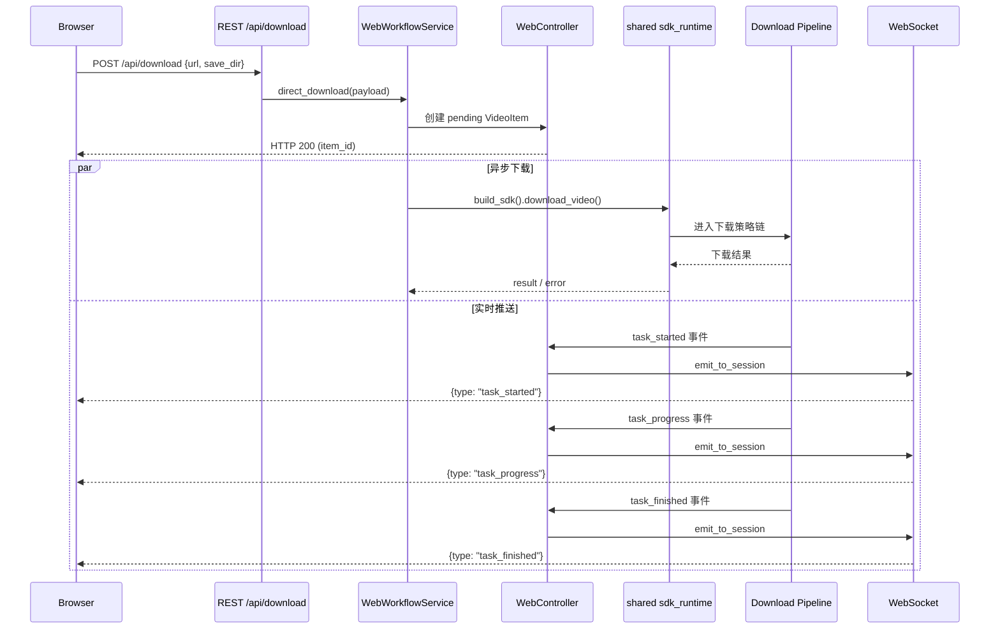
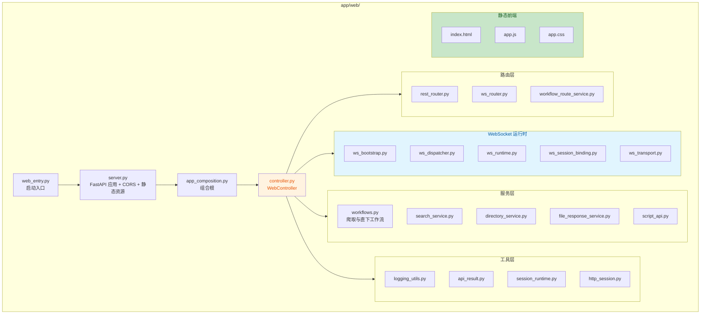

# 06 Web 运行时

## Web 组合根与双通道架构

```mermaid
flowchart TB
    subgraph Browser["浏览器前端"]
        HTML["index.html<br/>app.js / app.css"]
    end

    subgraph Server["FastAPI Server"]
        CORS["CORS 中间件<br/>(allow_origins=*)"]
        REST["REST API<br/>/api/* 端点"]
        WS["WebSocket /ws"]
    end

    subgraph Composition["WebAppComposition (组合根)"]
        Comp["build_web_app_composition()<br/>12 个服务对象聚合"]
        WebCtrl["WebController<br/>复用 ApplicationController 逻辑"]
    end

    subgraph Runtime["WebSocket 运行时"]
        Disp["WebSocketMessageDispatcher<br/>12 种消息类型分发"]
        WSRt["WebSocketRuntime<br/>MAX_MESSAGE_CHARS=64KB<br/>JSON 解析 + 断连清理"]
        SessRt["SessionRuntime<br/>会话隔离"]
    end

    subgraph Services["Web 服务层"]
        Workflow["WebWorkflowService<br/>workflows.py 统一编排"]
        Search["SearchService"]
        DirSvc["DirectoryService"]
        FileResp["FileResponseService"]
    end

    Browser -->|HTTP| REST
    Browser -->|WebSocket| WS
    REST --> Comp
    WS --> WSRt
    WSRt --> Disp
    Disp --> WebCtrl
    Comp --> WebCtrl
    WebCtrl --> Workflow
    WebCtrl --> Search
    WebCtrl --> DirSvc
    WebCtrl --> FileResp
    WebCtrl --> Plugin["PluginRegistry"]
    WebCtrl --> Download["DownloadManager"]

    REST -->|task_* / video_state| Browser
    WS -->|事件推送| Browser

    style Server fill:#bbdefb,color:#0d47a1
    style Composition fill:#c8e6c9,color:#1a5e20
    style Runtime fill:#e1f5fe,color:#01579b
```

## WebSocket 消息分发器（12 种消息类型）

```mermaid
flowchart TB
    WS["WebSocket /ws"] --> Runtime["WebSocketRuntime<br/>JSON 解析 + 64KB 限制"]
    Runtime --> Dispatcher{"WebSocketMessageDispatcher<br/>msg.type?"}

    Dispatcher -->|start_crawl| H1["启动爬虫"]
    Dispatcher -->|stop_crawl| H2["停止爬虫"]
    Dispatcher -->|select_tasks| H3["选择任务"]
    Dispatcher -->|scan_dir| H4["扫描目录"]
    Dispatcher -->|change_dir| H5["切换目录"]
    Dispatcher -->|download| H6["下载请求"]
    Dispatcher -->|search| H7["搜索"]
    Dispatcher -->|config| H8["配置更新"]
    Dispatcher -->|frontend_action| H9["前端动作"]
    Dispatcher -->|pause_download| H10["暂停下载"]
    Dispatcher -->|delete_video| H11["删除视频"]
    Dispatcher -->|other| H12["其他消息"]

    H1 --> WebCtrl["WebController"]
    H2 --> WebCtrl
    H3 --> WebCtrl
    H4 --> WebCtrl
    H5 --> WebCtrl
    H6 --> WebCtrl
    H7 --> WebCtrl
    H8 --> WebCtrl
    H9 --> WebCtrl
    H10 --> WebCtrl
    H11 --> WebCtrl

    style Dispatcher fill:#f3e5f5,color:#7b1fa2
    style WS fill:#e1f5fe,color:#01579b
```

## 会话管理与事件推送

```mermaid
flowchart LR
    subgraph Session["会话管理"]
        Reg["WebSessionRegistry<br/>default_session_id=default"]
        Bind["ws_session_binding<br/>WebSocket ↔ Session"]
        Coord["HttpSessionCoordinator<br/>会话恢复 + 鉴权协调"]
    end

    subgraph Events["事件推送链"]
        DM["DownloadManager<br/>task_* 事件"]
        Spider["Spider<br/>item_found / log"]
        Ctrl["WebController<br/>事件构建"]
        ConnMgr["ConnectionManager<br/>emit_to_session"]
        WS["WebSocket<br/>推送至浏览器"]
    end

    subgraph Security["安全基础设施"]
        Cookie["ucrawl_session<br/>ucrawl_session_token<br/>ucrawl_csrf_token"]
        Header["X-Ucrawl-Session-Token"]
        Origin["is_allowed_origin<br/>is_local_host"]
    end

    DM --> Ctrl
    Spider --> Ctrl
    Ctrl --> ConnMgr
    ConnMgr --> WS
    WS --> Bind
    Bind --> Reg
    Reg --> Coord
    Coord --> Cookie
    Coord --> Header
    Coord --> Origin

    style Session fill:#bbdefb,color:#0d47a1
    style Events fill:#c8e6c9,color:#1a5e20
    style Security fill:#fff3e0,color:#e65100
```

## 直接下载请求生命周期

```mermaid
sequenceDiagram
    participant UI as Browser
    participant API as REST /api/download
    participant WF as WebWorkflowService
    participant C as WebController
    participant SDK as shared sdk_runtime
    participant DL as Download Pipeline
    participant WS as WebSocket

    UI->>API: POST /api/download {url, save_dir}
    API->>WF: direct_download(payload)
    WF->>C: 创建 pending VideoItem
    C-->>UI: HTTP 200 (item_id)
    
    par 异步下载
        WF->>SDK: build_sdk().download_video()
        SDK->>DL: 进入下载策略链
        DL-->>SDK: 下载结果
        SDK-->>WF: result / error
    and 实时推送
        DL->>C: task_started 事件
        C->>WS: emit_to_session
        WS-->>UI: {type: "task_started"}
        
        DL->>C: task_progress 事件
        C->>WS: emit_to_session
        WS-->>UI: {type: "task_progress"}
        
        DL->>C: task_finished 事件
        C->>WS: emit_to_session
        WS-->>UI: {type: "task_finished"}
    end
```

## Web 层文件结构

```mermaid
flowchart TB
    subgraph Web["app/web/"]
        Entry["web_entry.py<br/>启动入口"]
        Server["server.py<br/>FastAPI 应用 + CORS + 静态资源"]
        Comp["app_composition.py<br/>组合根"]
        Ctrl["controller.py<br/>WebController"]
        
        subgraph Routes["路由层"]
            REST["rest_router.py"]
            WSRouter["ws_router.py"]
            WorkflowRoute["workflow_route_service.py"]
        end
        
        subgraph WSRuntime["WebSocket 运行时"]
            WSBoot["ws_bootstrap.py"]
            WSDisp["ws_dispatcher.py"]
            WSRt["ws_runtime.py"]
            WSBind["ws_session_binding.py"]
            WSTrans["ws_transport.py"]
        end
        
        subgraph Services["服务层"]
            Workflow["workflows.py<br/>爬取与直下工作流"]
            SearchSvc["search_service.py"]
            DirSvc["directory_service.py"]
            FileResp["file_response_service.py"]
            ScriptAPI["script_api.py"]
        end
        
        subgraph Utils["工具层"]
            LogUtil["logging_utils.py"]
            ApiResult["api_result.py"]
            SessionRt["session_runtime.py"]
            HTTPSession["http_session.py"]
        end
        
        subgraph StaticAssets["静态前端"]
            HTML["index.html"]
            JS["app.js"]
            CSS["app.css"]
        end
    end

    Entry --> Server
    Server --> Comp
    Comp --> Ctrl
    Ctrl --> Routes
    Ctrl --> WSRuntime
    Ctrl --> Services
    Ctrl --> Utils

    style Ctrl fill:#fff3e0,color:#e65100
    style WSRuntime fill:#e1f5fe,color:#01579b
    style StaticAssets fill:#c8e6c9,color:#1a5e20
```
