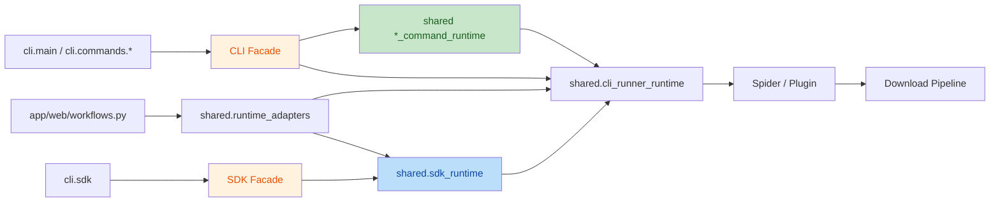
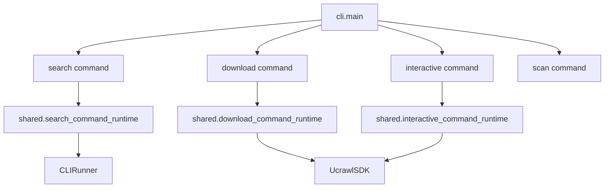
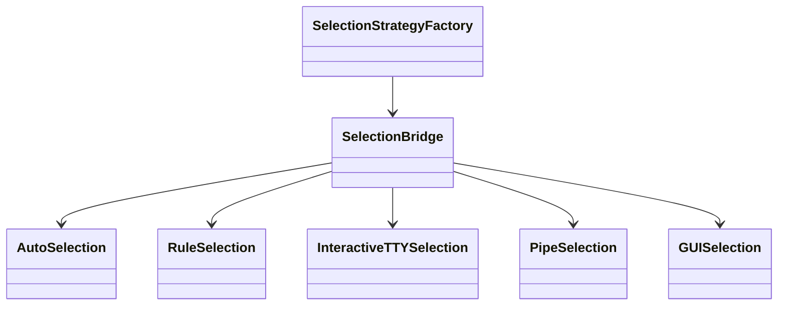

# 07 CLI / SDK / Shared Runtime

## 跨端共享运行时骨架

```mermaid
flowchart LR
    CLI[cli.main / cli.commands.*] --> Facade[CLI Facade]
    SDK[cli.sdk] --> SDKFacade[SDK Facade]
    WEB[app/web/workflows.py] --> Adapter[shared.runtime_adapters]

    Facade --> SharedCmd[shared *_command_runtime]
    SDKFacade --> SharedSDK[shared.sdk_runtime]
    Facade --> SharedRunner[shared.cli_runner_runtime]
    Adapter --> SharedRunner
    Adapter --> SharedSDK

    SharedCmd --> SharedRunner
    SharedSDK --> SharedRunner
    SharedRunner --> Spider[Spider / Plugin]
    Spider --> Downloader[Download Pipeline]

    style Facade fill:#fff3e0,color:#e65100
    style SDKFacade fill:#fff3e0,color:#e65100
    style SharedCmd fill:#c8e6c9,color:#1a5e20
    style SharedSDK fill:#bbdefb,color:#0d47a1
```

## 命令分发关系

```mermaid
flowchart TB
    Main[cli.main] --> Search[search command]
    Main --> Download[download command]
    Main --> Interactive[interactive command]
    Main --> Scan[scan command]
    Search --> SearchRt[shared.search_command_runtime]
    Download --> DownloadRt[shared.download_command_runtime]
    Interactive --> InteractiveRt[shared.interactive_command_runtime]
    SearchRt --> Runner[CLIRunner]
    DownloadRt --> SDKRt[UcrawlSDK]
    InteractiveRt --> SDKRt
```

## 选择策略桥

```mermaid
classDiagram
    class SelectionStrategyFactory
    class SelectionBridge
    class AutoSelection
    class RuleSelection
    class InteractiveTTYSelection
    class PipeSelection
    class GUISelection

    SelectionStrategyFactory --> SelectionBridge
    SelectionBridge --> AutoSelection
    SelectionBridge --> RuleSelection
    SelectionBridge --> InteractiveTTYSelection
    SelectionBridge --> PipeSelection
    SelectionBridge --> GUISelection
```
