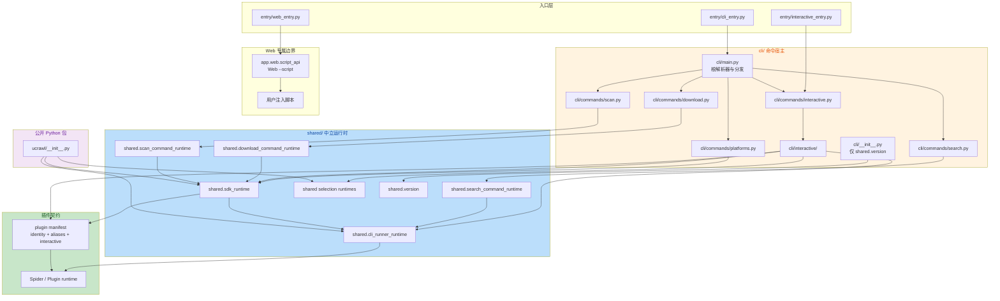
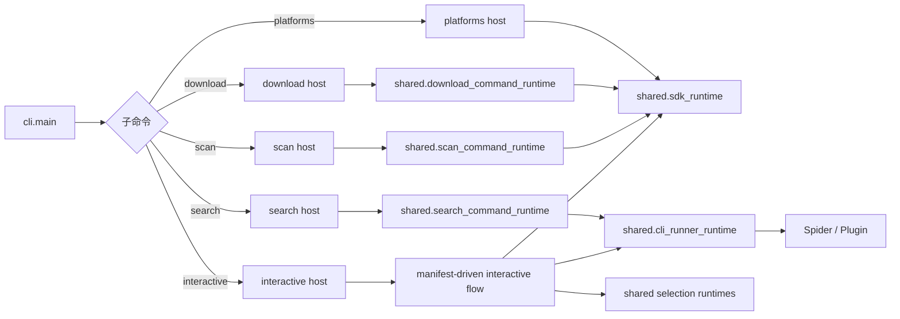
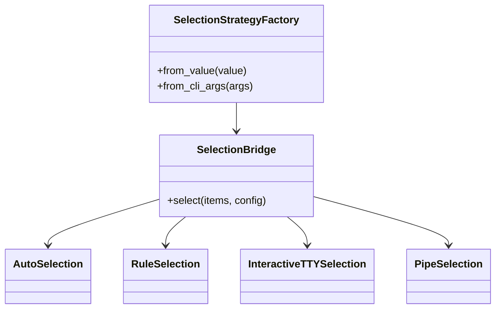
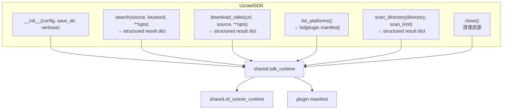
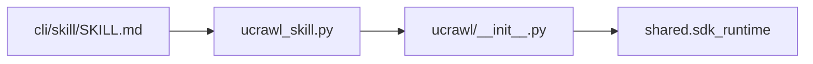

# 07 CLI / SDK / Shared Runtime

## 当前包边界与调用方向

`cli` 是命令实现包，不再充当 SDK 再导出层。公共 SDK、runner 与选择策略
统一从 `ucrawl/__init__.py` 导入。`ucrawl platforms` 与交互引导读取同一份
plugin manifest；外部插件可在 manifest 的 `interactive` 字段声明输入提示、
选项字段和鉴权元数据。

## 命令分发与语义运行时

三个命令运行时都返回语义状态，再由 CLI 宿主统一映射为稳定退出码。scan
的参数校验、SDK 生命周期和结果输出属于 `shared.scan_command_runtime`，
`cli/commands/scan.py` 只装配配置依赖。

## 共享选择策略

桌面 GUI 的选择策略属于 `app.ui`，不从 CLI 或公共 SDK 包导出。

## SDK API（shared/sdk_runtime.py）

## AI Skill 集成

