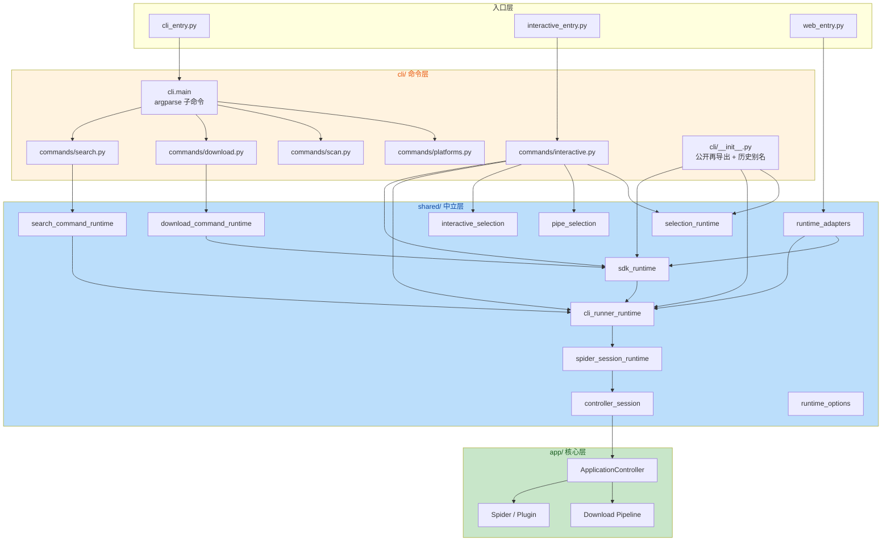
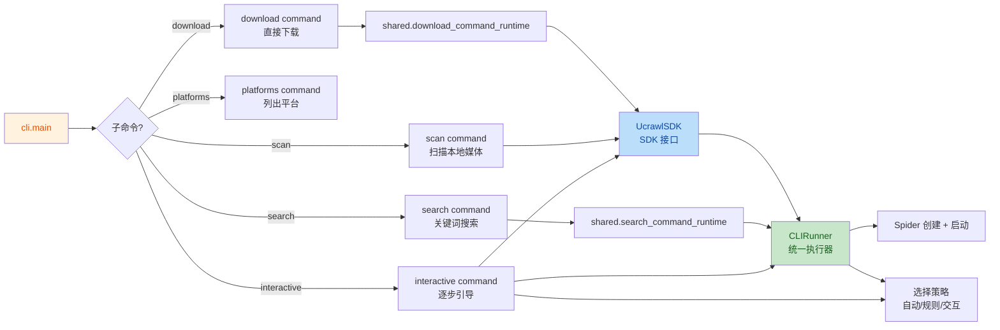
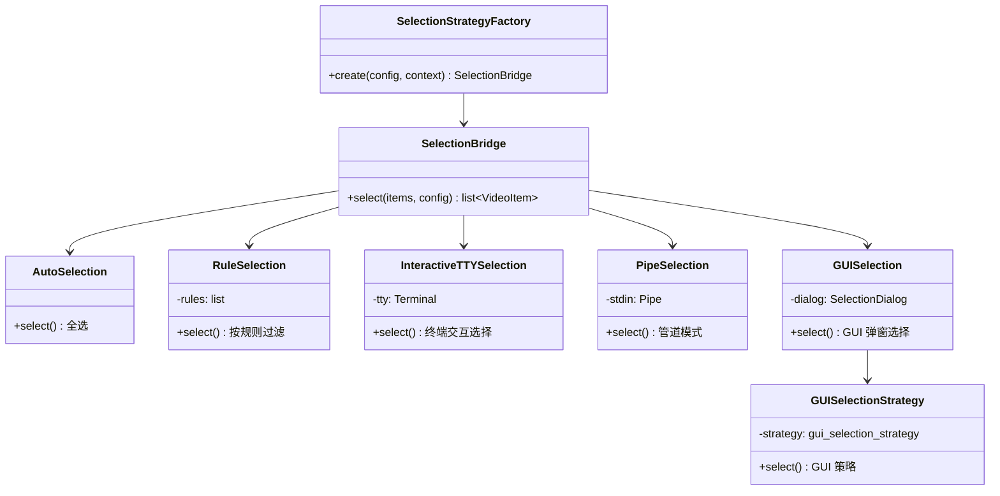
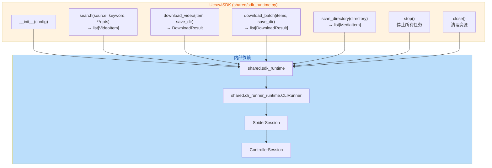
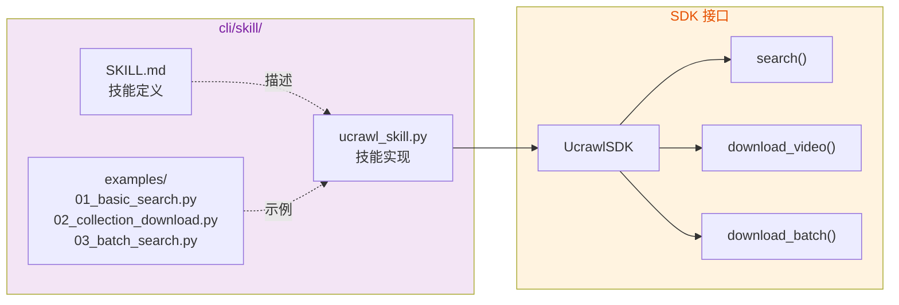

# 07 CLI / SDK / Shared Runtime

## 跨端共享运行时骨架

```mermaid
flowchart TB
    subgraph Entry["入口层"]
        CLIEntry["cli_entry.py"]
        InteractiveEntry["interactive_entry.py"]
        WebEntry["web_entry.py"]
    end

    subgraph CLI["cli/ 命令层"]
        Main["cli.main<br/>argparse 子命令"]
        CmdSearch["commands/search.py"]
        CmdDownload["commands/download.py"]
        CmdInteractive["commands/interactive.py"]
        CmdScan["commands/scan.py"]
        CmdPlatforms["commands/platforms.py"]
        PackageInit["cli/__init__.py<br/>公开再导出 + 历史别名"]
    end

    subgraph Shared["shared/ 中立层"]
        SearchRt["search_command_runtime"]
        DownloadRt["download_command_runtime"]
        SDKRt["sdk_runtime"]
        CLIRunnerRt["cli_runner_runtime"]
        SpiderSession["spider_session_runtime"]
        ControllerSession["controller_session"]
        RuntimeOpts["runtime_options"]
        RuntimeAdapters["runtime_adapters"]
        PipeSel["pipe_selection"]
        InteractiveSel["interactive_selection"]
        SelectionRt["selection_runtime"]
    end

    subgraph App["app/ 核心层"]
        AppCtrl["ApplicationController"]
        Spider["Spider / Plugin"]
        Download["Download Pipeline"]
    end

    CLIEntry --> Main
    InteractiveEntry --> CmdInteractive
    WebEntry --> RuntimeAdapters

    Main --> CmdSearch
    Main --> CmdDownload
    Main --> CmdScan
    Main --> CmdPlatforms

    CmdSearch --> SearchRt
    CmdDownload --> DownloadRt
    CmdInteractive --> SDKRt
    CmdInteractive --> CLIRunnerRt
    CmdInteractive --> InteractiveSel
    CmdInteractive --> PipeSel
    CmdInteractive --> SelectionRt
    PackageInit --> SDKRt
    PackageInit --> CLIRunnerRt
    PackageInit --> SelectionRt

    SearchRt --> CLIRunnerRt
    DownloadRt --> SDKRt
    SDKRt --> CLIRunnerRt
    CLIRunnerRt --> SpiderSession
    SpiderSession --> ControllerSession
    ControllerSession --> AppCtrl

    RuntimeAdapters --> CLIRunnerRt
    RuntimeAdapters --> SDKRt

    AppCtrl --> Spider
    AppCtrl --> Download

    style CLI fill:#fff3e0,color:#e65100
    style Shared fill:#bbdefb,color:#0d47a1
    style App fill:#c8e6c9,color:#1a5e20
```

## 命令分发关系

```mermaid
flowchart LR
    Main["cli.main"] --> Sub{"子命令?"}
    
    Sub -->|search| Search["search command<br/>关键词搜索"]
    Sub -->|download| Download["download command<br/>直接下载"]
    Sub -->|interactive| Interactive["interactive command<br/>逐步引导"]
    Sub -->|scan| Scan["scan command<br/>扫描本地媒体"]
    Sub -->|platforms| Platforms["platforms command<br/>列出平台"]
    
    Search --> SearchRt["shared.search_command_runtime"]
    Download --> DownloadRt["shared.download_command_runtime"]
    Interactive --> SDKRt
    Interactive --> Runner
    Interactive --> Selection
    Scan --> SDKRt
    
    SearchRt --> Runner["CLIRunner<br/>统一执行器"]
    DownloadRt --> SDKRt["UcrawlSDK<br/>SDK 接口"]
    SDKRt --> Runner
    
    Runner --> Spider["Spider 创建 + 启动"]
    Runner --> Selection["选择策略<br/>自动/规则/交互"]

    style Main fill:#fff3e0,color:#e65100
    style Runner fill:#c8e6c9,color:#1a5e20
    style SDKRt fill:#bbdefb,color:#0d47a1
```

## 选择策略桥（6 种策略）

```mermaid
classDiagram
    class SelectionStrategyFactory {
        +create(config, context) SelectionBridge
    }

    class SelectionBridge {
        +select(items, config) list~VideoItem~
    }

    class AutoSelection {
        +select() 全选
    }

    class RuleSelection {
        +select() 按规则过滤
        -rules: list
    }

    class InteractiveTTYSelection {
        +select() 终端交互选择
        -tty: Terminal
    }

    class PipeSelection {
        +select() 管道模式
        -stdin: Pipe
    }

    class GUISelection {
        +select() GUI 弹窗选择
        -dialog: SelectionDialog
    }

    class GUISelectionStrategy {
        +select() GUI 策略
        -strategy: gui_selection_strategy
    }

    SelectionStrategyFactory --> SelectionBridge
    SelectionBridge --> AutoSelection
    SelectionBridge --> RuleSelection
    SelectionBridge --> InteractiveTTYSelection
    SelectionBridge --> PipeSelection
    SelectionBridge --> GUISelection
    GUISelection --> GUISelectionStrategy
```

## SDK API（shared/sdk_runtime.py）

```mermaid
flowchart TB
    subgraph SDK["UcrawlSDK (shared/sdk_runtime.py)"]
        Init["__init__(config)"]
        Search["search(source, keyword, **opts)<br/>→ list[VideoItem]"]
        Download["download_video(item, save_dir)<br/>→ DownloadResult"]
        DownloadBatch["download_batch(items, save_dir)<br/>→ list[DownloadResult]"]
        Scan["scan_directory(directory)<br/>→ list[MediaItem]"]
        Stop["stop()<br/>停止所有任务"]
        Close["close()<br/>清理资源"]
    end

    subgraph Internal["内部依赖"]
        SDKRt["shared.sdk_runtime"]
        Runner["shared.cli_runner_runtime.CLIRunner"]
        SpiderSession["SpiderSession"]
        Controller["ControllerSession"]
    end

    Init --> SDKRt
    Search --> SDKRt
    Download --> SDKRt
    DownloadBatch --> SDKRt
    Scan --> SDKRt
    Stop --> SDKRt
    Close --> SDKRt

    SDKRt --> Runner
    Runner --> SpiderSession
    SpiderSession --> Controller

    style SDK fill:#fff3e0,color:#e65100
    style Internal fill:#bbdefb,color:#0d47a1
```

## AI Skill 集成

```mermaid
flowchart LR
    subgraph Skill["cli/skill/"]
        SkillMD["SKILL.md<br/>技能定义"]
        SkillPy["ucrawl_skill.py<br/>技能实现"]
        Examples["examples/<br/>01_basic_search.py<br/>02_collection_download.py<br/>03_batch_search.py"]
    end

    subgraph SDK["SDK 接口"]
        UCrawl["UcrawlSDK"]
        Search["search()"]
        Download["download_video()"]
        Batch["download_batch()"]
    end

    SkillPy --> UCrawl
    UCrawl --> Search
    UCrawl --> Download
    UCrawl --> Batch

    SkillMD -.->|描述| SkillPy
    Examples -.->|示例| SkillPy

    style Skill fill:#f3e5f5,color:#7b1fa2
    style SDK fill:#fff3e0,color:#e65100
```
