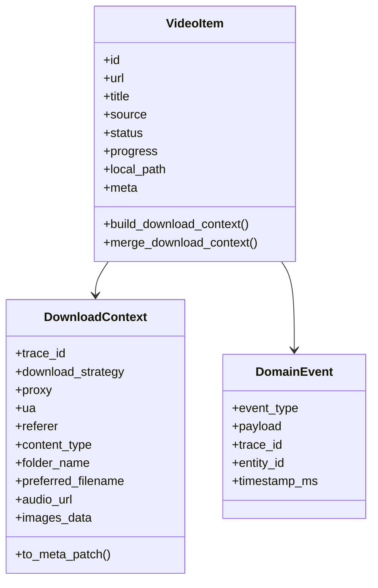
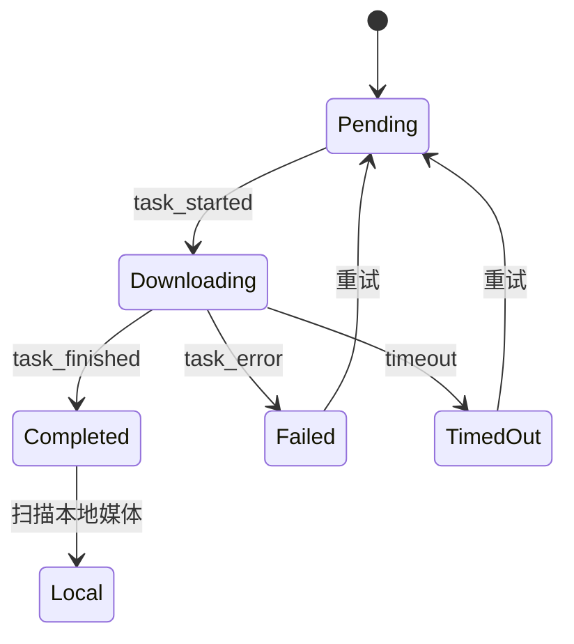
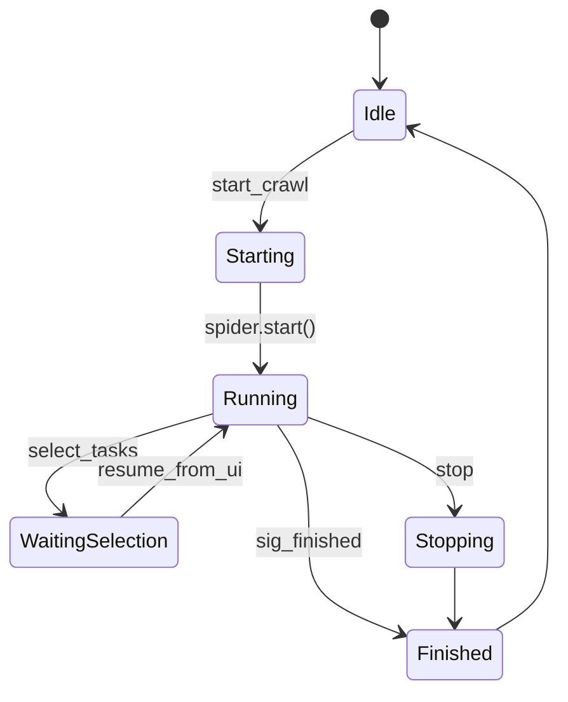

# 08 数据模型与状态

## 核心数据模型关系

```mermaid
classDiagram
    class VideoItem {
      +id
      +url
      +title
      +source
      +status
      +progress
      +local_path
      +meta
      +build_download_context()
      +merge_download_context()
    }

    class DownloadContext {
      +trace_id
      +download_strategy
      +proxy
      +ua
      +referer
      +content_type
      +folder_name
      +preferred_filename
      +audio_url
      +images_data
      +to_meta_patch()
    }

    class DomainEvent {
      +event_type
      +payload
      +trace_id
      +entity_id
      +timestamp_ms
    }

    VideoItem --> DownloadContext
    VideoItem --> DomainEvent
```

## 下载状态机

```mermaid
stateDiagram-v2
    [*] --> Pending
    Pending --> Downloading: task_started
    Downloading --> Completed: task_finished
    Downloading --> Failed: task_error
    Downloading --> TimedOut: timeout
    Completed --> Local: 扫描本地媒体
    Failed --> Pending: 重试
    TimedOut --> Pending: 重试
```

## 爬虫状态机

```mermaid
stateDiagram-v2
    [*] --> Idle
    Idle --> Starting: start_crawl
    Starting --> Running: spider.start()
    Running --> WaitingSelection: select_tasks
    WaitingSelection --> Running: resume_from_ui
    Running --> Stopping: stop
    Running --> Finished: sig_finished
    Stopping --> Finished
    Finished --> Idle
```
