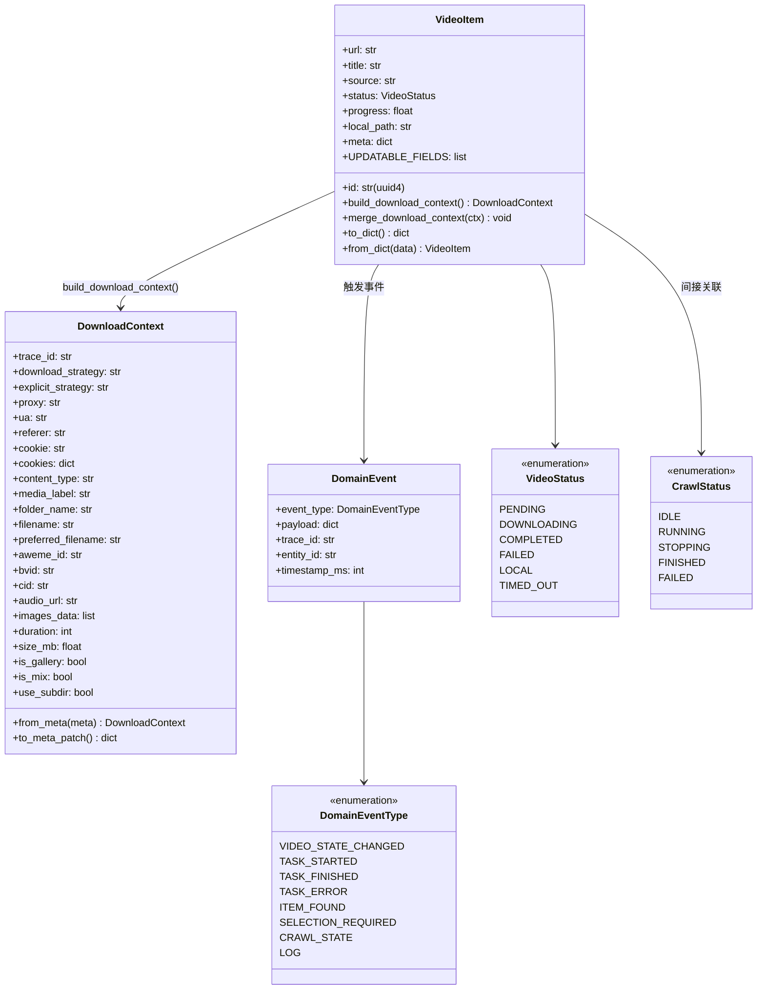
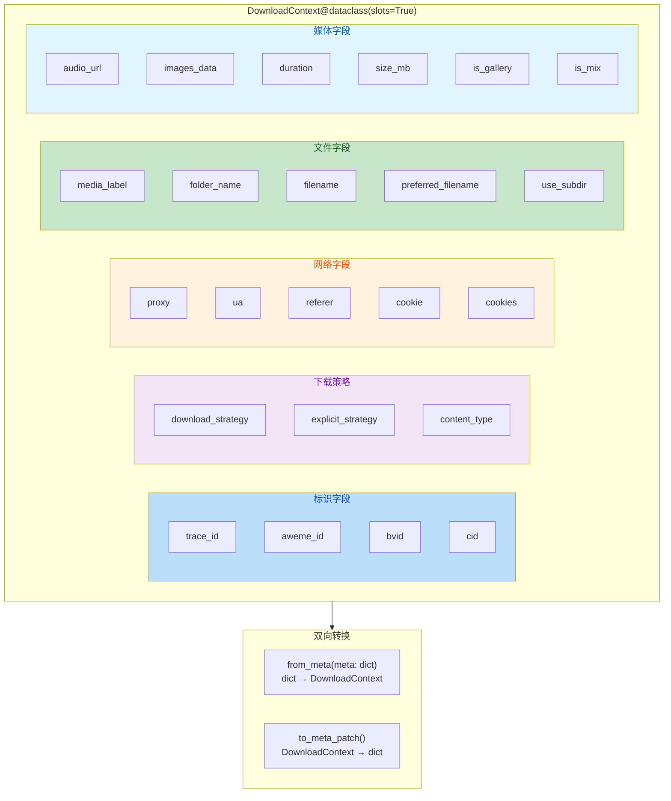
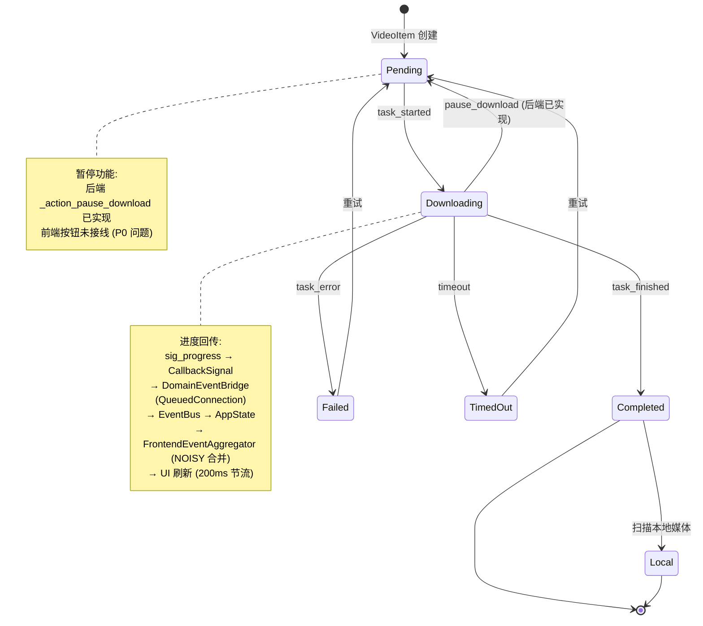
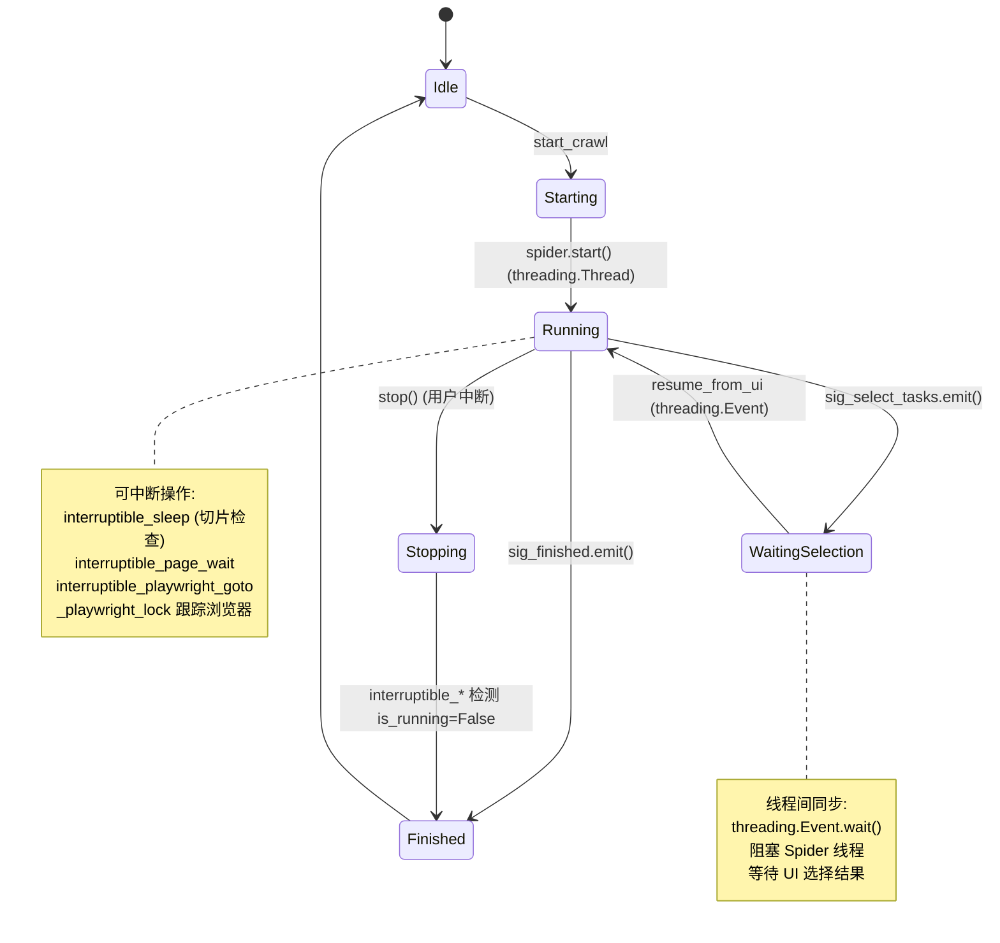

# 08 数据模型与状态

## 核心数据模型关系

```mermaid
classDiagram
    class VideoItem {
        +id: str (uuid4)
        +url: str
        +title: str
        +source: str
        +status: VideoStatus
        +progress: float
        +local_path: str
        +meta: dict
        +UPDATABLE_FIELDS: list
        +build_download_context() DownloadContext
        +merge_download_context(ctx) void
        +to_dict() dict
        +from_dict(data) VideoItem
    }

    class DownloadContext {
        +trace_id: str
        +download_strategy: str
        +explicit_strategy: str
        +proxy: str
        +ua: str
        +referer: str
        +cookie: str
        +cookies: dict
        +content_type: str
        +media_label: str
        +folder_name: str
        +filename: str
        +preferred_filename: str
        +aweme_id: str
        +bvid: str
        +cid: str
        +audio_url: str
        +images_data: list
        +duration: int
        +size_mb: float
        +is_gallery: bool
        +is_mix: bool
        +use_subdir: bool
        +from_meta(meta) DownloadContext
        +to_meta_patch() dict
    }

    class DomainEvent {
        +event_type: DomainEventType
        +payload: dict
        +trace_id: str
        +entity_id: str
        +timestamp_ms: int
    }

    class DomainEventType {
        <<enumeration>>
        VIDEO_STATE_CHANGED
        TASK_STARTED
        TASK_FINISHED
        TASK_ERROR
        ITEM_FOUND
        SELECTION_REQUIRED
        CRAWL_STATE
        LOG
    }

    class VideoStatus {
        <<enumeration>>
        PENDING
        DOWNLOADING
        COMPLETED
        FAILED
        LOCAL
        TIMED_OUT
    }

    class CrawlStatus {
        <<enumeration>>
        IDLE
        RUNNING
        STOPPING
        FINISHED
        FAILED
    }

    VideoItem --> DownloadContext : build_download_context()
    VideoItem --> DomainEvent : 触发事件
    DomainEvent --> DomainEventType
    VideoItem --> VideoStatus
    VideoItem --> CrawlStatus : 间接关联
```

## DownloadContext 22 字段（slots=True）

```mermaid
flowchart TB
    subgraph Context["DownloadContext@dataclass(slots=True)"]
        subgraph Identity["标识字段"]
            F1["trace_id"]
            F2["aweme_id"]
            F3["bvid"]
            F4["cid"]
        end

        subgraph Download["下载策略"]
            F5["download_strategy"]
            F6["explicit_strategy"]
            F7["content_type"]
        end

        subgraph Network["网络字段"]
            F8["proxy"]
            F9["ua"]
            F10["referer"]
            F11["cookie"]
            F12["cookies"]
        end

        subgraph File["文件字段"]
            F13["media_label"]
            F14["folder_name"]
            F15["filename"]
            F16["preferred_filename"]
            F17["use_subdir"]
        end

        subgraph Media["媒体字段"]
            F18["audio_url"]
            F19["images_data"]
            F20["duration"]
            F21["size_mb"]
            F22["is_gallery"]
            F23["is_mix"]
        end
    end

    subgraph Conversion["双向转换"]
        FromMeta["from_meta(meta: dict)<br/>dict → DownloadContext"]
        ToPatch["to_meta_patch()<br/>DownloadContext → dict"]
    end

    Context --> Conversion

    style Identity fill:#bbdefb,color:#0d47a1
    style Download fill:#f3e5f5,color:#7b1fa2
    style Network fill:#fff3e0,color:#e65100
    style File fill:#c8e6c9,color:#1a5e20
    style Media fill:#e1f5fe,color:#01579b
```

## 下载状态机

```mermaid
stateDiagram-v2
    [*] --> Pending: VideoItem 创建
    Pending --> Downloading: task_started
    Downloading --> Completed: task_finished
    Downloading --> Failed: task_error
    Downloading --> TimedOut: timeout
    Downloading --> Pending: pause_download (后端已实现)
    Completed --> Local: 扫描本地媒体
    Failed --> Pending: 重试
    TimedOut --> Pending: 重试
    Completed --> [*]
    Local --> [*]

    note right of Downloading
        进度回传:
        sig_progress → CallbackSignal
        → DomainEventBridge (QueuedConnection)
        → EventBus → AppState
        → FrontendEventAggregator (NOISY 合并)
        → UI 刷新 (200ms 节流)
    end note

    note right of Pending
        暂停功能:
        后端 _action_pause_download 已实现
        前端按钮未接线 (P0 问题)
    end note
```

## 爬虫状态机

```mermaid
stateDiagram-v2
    [*] --> Idle
    Idle --> Starting: start_crawl
    Starting --> Running: spider.start() (threading.Thread)
    Running --> WaitingSelection: sig_select_tasks.emit()
    WaitingSelection --> Running: resume_from_ui (threading.Event)
    Running --> Stopping: stop() (用户中断)
    Running --> Finished: sig_finished.emit()
    Stopping --> Finished: interruptible_* 检测 is_running=False
    Finished --> Idle

    note right of Running
        可中断操作:
        interruptible_sleep (切片检查)
        interruptible_page_wait
        interruptible_playwright_goto
        _playwright_lock 跟踪浏览器
    end note

    note right of WaitingSelection
        线程间同步:
        threading.Event.wait()
        阻塞 Spider 线程
        等待 UI 选择结果
    end note
```

## 异常体系（24 个异常类，5 个领域）

```mermaid
flowchart TB
    AppError["AppError (base)<br/>code / severity / recoverable<br/>to_dict()"]

    AppError --> ConfigError["ConfigError"]
    ConfigError --> ConfigRead["ConfigReadError"]
    ConfigError --> ConfigWrite["ConfigWriteError"]
    ConfigError --> ConfigValidation["ConfigValidationError"]

    AppError --> DownloaderError["DownloaderError"]
    DownloaderError --> DLStopped["DownloaderStoppedError"]
    DownloaderError --> ExtTool["ExternalToolError"]
    DownloaderError --> ExtNotFound["ExternalToolNotFoundError"]
    DownloaderError --> Merge["MergeError"]
    DownloaderError --> Stream["StreamDownloadError"]

    AppError --> ServiceError["ServiceError"]
    ServiceError --> MediaScan["MediaScanError"]
    ServiceError --> FileOp["FileOperationError"]
    ServiceError --> DebugAction["DebugActionError"]

    AppError --> SpiderError["SpiderError"]
    SpiderError --> SpiderAuth["SpiderAuthError"]
    SpiderError --> SpiderParse["SpiderParseError"]
    SpiderAuth --> CookieLoad["CookieLoadError"]
    SpiderAuth --> CookieSave["CookieSaveError"]
    SpiderAuth --> InvalidCookie["InvalidCookieStateError"]
    SpiderAuth --> LoginTimeout["LoginTimeoutError"]
    SpiderAuth --> LoginCancel["LoginCancelledError"]
    SpiderAuth --> LoginCheck["LoginCheckError"]
    SpiderParse --> StreamResolve["StreamResolveError"]

    style AppError fill:#ffebee,color:#b71c1c
    style SpiderError fill:#fff3e0,color:#e65100
    style DownloaderError fill:#bbdefb,color:#0d47a1
    style ConfigError fill:#c8e6c9,color:#1a5e20
    style ServiceError fill:#f3e5f5,color:#7b1fa2
```
