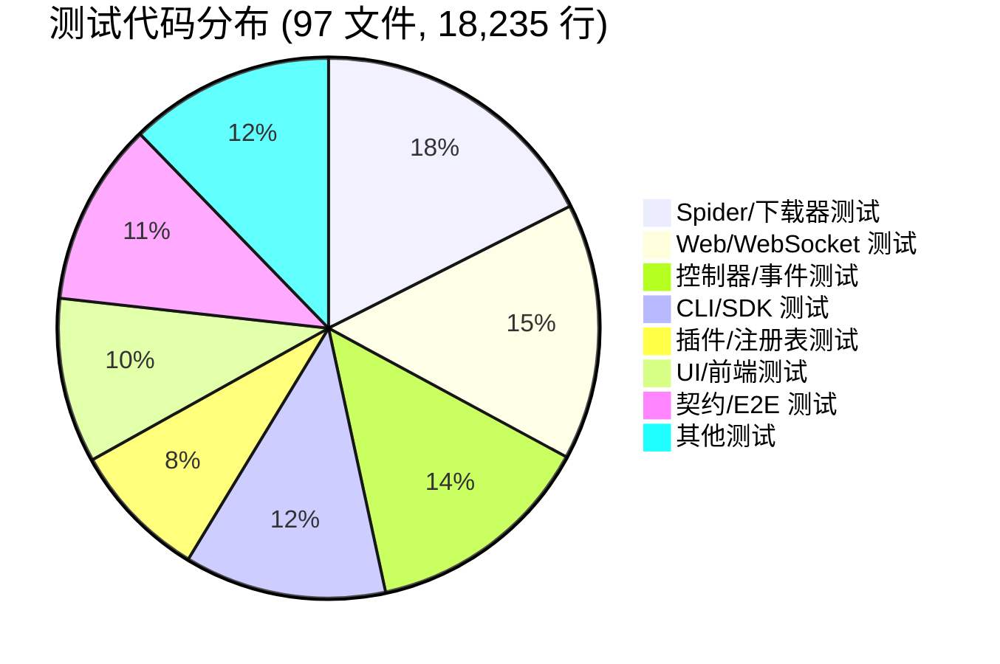
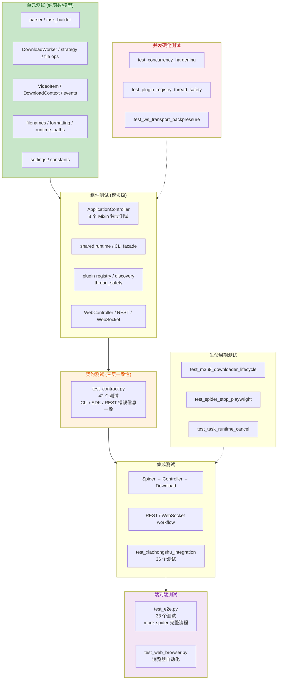
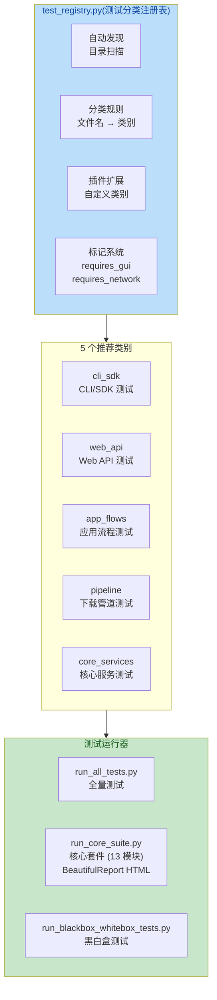
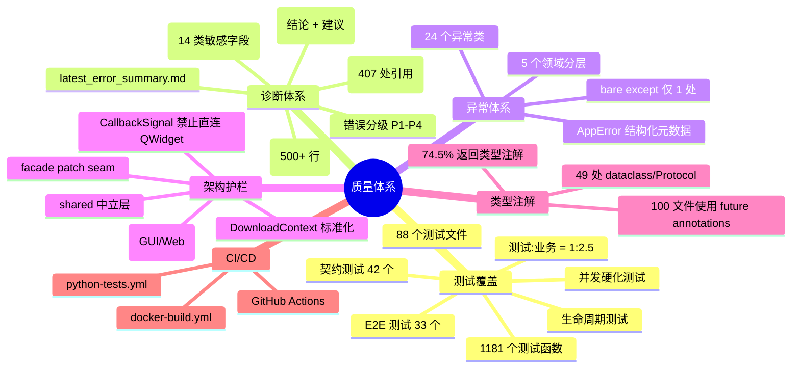
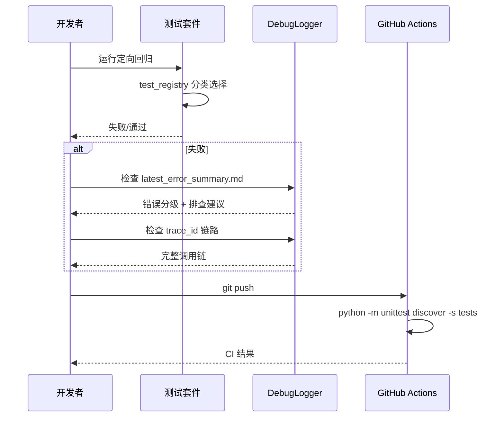

# 09 测试与质量地图

## 测试规模（实际统计）

```mermaid
pie title 测试代码分布 (97 文件, 18,235 行)
    "Spider/下载器测试" : 3200
    "Web/WebSocket 测试" : 2800
    "控制器/事件测试" : 2500
    "CLI/SDK 测试" : 2200
    "插件/注册表测试" : 1500
    "UI/前端测试" : 1800
    "契约/E2E 测试" : 2000
    "其他测试" : 2235
```

## 测试分层

```mermaid
flowchart TB
    subgraph Unit["单元测试 (纯函数/模型)"]
        Parser["parser / task_builder"]
        Worker["DownloadWorker / strategy / file ops"]
        Models["VideoItem / DownloadContext / events"]
        Utils["filenames / formatting / runtime_paths"]
        Config["settings / constants"]
    end

    subgraph Component["组件测试 (模块级)"]
        Controller["ApplicationController<br/>8 个 Mixin 独立测试"]
        Runtime["shared runtime / CLI facade"]
        Plugins["plugin registry / discovery<br/>thread_safety"]
        WebCtrl["WebController / REST / WebSocket"]
    end

    subgraph Contract["契约测试 (三层一致性)"]
        ThreeLayer["test_contract.py<br/>42 个测试<br/>CLI / SDK / REST 错误信息一致"]
    end

    subgraph Integration["集成测试"]
        Chains["Spider → Controller → Download"]
        Web["REST / WebSocket workflow"]
        XHS["test_xiaohongshu_integration<br/>36 个测试"]
    end

    subgraph E2E["端到端测试"]
        E2ETest["test_e2e.py<br/>33 个测试<br/>mock spider 完整流程"]
        Browser["test_web_browser.py<br/>浏览器自动化"]
    end

    subgraph Hardening["并发硬化测试"]
        Concurrency["test_concurrency_hardening"]
        ThreadSafe["test_plugin_registry_thread_safety"]
        Backpressure["test_ws_transport_backpressure"]
    end

    subgraph Lifecycle["生命周期测试"]
        M3U8["test_m3u8_downloader_lifecycle"]
        StopPlaywright["test_spider_stop_playwright"]
        Cancel["test_task_runtime_cancel"]
    end

    Unit --> Component
    Component --> Contract
    Contract --> Integration
    Integration --> E2E
    Hardening -.-> Component
    Lifecycle -.-> Integration

    style Unit fill:#c8e6c9,color:#1a5e20
    style Contract fill:#fff3e0,color:#e65100
    style E2E fill:#f3e5f5,color:#7b1fa2
    style Hardening fill:#ffebee,color:#b71c1c
```

## 测试注册表系统

```mermaid
flowchart TB
    subgraph Registry["test_registry.py(测试分类注册表)"]
        Discover["自动发现<br/>目录扫描"]
        Rules["分类规则<br/>文件名 → 类别"]
        Plugin["插件扩展<br/>自定义类别"]
        Markers["标记系统<br/>requires_gui<br/>requires_network"]
    end

    subgraph Categories["5 个推荐类别"]
        C1["cli_sdk<br/>CLI/SDK 测试"]
        C2["web_api<br/>Web API 测试"]
        C3["app_flows<br/>应用流程测试"]
        C4["pipeline<br/>下载管道测试"]
        C5["core_services<br/>核心服务测试"]
    end

    subgraph Runners["测试运行器"]
        All["run_all_tests.py<br/>全量测试"]
        Core["run_core_suite.py<br/>核心套件 (13 模块)<br/>BeautifulReport HTML"]
        BB["run_blackbox_whitebox_tests.py<br/>黑白盒测试"]
    end

    Registry --> Categories
    Categories --> Runners

    style Registry fill:#bbdefb,color:#0d47a1
    style Runners fill:#c8e6c9,color:#1a5e20
```

## 质量护栏

```mermaid
mindmap
  root((质量体系))
    测试覆盖
      1181 个测试函数
      88 个测试文件
      测试:业务 = 1:2.5
      契约测试 42 个
      E2E 测试 33 个
      并发硬化测试
      生命周期测试
    诊断体系
      DebugLogger (500+ 行)
      PII 脱敏 (14 类敏感字段)
      trace_id 全链路 (407 处引用)
      错误自诊断 (结论 + 建议)
      latest_error_summary.md
      错误分级 P1-P4
    异常体系
      24 个异常类
      5 个领域分层
      bare except 仅 1 处
      AppError 结构化元数据
    架构护栏
      shared 中立层
      facade patch seam
      组合根 (GUI/Web)
      DownloadContext 标准化
      CallbackSignal 禁止直连 QWidget
    类型注解
      74.5% 返回类型注解
      100 文件使用 future annotations
      49 处 dataclass/Protocol
    CI/CD
      GitHub Actions
      python-tests.yml
      docker-build.yml
```

## 代码质量成熟度（AEMM 模型）

```mermaid
flowchart LR
    subgraph L0["L0 实验性"]
        E1["Web 安全 (CORS *)"]
    end

    subgraph L1["L1 可用"]
        Q1["代码规范 (.editorconfig)"]
        Q2["文档完整度 (29 规则)"]
        Q3["安全性 (session 基础设施)"]
        Q4["配置治理 (dataclass)"]
    end

    subgraph L2["L2 可靠"]
        Q5["类型安全 (74.5% 注解)"]
        Q6["错误处理 (24 异常类)"]
        Q7["测试覆盖 (1181 测试)"]
        Q8["可观测性 (DebugLogger)"]
        Q9["架构模式 (Mixin+EventBus)"]
    end

    subgraph L3["L3 目标"]
        Q10["mypy strict"]
        Q11["coverage >80%"]
        Q12["断路器 / SLO"]
        Q13["Decision Trace"]
        Q14["MCP Server"]
        Q15["API 鉴权中间件"]
    end

    L0 --> L1 --> L2 --> L3

    style L0 fill:#ffebee,color:#b71c1c
    style L1 fill:#fff3e0,color:#e65100
    style L2 fill:#c8e6c9,color:#1a5e20
    style L3 fill:#e1f5fe,color:#01579b
```

## 典型回归流程

```mermaid
sequenceDiagram
    participant Dev as 开发者
    participant Test as 测试套件
    participant Diag as DebugLogger
    participant CI as GitHub Actions

    Dev->>Test: 运行定向回归
    Test->>Test: test_registry 分类选择
    Test-->>Dev: 失败/通过
    
    alt 失败
        Dev->>Diag: 检查 latest_error_summary.md
        Diag-->>Dev: 错误分级 + 排查建议
        Dev->>Diag: 检查 trace_id 链路
        Diag-->>Dev: 完整调用链
    end
    
    Dev->>CI: git push
    CI->>CI: python -m unittest discover -s tests
    CI-->>Dev: CI 结果
```
