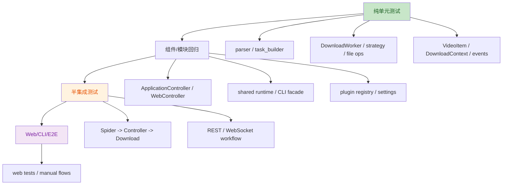
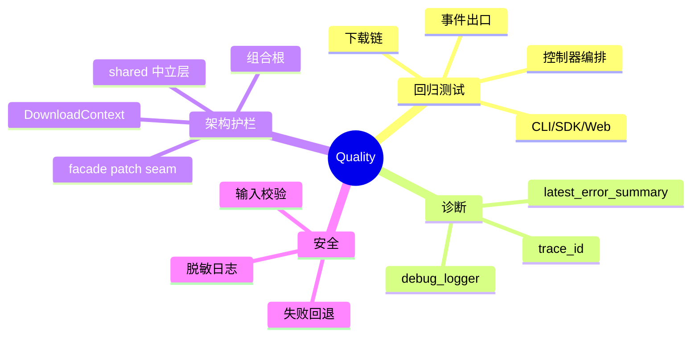
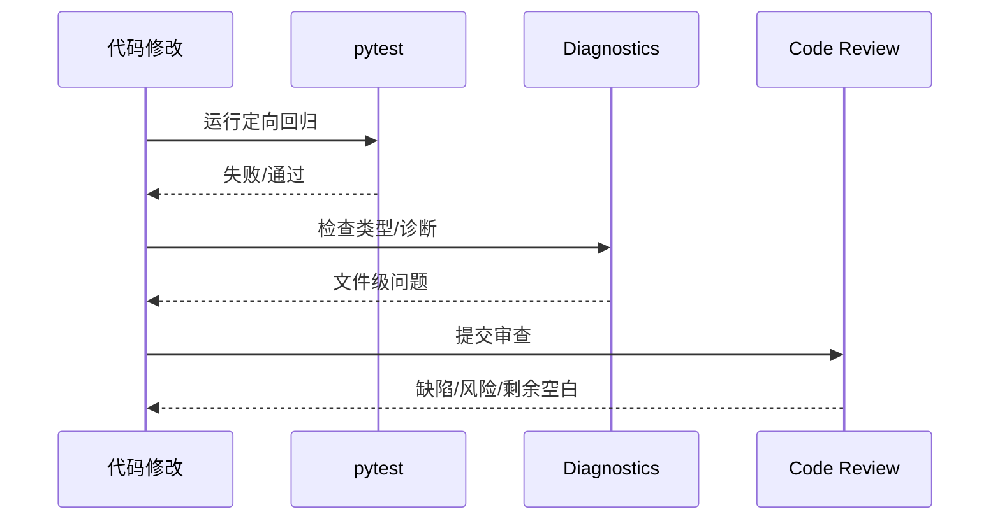

# 09 测试与质量地图

## 测试分层

```mermaid
flowchart TB
    Unit[纯单元测试] --> Component[组件/模块回归]
    Component --> Semi[半集成测试]
    Semi --> E2E[Web/CLI/E2E]

    Unit --> Parser[parser / task_builder]
    Unit --> Worker[DownloadWorker / strategy / file ops]
    Unit --> Models[VideoItem / DownloadContext / events]

    Component --> Controller[ApplicationController / WebController]
    Component --> Runtime[shared runtime / CLI facade]
    Component --> Plugins[plugin registry / settings]

    Semi --> Chains[Spider -> Controller -> Download]
    Semi --> Web[REST / WebSocket workflow]
    E2E --> Browser[web tests / manual flows]

    style Unit fill:#c8e6c9,color:#1a5e20
    style Semi fill:#fff3e0,color:#e65100
    style E2E fill:#f3e5f5,color:#7b1fa2
```

## 质量护栏

```mermaid
mindmap
  root((Quality))
    回归测试
      下载链
      CLI/SDK/Web
      控制器编排
      事件出口
    诊断
      debug_logger
      latest_error_summary
      trace_id
    架构护栏
      shared 中立层
      facade patch seam
      组合根
      DownloadContext
    安全
      脱敏日志
      输入校验
      失败回退
```

## 典型回归流程

```mermaid
sequenceDiagram
    participant Dev as 代码修改
    participant Test as pytest
    participant Diag as Diagnostics
    participant Reviewer as Code Review

    Dev->>Test: 运行定向回归
    Test-->>Dev: 失败/通过
    Dev->>Diag: 检查类型/诊断
    Diag-->>Dev: 文件级问题
    Dev->>Reviewer: 提交审查
    Reviewer-->>Dev: 缺陷/风险/剩余空白
```
