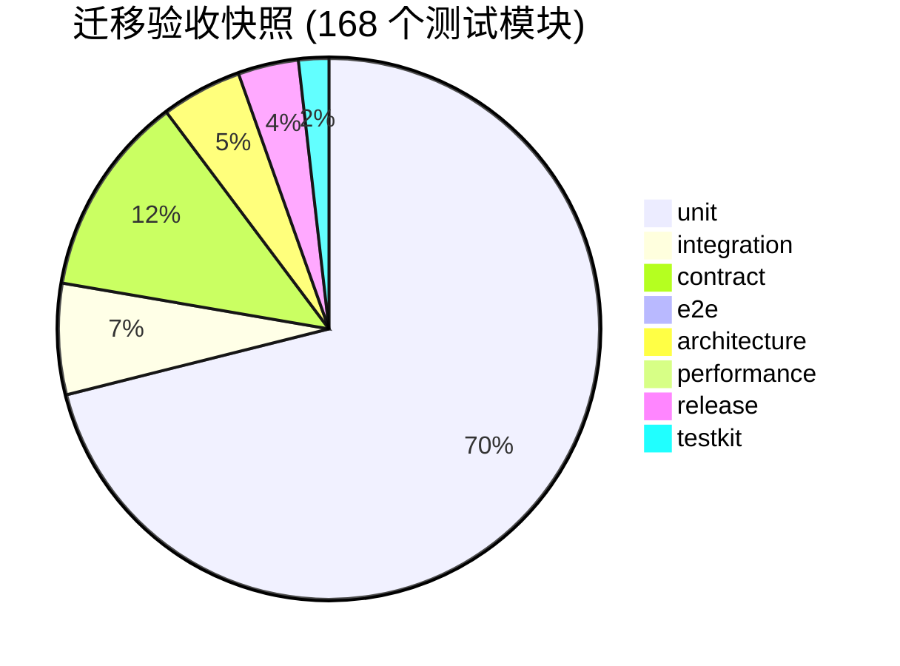
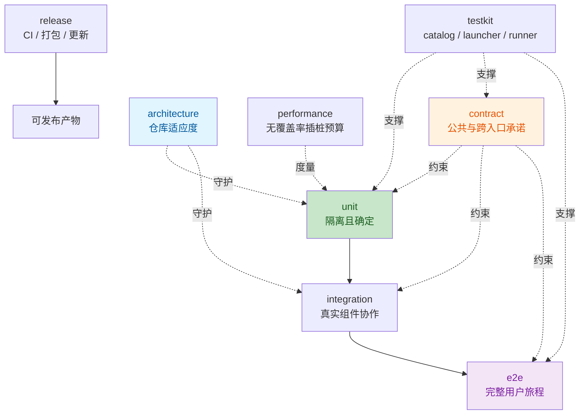
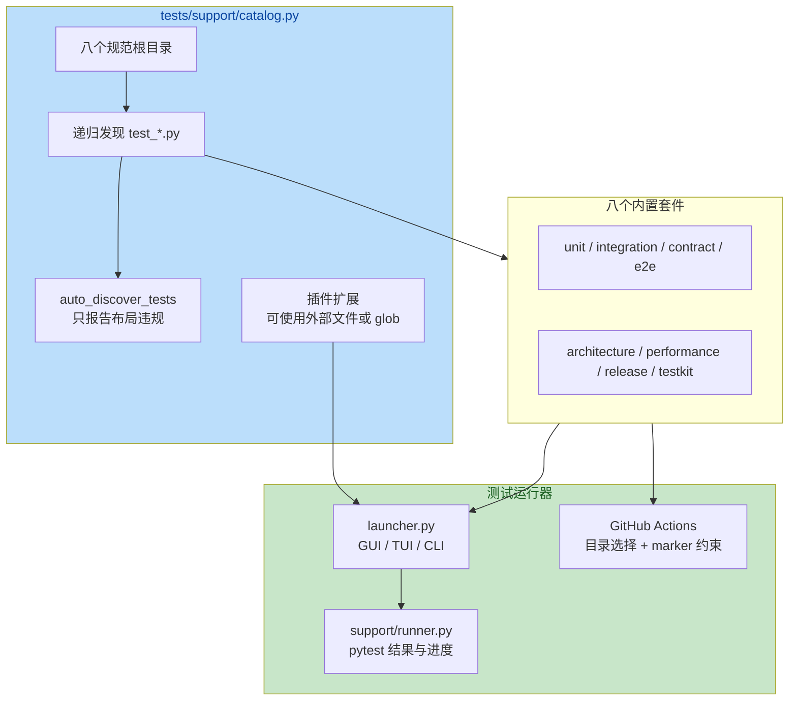
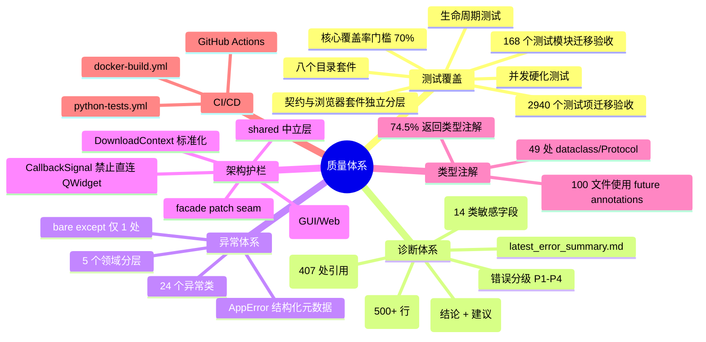
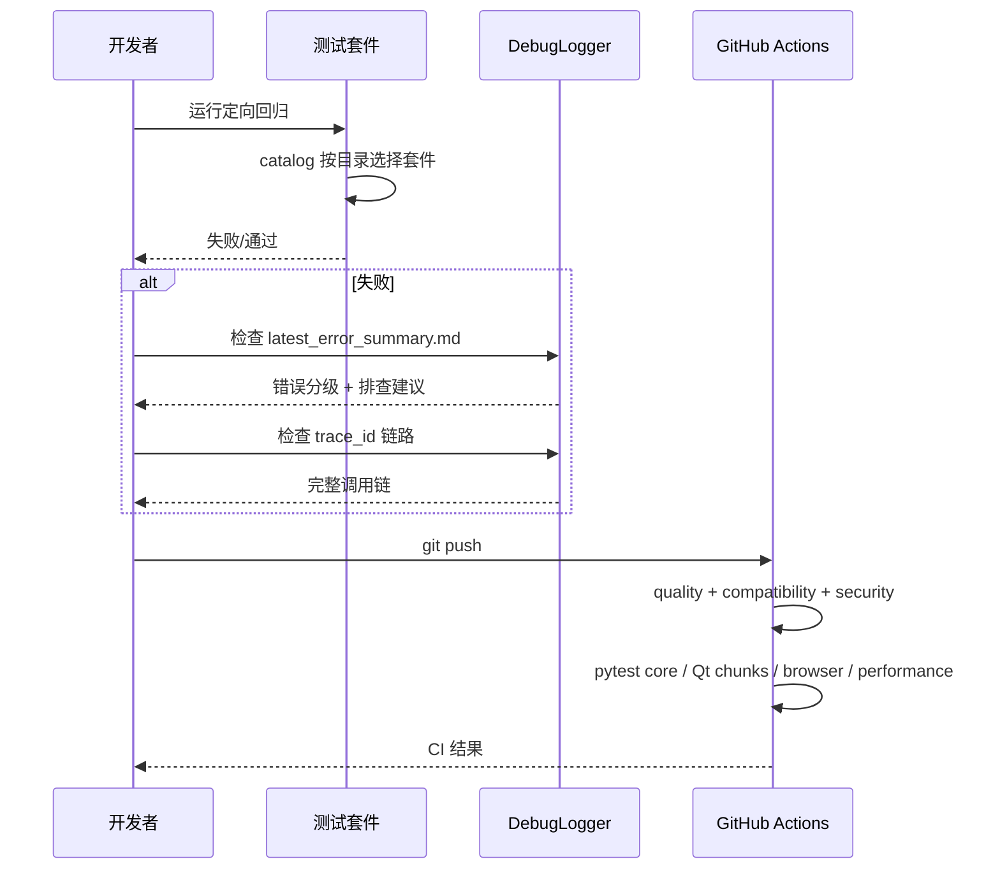

# 09 测试与质量地图

## 测试规模（实际统计）

```mermaid
pie title 迁移验收快照 (168 个测试模块)
    "unit" : 118
    "integration" : 11
    "contract" : 20
    "e2e" : 1
    "architecture" : 8
    "performance" : 1
    "release" : 6
    "testkit" : 3
```

模块数来自目录 catalog 的迁移验收快照；启动器运行时动态统计，不把这些数字硬编码成结构门槛。

## 测试分层

```mermaid
flowchart TB
    Unit["unit<br/>隔离且确定"] --> Integration["integration<br/>真实组件协作"] --> E2E["e2e<br/>完整用户旅程"]
    Contract["contract<br/>公共与跨入口承诺"] -.约束.-> Unit
    Contract -.约束.-> Integration
    Contract -.约束.-> E2E
    Architecture["architecture<br/>仓库适应度"] -.守护.-> Unit
    Architecture -.守护.-> Integration
    Performance["performance<br/>无覆盖率插桩预算"] -.度量.-> Unit
    Release["release<br/>CI / 打包 / 更新"] --> Delivery["可发布产物"]
    Testkit["testkit<br/>catalog / launcher / runner"] -.支撑.-> Unit
    Testkit -.支撑.-> Contract
    Testkit -.支撑.-> E2E

    style Unit fill:#c8e6c9,color:#1a5e20
    style Contract fill:#fff3e0,color:#e65100
    style E2E fill:#f3e5f5,color:#7b1fa2
    style Architecture fill:#e1f5fe,color:#01579b
```

## 目录套件系统

```mermaid
flowchart TB
    subgraph Catalog["tests/support/catalog.py"]
        Roots["八个规范根目录"]
        Discover["递归发现 test_*.py"]
        Violations["auto_discover_tests<br/>只报告布局违规"]
        Plugin["插件扩展<br/>可使用外部文件或 glob"]
    end

    subgraph Suites["八个内置套件"]
        C1["unit / integration / contract / e2e"]
        C2["architecture / performance / release / testkit"]
    end

    subgraph Runners["测试运行器"]
        Launcher["launcher.py<br/>GUI / TUI / CLI"]
        Runner["support/runner.py<br/>pytest 结果与进度"]
        CI["GitHub Actions<br/>目录选择 + marker 约束"]
    end

    Roots --> Discover --> Suites
    Discover --> Violations
    Plugin --> Launcher
    Suites --> Launcher --> Runner
    Suites --> CI

    style Catalog fill:#bbdefb,color:#0d47a1
    style Runners fill:#c8e6c9,color:#1a5e20
```

## 质量护栏

```mermaid
mindmap
  root((质量体系))
    测试覆盖
      2940 个测试项迁移验收
      168 个测试模块迁移验收
      八个目录套件
      核心覆盖率门槛 70%
      契约与浏览器套件独立分层
      并发硬化测试
      生命周期测试
    诊断体系
      DebugLogger (500+ 行)
      PII 脱敏 (14 类敏感字段)
      trace_id 全链路 (407 处引用)
      错误自诊断 (结论 + 建议)
      latest_error_summary.md
      错误分级 P1-P4
    异常体系
      24 个异常类
      5 个领域分层
      bare except 仅 1 处
      AppError 结构化元数据
    架构护栏
      shared 中立层
      facade patch seam
      组合根 (GUI/Web)
      DownloadContext 标准化
      CallbackSignal 禁止直连 QWidget
    类型注解
      74.5% 返回类型注解
      100 文件使用 future annotations
      49 处 dataclass/Protocol
    CI/CD
      GitHub Actions
      python-tests.yml
      docker-build.yml
```

## 代码质量成熟度（AEMM 模型）

```mermaid
flowchart LR
    subgraph L0["L0 实验性"]
        E1["Web 安全 (CORS *)"]
    end

    subgraph L1["L1 可用"]
        Q1["代码规范 (.editorconfig)"]
        Q2["文档完整度 (29 规则)"]
        Q3["安全性 (session 基础设施)"]
        Q4["配置治理 (dataclass)"]
    end

    subgraph L2["L2 可靠"]
        Q5["类型安全 (74.5% 注解)"]
        Q6["错误处理 (24 异常类)"]
        Q7["测试覆盖 (1181 测试)"]
        Q8["可观测性 (DebugLogger)"]
        Q9["架构模式 (Mixin+EventBus)"]
    end

    subgraph L3["L3 目标"]
        Q10["mypy strict"]
        Q11["coverage >80%"]
        Q12["断路器 / SLO"]
        Q13["Decision Trace"]
        Q14["MCP Server"]
        Q15["API 鉴权中间件"]
    end

    L0 --> L1 --> L2 --> L3

    style L0 fill:#ffebee,color:#b71c1c
    style L1 fill:#fff3e0,color:#e65100
    style L2 fill:#c8e6c9,color:#1a5e20
    style L3 fill:#e1f5fe,color:#01579b
```

## 典型回归流程

```mermaid
sequenceDiagram
    participant Dev as 开发者
    participant Test as 测试套件
    participant Diag as DebugLogger
    participant CI as GitHub Actions

    Dev->>Test: 运行定向回归
    Test->>Test: catalog 按目录选择套件
    Test-->>Dev: 失败/通过
    
    alt 失败
        Dev->>Diag: 检查 latest_error_summary.md
        Diag-->>Dev: 错误分级 + 排查建议
        Dev->>Diag: 检查 trace_id 链路
        Diag-->>Dev: 完整调用链
    end
    
    Dev->>CI: git push
    CI->>CI: quality + compatibility + security
    CI->>CI: pytest core / Qt chunks / browser / performance
    CI-->>Dev: CI 结果
```
