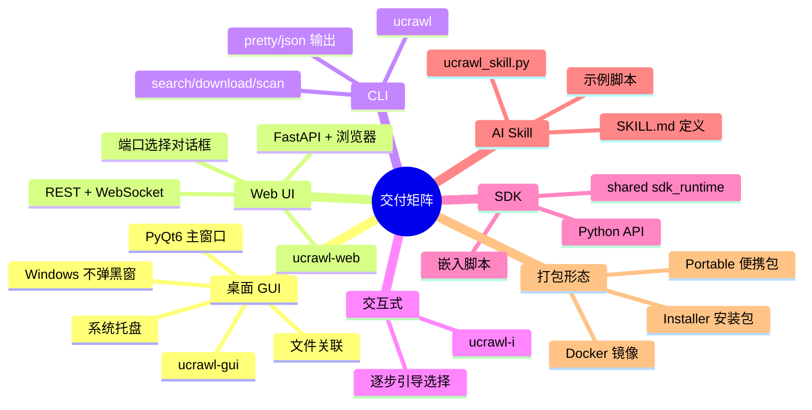
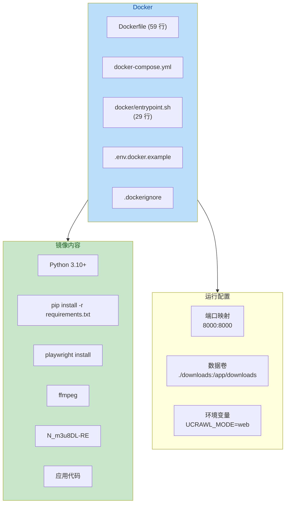
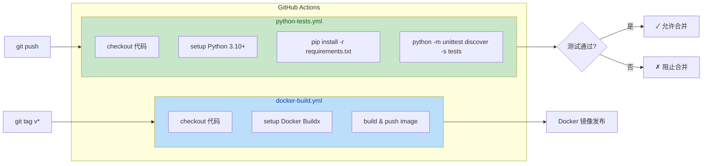
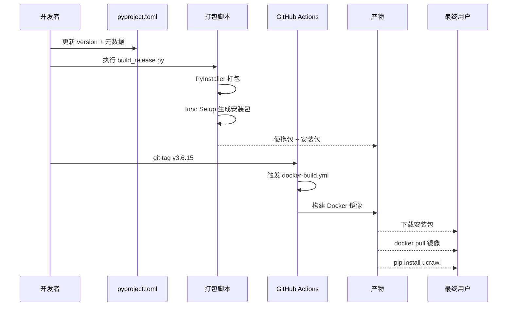

# 10 打包与交付

## 交付形态（6 种入口 + 3 种打包）

```mermaid
mindmap
  root((交付矩阵))
    桌面 GUI
      ucrawl-gui
      PyQt6 主窗口
      Windows 不弹黑窗
      系统托盘
      文件关联
    Web UI
      ucrawl-web
      FastAPI + 浏览器
      REST + WebSocket
      端口选择对话框
    CLI
      ucrawl
      search/download/scan
      pretty/json 输出
    交互式
      ucrawl-i
      逐步引导选择
    SDK
      Python API
      嵌入脚本
      shared sdk_runtime
    AI Skill
      SKILL.md 定义
      ucrawl_skill.py
      示例脚本
    打包形态
      Portable 便携包
      Installer 安装包
      Docker 镜像
```

## 打包流程

```mermaid
flowchart LR
    subgraph Source["源码"]
        PyProject["pyproject.toml<br/>version=3.6.15"]
        Meta["project_meta.py<br/>版本/名称/描述"]
    end

    subgraph Build["打包脚本 (packaging/)"]
        BuildRelease["build_release.py<br/>统一构建入口"]
        BuildPortable["build_portable.py<br/>PyInstaller 便携包"]
        BuildInstaller["build_installer.py<br/>Inno Setup 安装包"]
        PortableSpec["portable.spec<br/>PyInstaller spec"]
        InstallerISS["installer.iss<br/>Inno Setup 脚本"]
        RuntimeHook["runtime_hook.py<br/>运行时钩子"]
        GuiLauncher["_gui_launcher.py<br/>GUI 启动器"]
        WebUILauncher["_webui_launcher.py<br/>Web UI 启动器"]
    end

    subgraph Artifacts["构建产物"]
        Portable["便携包<br/>单目录可运行"]
        Installer["安装包<br/>.exe 安装程序"]
        Docker["Docker 镜像"]
    end

    subgraph Runtime["运行时资源"]
        FFmpeg["ffmpeg.exe"]
        Nm3u8["N_m3u8DL-RE.exe"]
        Icon["Web.ico / favicon.ico"]
        Wizard["wizard_image.bmp<br/>wizard_small_image.bmp"]
    end

    Source --> Build
    Build --> Artifacts
    Runtime --> Build
    Artifacts --> Final["最终交付"]

    style Build fill:#fff3e0,color:#e65100
    style Artifacts fill:#c8e6c9,color:#1a5e20
    style Runtime fill:#bbdefb,color:#0d47a1
```

## Docker 容器化

```mermaid
flowchart TB
    subgraph Docker["Docker"]
        Dockerfile["Dockerfile (59 行)"]
        Compose["docker-compose.yml"]
        Entrypoint["docker/entrypoint.sh<br/>(29 行)"]
        EnvExample[".env.docker.example"]
        Ignore[".dockerignore"]
    end

    subgraph Image["镜像内容"]
        Python["Python 3.10+"]
        Deps["pip install -r requirements.txt"]
        Playwright["playwright install"]
        FFmpeg["ffmpeg"]
        Nm3u8["N_m3u8DL-RE"]
        App["应用代码"]
    end

    subgraph Run["运行配置"]
        Port["端口映射<br/>8000:8000"]
        Volume["数据卷<br/>./downloads:/app/downloads"]
        Env["环境变量<br/>UCRAWL_MODE=web"]
    end

    Docker --> Image
    Docker --> Run

    style Docker fill:#bbdefb,color:#0d47a1
    style Image fill:#c8e6c9,color:#1a5e20
```

## CI/CD 流水线

```mermaid
flowchart LR
    subgraph GitHub["GitHub Actions"]
        subgraph Test["python-tests.yml"]
            T1["checkout 代码"]
            T2["setup Python 3.10+"]
            T3["pip install -r requirements.txt"]
            T4["python -m unittest discover -s tests"]
        end

        subgraph DockerBuild["docker-build.yml"]
            D1["checkout 代码"]
            D2["setup Docker Buildx"]
            D3["build & push image"]
        end
    end

    Push["git push"] --> Test
    Tag["git tag v*"] --> DockerBuild

    Test --> Result{"测试通过?"}
    Result -->|是| Pass["✓ 允许合并"]
    Result -->|否| Fail["✗ 阻止合并"]

    DockerBuild --> Image["Docker 镜像发布"]

    style Test fill:#c8e6c9,color:#1a5e20
    style DockerBuild fill:#bbdefb,color:#0d47a1
```

## 发布序列

```mermaid
sequenceDiagram
    participant Dev as 开发者
    participant Ver as pyproject.toml
    participant Build as 打包脚本
    participant CI as GitHub Actions
    participant Artifact as 产物
    participant User as 最终用户

    Dev->>Ver: 更新 version + 元数据
    Dev->>Build: 执行 build_release.py
    Build->>Build: PyInstaller 打包
    Build->>Build: Inno Setup 生成安装包
    Build-->>Artifact: 便携包 + 安装包
    
    Dev->>CI: git tag v3.6.15
    CI->>CI: 触发 docker-build.yml
    CI->>Artifact: 构建 Docker 镜像
    
    Artifact-->>User: 下载安装包
    Artifact-->>User: docker pull 镜像
    Artifact-->>User: pip install ucrawl
```
