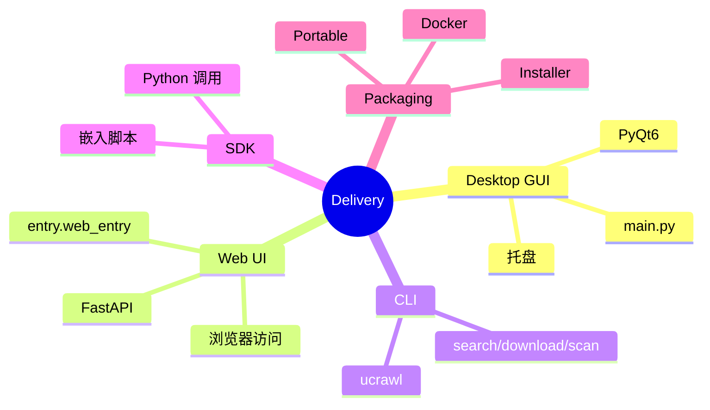
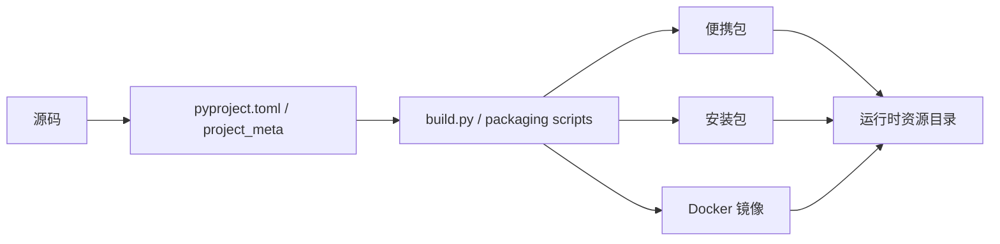
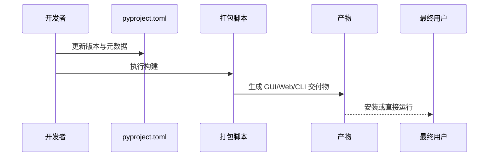

# 10 打包与交付

## 交付形态

```mermaid
mindmap
  root((Delivery))
    Desktop GUI
      main.py
      PyQt6
      托盘
    Web UI
      entry.web_entry
      FastAPI
      浏览器访问
    CLI
      ucrawl
      search/download/scan
    SDK
      Python 调用
      嵌入脚本
    Packaging
      Portable
      Installer
      Docker
```

## 打包流程

```mermaid
flowchart LR
    Source[源码] --> Meta[pyproject.toml / project_meta]
    Meta --> Build[build.py / packaging scripts]
    Build --> Portable[便携包]
    Build --> Installer[安装包]
    Build --> Docker[Docker 镜像]
    Portable --> Runtime[运行时资源目录]
    Installer --> Runtime
    Docker --> Runtime
```

## 发布序列

```mermaid
sequenceDiagram
    participant Dev as 开发者
    participant Version as pyproject.toml
    participant Build as 打包脚本
    participant Artifact as 产物
    participant User as 最终用户

    Dev->>Version: 更新版本与元数据
    Dev->>Build: 执行构建
    Build->>Artifact: 生成 GUI/Web/CLI 交付物
    Artifact-->>User: 安装或直接运行
```
